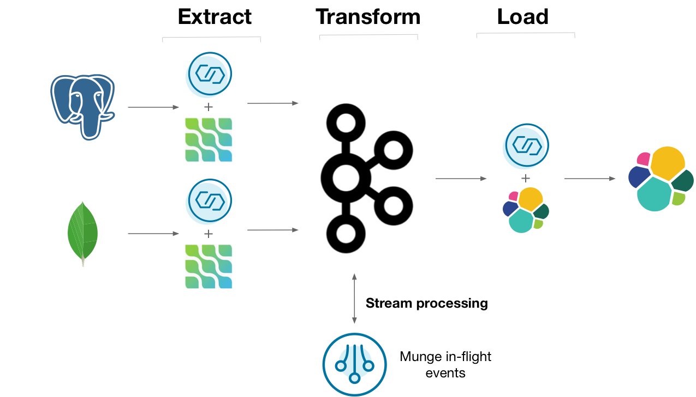

What is it?
----------

A streaming ETL pipeline is ...

Why ksqlDB
----------

ksqlDB is good fit for this because ...

Implement it
------------

### Step 1: foo bar baz

lorem ipsum

### Step 2: blah blah blah

lorem ipsum