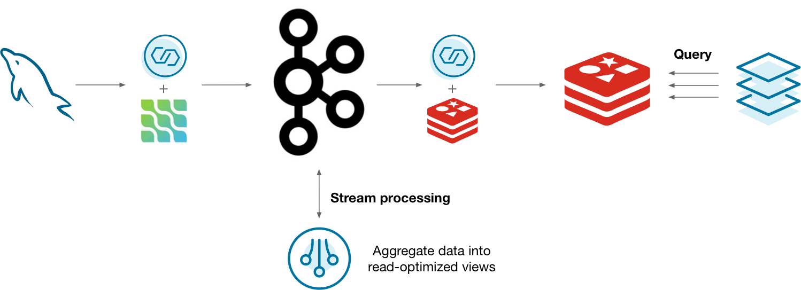
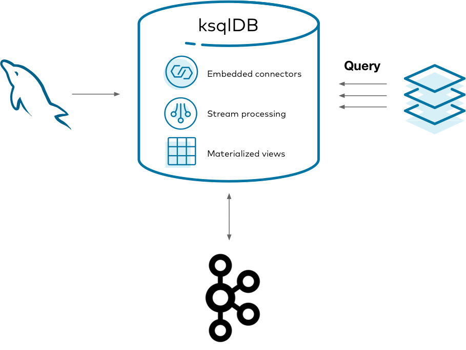

What is it?
----------

A materialized view (sometimes called a "[materialized cache](https://www.confluent.io/blog/build-materialized-cache-with-ksqldb/)") is an approach to precomputing the results of a query and storing them for fast read access. By contrast to a regular database query, which does all of its work at read-time, materialized views do nearly all of their work at write-time. This is why materialized views can offer highly performant reads.

A pretty standard way to build a materialized cache is to capture the changelog of a database and process it as a stream of events. This lets you create multiple distributed materializations that best suit each application's query patterns.

{: style="width:90%;"}

One way you might do this would be to capture the changelog of MySQL using the Debezium Kafka Connector. The changelog is stored in Kafka and processed by a stream processor. As the materialization updates, it's updated in Redis so that applications can look query the materializations. This can work, but is there a better way?

Why ksqlDB
----------

Running all of the above systems is admittedly a lot to manage. In addition to your database, you end up managing clusters for Kafka, connectors, the stream processor, and another data store. It's challenging to monitor, secure, and scale all of these systems as one. ksqlDB helps to consolidate this complexity by slimming the architecture down to two things: storage (Kafka) and compute (ksqlDB).

{: style="width:60%;"}

Using ksqlDB, you can run any Kafka Connect connector by embedding it in ksqlDB's servers. You can also directly query ksqlDB's tables of state, obviating the need to sink your data to another data store. This gives you one mental model, in SQL, for managing your materialized views end-to-end.

Implement it
------------

Imagine that you work at a company with a call center. People frequently call in about purchasing a product, to ask for a refund, and other things. Because the volume of calls is rather high, it isn't practical to run queries over the database storing all the calls every time someone calls in.

In this tutorial, we'll show you how to create and query a set of materialized views about phone calls made to the call center. We'll demonstrate capturing changes from a MySQL database, forwarding them into Kafka, creating materialized views with ksqlDB, and querying them from your applications.

### Get the Debezium connector

To get started, we'll need to download the Debezium connector to a fresh directory. You can either get that using [confluent-hub](https://docs.confluent.io/current/connect/managing/confluent-hub/client.html), or by running the following one-off Docker command that wraps it:

```
docker run --rm -v $PWD/confluent-hub-components:/share/confluent-hub-components confluentinc/ksqldb-server:0.8.0 confluent-hub install --no-prompt debezium/debezium-connector-mysql:1.1.0
```

After running this, you should have a folder named `confluent-hub-components` with some jar files in it.

### Start the stack

We'll need to set up and launch the services in the stack. To do this, we'll need to make a couple of files.

MySQL requires some custom configuration to play well with Debezium, so let's take care of that first. Debezium has a dedicated [tutorial](https://debezium.io/documentation/reference/1.1/assemblies/cdc-mysql-connector/as_setup-the-mysql-server.html) on this if you're interested, but this guide covers just the essentials. Make a new file at `mysql/custom-config.cnf` with the following content:

```
[mysqld]
server-id                = 223344 
log_bin                  = mysql-bin 
binlog_format            = ROW 
binlog_row_image         = FULL 
expire_logs_days         = 10
gtid_mode                = ON
enforce_gtid_consistency = ON
```

This sets up MySQL's transaction log so that Debezium can watch for changes as they occur.

With that file in place, create a `docker-compose.yml` file that defines the services to launch:

```yaml
---
version: '2'

services:
  mysql:
    image: mysql:8.0.19
    hostname: mysql
    container_name: mysql
    ports:
      - "3306:3306"
    environment:
      MYSQL_ROOT_PASSWORD: mysql-pw
      MYSQL_DATABASE: call-center
      MYSQL_USER: example-user
      MYSQL_PASSWORD: example-pw
    volumes:
      - "./mysql/custom-config.cnf:/etc/mysql/conf.d/custom-config.cnf"

  zookeeper:
    image: confluentinc/cp-zookeeper:5.4.0
    hostname: zookeeper
    container_name: zookeeper
    ports:
      - "2181:2181"
    environment:
      ZOOKEEPER_CLIENT_PORT: 2181
      ZOOKEEPER_TICK_TIME: 2000

  broker:
    image: confluentinc/cp-enterprise-kafka:5.4.0
    hostname: broker
    container_name: broker
    depends_on:
      - zookeeper
    ports:
      - "29092:29092"
    environment:
      KAFKA_BROKER_ID: 1
      KAFKA_ZOOKEEPER_CONNECT: 'zookeeper:2181'
      KAFKA_LISTENER_SECURITY_PROTOCOL_MAP: PLAINTEXT:PLAINTEXT,PLAINTEXT_HOST:PLAINTEXT
      KAFKA_ADVERTISED_LISTENERS: PLAINTEXT://broker:9092,PLAINTEXT_HOST://localhost:29092
      KAFKA_OFFSETS_TOPIC_REPLICATION_FACTOR: 1
      KAFKA_GROUP_INITIAL_REBALANCE_DELAY_MS: 0
      KAFKA_TRANSACTION_STATE_LOG_MIN_ISR: 1
      KAFKA_TRANSACTION_STATE_LOG_REPLICATION_FACTOR: 1

  schema-registry:
    image: confluentinc/cp-schema-registry:5.4.1
    hostname: schema-registry
    container_name: schema-registry
    depends_on:
      - zookeeper
      - broker
    ports:
      - "8081:8081"
    environment:
      SCHEMA_REGISTRY_HOST_NAME: schema-registry
      SCHEMA_REGISTRY_KAFKASTORE_CONNECTION_URL: 'zookeeper:2181'

  ksqldb-server:
    image: confluentinc/ksqldb-server:0.8.0
    hostname: ksqldb-server
    container_name: ksqldb-server
    depends_on:
      - broker
      - schema-registry
    ports:
      - "8088:8088"
    volumes:
      - "./confluent-hub-components/debezium-debezium-connector-mysql:/usr/share/kafka/plugins/debezium-mysql"
    environment:
      KSQL_LISTENERS: "http://0.0.0.0:8088"
      KSQL_BOOTSTRAP_SERVERS: "broker:9092"
      KSQL_KSQL_SCHEMA_REGISTRY_URL: "http://schema-registry:8081"
      KSQL_KSQL_LOGGING_PROCESSING_STREAM_AUTO_CREATE: "true"
      KSQL_KSQL_LOGGING_PROCESSING_TOPIC_AUTO_CREATE: "true"
      # Configuration to embed Kafka Connect support.
      KSQL_CONNECT_GROUP_ID: "ksql-connect-cluster"
      KSQL_CONNECT_BOOTSTRAP_SERVERS: "broker:9092"
      KSQL_CONNECT_KEY_CONVERTER: "io.confluent.connect.avro.AvroConverter"
      KSQL_CONNECT_VALUE_CONVERTER: "io.confluent.connect.avro.AvroConverter"
      KSQL_CONNECT_KEY_CONVERTER_SCHEMA_REGISTRY_URL: "http://schema-registry:8081"
      KSQL_CONNECT_VALUE_CONVERTER_SCHEMA_REGISTRY_URL: "http://schema-registry:8081"
      KSQL_CONNECT_VALUE_CONVERTER_SCHEMAS_ENABLE: "false"
      KSQL_CONNECT_CONFIG_STORAGE_TOPIC: "ksql-connect-configs"
      KSQL_CONNECT_OFFSET_STORAGE_TOPIC: "ksql-connect-offsets"
      KSQL_CONNECT_STATUS_STORAGE_TOPIC: "ksql-connect-statuses"
      KSQL_CONNECT_CONFIG_STORAGE_REPLICATION_FACTOR: 1
      KSQL_CONNECT_OFFSET_STORAGE_REPLICATION_FACTOR: 1
      KSQL_CONNECT_STATUS_STORAGE_REPLICATION_FACTOR: 1
      KSQL_CONNECT_PLUGIN_PATH: "/usr/share/kafka/plugins"

  ksqldb-cli:
    image: confluentinc/ksqldb-cli:0.8.0
    container_name: ksqldb-cli
    depends_on:
      - broker
      - ksqldb-server
    entrypoint: /bin/sh
    tty: true
```

There's a few things to notice here. The MySQL image mounts the custom configuration file that we wrote. MySQL merges these configuration settings into its system-wide configuration. The environment variables we gave it also set up a blank database called `call-center` along with a user named `example-user` that can access it.

Also note that the ksqlDB server image mounts the `confluent-hub-components` directory, too. The jar files that we downloaded need to be on the classpath of ksqlDB when the server starts up.

Bring up the entire stack by running:

```
docker-compose up
```

### Configure MySQL for Debezium

MySQL requires just a bit more modification before it can work with Debezium. Debezium needs to connect to MySQL as a user that has a specific set of privileges to replicate its changelog. We already set up the `example-user` by default in the Docker Compose file. Now we just need to give it the right privileges. We can do this by logging into the MySQL container:

```
docker exec -it mysql /bin/bash
```

And then logging into MySQL as root:

```
mysql -u root -p
```

The root password, as specified in the Docker Compose file, is `mysql-pw`.

For simplicity, this tutorial grants all privileges to `example-user` connecting from any host. In the real world you'd want to manage your permissions much more tightly.

Grant the privileges for replication by executing the following at the MySQL prompt:

```sql
GRANT ALL PRIVILEGES ON *.* TO 'example-user' WITH GRANT OPTION;
ALTER USER 'example-user'@'%' IDENTIFIED WITH mysql_native_password BY 'example-pw';
FLUSH PRIVILEGES;
```

### Create the calls table in MySQL

Let's seed our blank database with some initial state. In the same MySQL CLI, switch into the `call-center` database:

```sql
USE call-center;
```

Create a table that will represent phone calls that were made. We'll keep this table simple. The columns will represent the name of the person calling, the reason that they called, and the duration in seconds of the call.

```sql
CREATE TABLE calls (name TEXT, reason TEXT, duration_seconds INT);
```

And now add some initial data. We'll add more later, but this will suffice for now:

```sql
INSERT INTO calls (name, reason, duration_seconds) VALUES ("michael", "purchase", 540);
INSERT INTO calls (name, reason, duration_seconds) VALUES ("michael", "help", 224);
INSERT INTO calls (name, reason, duration_seconds) VALUES ("colin", "help", 802);
INSERT INTO calls (name, reason, duration_seconds) VALUES ("derek", "purchase", 10204);
INSERT INTO calls (name, reason, duration_seconds) VALUES ("derek", "help", 600);
INSERT INTO calls (name, reason, duration_seconds) VALUES ("colin", "refund", 105);
INSERT INTO calls (name, reason, duration_seconds) VALUES ("michael", "help", 2030);
INSERT INTO calls (name, reason, duration_seconds) VALUES ("colin", "purchase", 800);
INSERT INTO calls (name, reason, duration_seconds) VALUES ("derek", "help", 2514);
INSERT INTO calls (name, reason, duration_seconds) VALUES ("derek", "refund", 325);
```

### Start the Debezium connector

With MySQL ready to go, connect to ksqlDB's server using its interactive CLI. Run the following from your host:

```
docker exec -it ksqldb-cli ksql http://ksqldb-server:8088
```

Before we issue more commands, instruct ksqlDB to start all queries from earliest point in each topic:

```sql
SET 'auto.offset.reset' = 'earliest';
```

Now we can connect ask Debezium to stream MySQL's changelog into Kafka. Invoke the following command in ksqlDB. This creates a Debezium source connector and writes all of its changes to Kafka topics:

```sql
CREATE SOURCE CONNECTOR calls_reader WITH (
    'connector.class' = 'io.debezium.connector.mysql.MySqlConnector',
    'database.hostname' = 'mysql',
    'database.port' = '3306',
    'database.user' = 'example-user',
    'database.password' = 'example-pw',
    'database.allowPublicKeyRetrieval' = 'true',
    'database.server.id' = '184054',
    'database.server.name' = 'call-center-db',
    'database.whitelist' = 'call-center',
    'database.history.kafka.bootstrap.servers' = 'broker:9092',
    'database.history.kafka.topic' = 'call-center',
    'table.whitelist' = 'call-center.calls',
    'include.schema.changes' = 'false'
);
```

After a few seconds, it should create a topic named `call-center-db.call-center.calls`. Print the raw topic contents to make sure it captured the initial rows that we seeded the calls table with:

```sql
PRINT 'call-center-db.call-center.calls' FROM BEGINNING;
```

If nothing prints out, the connector probably failed to launch. You can check ksqlDB's logs with:

```
docker logs -f ksqldb-server
```

You can also show the status of the connector in the ksqlDB CLI with:

```
DESCRIBE CONNECTOR calls_reader;
```

### Create the ksqlDB calls stream

For ksqlDB to be able to use the topic that Debezium created, we need to declare a stream over it. Because we configured Kafka Connect with Schema Registry, we don't need to declare the schema of the data for the streams. It is simply inferred the schema that Debezium writes with. Run the following at the ksqlDB CLI:

```sql
CREATE STREAM calls WITH (
    kafka_topic = 'call-center-db.call-center.calls',
    value_format = 'avro'
);
```

### Create the materialized views

A pretty common situation in call centers is the need to know what the current caller has called about in the past. Let's create a simple materialized view that keeps track of the distinct number of reasons that a user called for, and what the last reason was that they called for, too. This gives us an idea of how many kinds of inquiries the caller has raised, and also gives us context based on the last time they called.

We do this by declaring a table called `support_view`. Keeping track of the distinct number of reasons a caller raised is as simple as grouping by the user name, then aggregating with `count_distinct` over the `reason` value. Similarly, we can retain the last reason the person called for with the `latest_by_offset` aggregation.

Notice that Debezium writes events to the topic in the form of a map with "before" and "after" keys to make it clear what changed in each operation. That is why each column uses arrow syntax to drill into the nested `after` key.


Run this statement at the prompt:

```sql
CREATE TABLE support_view AS
    SELECT after->name AS name,
           count_distinct(after->reason) AS distinct_reasons,
           latest_by_offset(after->reason) AS last_reason
    FROM calls
    GROUP BY after->name
    EMIT CHANGES;
```

We have our first materialized view in place. Let's create one more.

It's useful to have an idea of the lifetime behavior of each caller. Rather than issuing a query over all the data every time we have a question about a caller, a materialized view makes it easy to incrementally update the answer as new information arrives over time. In this materialized view, we count the total number of times each person has called. We also compute the total number of minutes we've spent on the phone with this person. Run the following:

```sql
CREATE TABLE lifetime_view AS
    SELECT after->name AS name,
           count(after->reason) AS total_calls,
           (sum(after->duration_seconds) / 60) as minutes_engaged
    FROM calls
    GROUP BY after->name
    EMIT CHANGES;
```

### Query the materialized views

Now we can query our materialized views to look up the values for keys with low latency. How many reasons has Derek called for, and what was the last thing he called about? Run this at the prompt:

```sql
SELECT name, distinct_reasons, last_reason
FROM support_view
WHERE ROWKEY = 'derek';
```

Which should result in:

```
+---------+-------------------+------------+
|NAME     |DISTINCT_REASONS   |LAST_REASON |
+---------+-------------------+------------+
|derek    |3                  |refund      |
```

How many times has Michael called us, and how many minutes has he spent on the line?

```sql
SELECT name, total_calls, minutes_engaged
FROM lifetime_view
WHERE ROWKEY = 'michael';
```

You should see:

```
+-----------+---------------+----------------+
|NAME       |TOTAL_CALLS    |MINUTES_ENGAGED |
+-----------+---------------+----------------+
|michael    |3              |46              |
```

Try inserting more rows into the MySQL prompt. Query ksqlDB and watch the results propagate in real-time.

### Running this in production

In practice, you won't want to query your materialized views from the ksqlDB prompt.
It's much more useful to query them from within your applications. To do that, you can
submit queries to ksqlDB's servers through its [REST API](../../developer-guide/api/).
