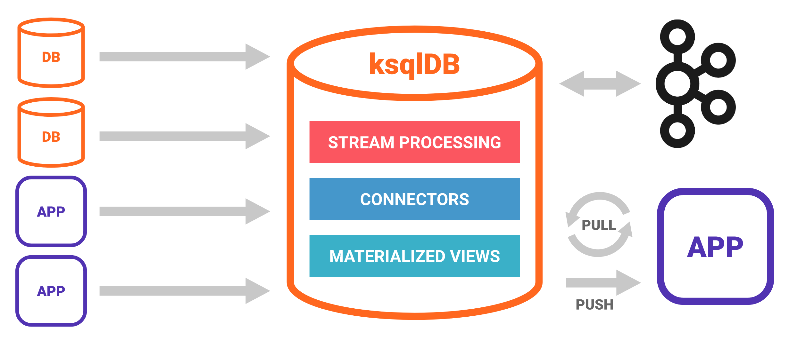

ksqlDB is built on these conceptual pillars:

- [Collections: streams and tables](#collections-streams-and-tables)
- [Events: facts with timestamps](#events-facts-with-timestamps)
- [Queries: ask questions about materialized views](#queries-ask-questions-about-materialized-views)
- [Stream Processing: handle events in real time](#stream-processing-handle-events-in-real-time)
- [Materialized Views: enable efficient queries](#materialized-views-enable-efficient-queries)
- [Functions: enhance queries with built-in and custom logic](#functions-enhance-queries-with-built-in-and-custom-logic)
- [Connectors: get data in and send data out](#connectors-get-data-in-and-send-data-out)
- [Schemas: define the structure of your event data](#schemas-define-the-structure-of-your-event-data)

More in the **Concepts** section:

- [Architecture](ksqldb-architecture.md)
- [Kafka Streams and kslDB](ksqldb-and-kafka-streams.md)
- [Time and Windows](time-and-windows-in-ksqldb-queries.md)

Collections: streams and tables
-------------------------------

[Collections](collections/index.md)

Events: facts with timestamps
-----------------------------

[Events](events.md)

Queries: ask questions about materialized views
-----------------------------------------------

[Queries](queries/index.md)

Stream Processing: handle events in real time
------------------------------------------------

[Stream Processing](stream-processing.md)

Materialized Views: enable efficient queries
--------------------------------------------

[Materialized Views](materialized-views.md)

Functions: enhance queries with built-in and custom logic
---------------------------------------------------------

[Functions](functions.md)

Connectors: get data in and send data out
-----------------------------------------

[Connectors](connectors.md)

Schemas: define the structure of your event data
------------------------------------------------

[Schemas](schemas.md)

Page last revised on: {{ git_revision_date }}
