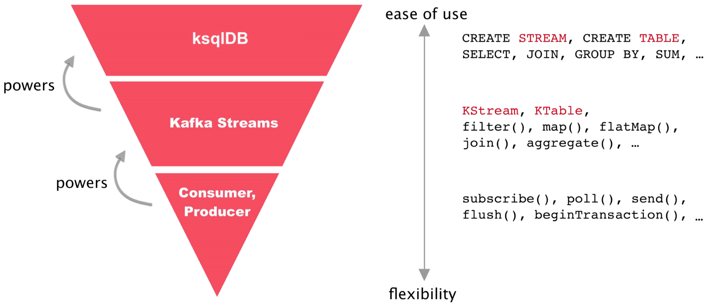

ksqlDB is the streaming database for {{ site.aktm }}. With ksqlDB, you can
write event streaming applications by using a lightweight SQL syntax.

{{ site.kstreams }} is the {{ site.ak }} library for writing streaming
applications and microservices in Java and Scala.

ksqlDB is built on {{ site.kstreams }}, a robust stream processing framework
that is part of {{ site.ak }}.



ksqlDB gives you a query layer for building event streaming applications on
{{ site.ak }} topics. ksqlDB abstracts away much of the complex programming
that's required for real-time operations on streams of data, so that one line
of SQL can do the work of a dozen lines of Java or Scala.

For example, to implement simple fraud-detection logic on a {{ site.ak }} topic
named `payments`, you could write one line of SQL:

```sql
CREATE STREAM fraudulent_payments AS
 SELECT fraudProbability(data) FROM payments
 WHERE fraudProbability(data) > 0.8
 EMIT CHANGES;
```

The equivalent Scala code on {{ site.kstreams }} might resemble:

```scala
// Example fraud-detection logic using the Kafka Streams API.
object FraudFilteringApplication extends App {

  val builder: StreamsBuilder = new StreamsBuilder()
  val fraudulentPayments: KStream[String, Payment] = builder
    .stream[String, Payment]("payments-kafka-topic")
    .filter((_ ,payment) => payment.fraudProbability > 0.8)
  fraudulentPayments.to("fraudulent-payments-topic")

  val config = new java.util.Properties 
  config.put(StreamsConfig.APPLICATION_ID_CONFIG, "fraud-filtering-app")
  config.put(StreamsConfig.BOOTSTRAP_SERVERS_CONFIG, "kafka-broker1:9092")

  val streams: KafkaStreams = new KafkaStreams(builder.build(), config)
  streams.start()
}
```

ksqlDB is easier to use, and {{ site.kstreams }} is more flexible. Which
technology you choose for your real-time streaming applications depends
on a number of considerations. Keep in mind that you can use both ksqlDB
and {{ site.kstreams }} together in your implementations.

Differences Between ksqlDB and Kafka Streams
--------------------------------------------

The following table summarizes some of the differences between ksqlDB and
{{ site.kstreams }}.

|    Differences    |                   ksqlDB                    |                    {{ site.kstreams }}                    |
| ----------------- | ------------------------------------------- | --------------------------------------------------------- |
| You write:        | SQL statements                              | JVM applications                                          |
| Graphical UI      | Yes, in {{ site.c3 }} and {{ site.ccloud }} | No                                                        |
| Console           | Yes                                         | No                                                        |
| Data formats      | Avro, JSON, CSV                             | Any data format, including Avro, JSON, CSV, Protobuf, XML |
| REST API included | Yes                                         | No, but you can implement your own                        |
| Runtime included  | Yes, the ksqlDB server                      | Applications run as standard JVM processes                |
| Queryable state   | No                                          | Yes                                                       |

Developer Workflows
-------------------

There are different workflows for ksqlDB and {{ site.kstreams }} when you
develop streaming applications.

- ksqlDB: You write SQL queries interactively and view the results in
real-time, either in the ksqlDB CLI or in {{ site.c3 }}. You can save
a .sql file and deploy it to production as a "headless"
application, which runs without a GUI, CLI, or REST interface on
ksqlDB servers.
- {{ site.kstreams }}: You write code in Java or Scala, recompile, and run
and test the application in an IDE, like IntelliJ. You deploy the
application to production as a jar file that runs in a {{ site.ak }} cluster.

ksqlDB and Kafka Streams: Where to Start?
-----------------------------------------

Use the following table to help you decide between ksqlDB and Kafka
Streams as a starting point for your real-time streaming application
development.


|                                                    Start with ksqlDB when...                                                    |                                                                          Start with {{ site.kstreams }} when...                                                                          |
| ------------------------------------------------------------------------------------------------------------------------------- | ---------------------------------------------------------------------------------------------------------------------------------------------------------------------------------------- |
| New to streaming and {{ site.ak }}                                                                                              | Prefer writing and deploying JVM applications like Java and Scala; for example, due to people skills, tech environment                                                                   |
| To quicken and broaden the adoption and value of {{ site.ak }} in your organization                                             | Use case is not naturally expressible through SQL, for example, finite state machines                                                                                                    |
| Prefer an interactive experience with UI and CLI                                                                                | Building microservices                                                                                                                                                                   |
| Prefer SQL to writing code in Java or Scala                                                                                     | Must integrate with external services, or use 3rd-party libraries (but ksqlDB user defined functions(UDFs) may help)                                                                     |
| Use cases include enriching data; joining data sources; filtering, transforming, and masking data; identifying anomalous events | To customize or fine-tune a use case, for example, with the {{ site.kstreams }} Processor API: custom join variants, or probabilistic counting at very large scale with Count-Min Sketch |
| Use case is naturally expressible by using SQL, with optional help from UDFs                                                    | Need queryable state, which ksqlDB doesn't support                                                                                                                                       |
| Want the power of {{ site.kstreams }} but you aren't on the JVM: use the ksqlDB REST API from Python, Go, C#, JavaScript, shell |                                                                                                                                                                                          |

Usually, ksqlDB isn't a good fit for BI reports, ad-hoc querying, or
queries with random access patterns, because it's a continuous query
system on data streams.

To get started with ksqlDB, try the [Tutorials and Examples](../tutorials/index.md).

To get started with {{ site.kstreams }}, try the
[Streams Quick Start](https://docs.confluent.io/current/streams/quickstart.html).

Next Steps
----------

-   [Write Streaming Queries Against {{ site.aktm }} Using ksqlDB](../tutorials/basics-docker.md)
-   [ksqlDB Developer Guide](../developer-guide/index.md)
-   [Streams Developer Guide](https://docs.confluent.io/current/streams/developer-guide/index.html)

Page last revised on: {{ git_revision_date }}
