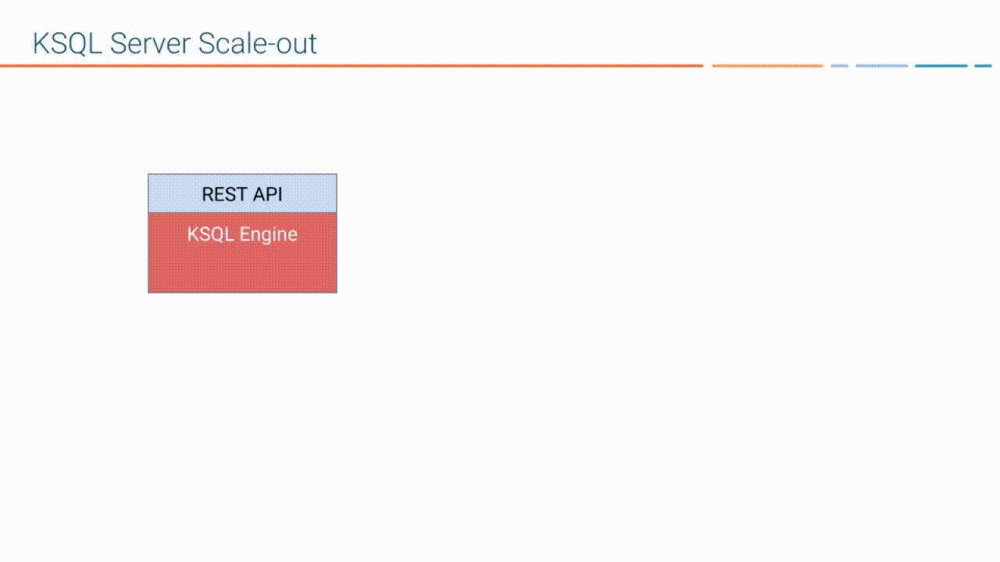
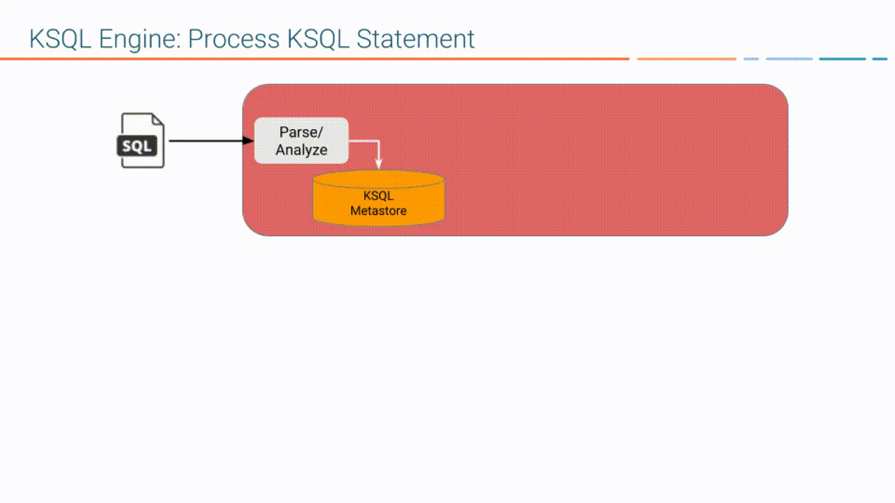
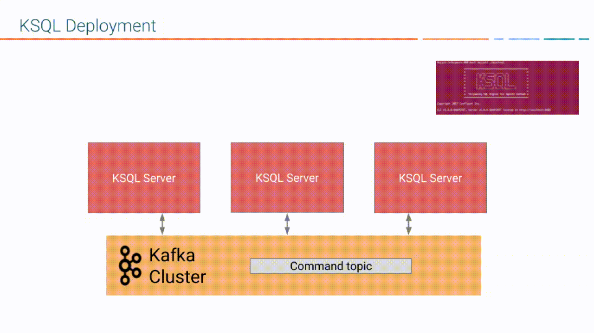
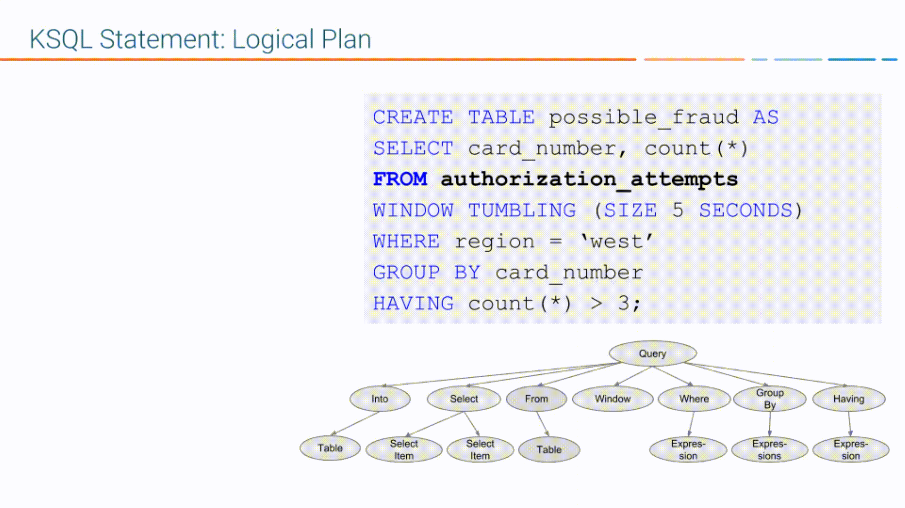

You can use ksqlDB to build event streaming applications from {{ site.aktm }}
topics by using only SQL statements and queries. ksqlDB is built on
{{ site.kstreams }}, so a ksqlDB application communicates with a {{ site.ak }}
cluster like any other {{ site.kstreams }} application.

ksqlDB Components
-----------------

ksqlDB has these main components:

- ksqlDB engine -- processes SQL statements and queries
- REST interface -- enables client access to the engine
- ksqlDB CLI -- console that provides a command-line interface (CLI)to the engine
- ksqlDB UI -- enables developing ksqlDB applications in {{ site.c3 }} and {{ site.ccloud }} 

ksqlDB Server comprises the ksqlDB engine and the REST API. ksqlDB Server
instances communicate with a {{ site.ak }} cluster, and you can add more of
them as necessary without restarting your applications.


- ksqlDB Engine: The ksqlDB engine executes SQL statements and queries. You
define your application logic by writing SQL statements, and the engine
builds and runs the application on available ksqlDB servers. Each ksqlDB
Server instance runs a ksqlDB engine. Under the hood, the engine
parses your SQL statements and builds corresponding Kafka Streams
topologies. The ksqlDB engine is implemented in the
[KsqlEngine.java](https://github.com/confluentinc/ksql/blob/master/ksql-engine/src/main/java/io/confluent/ksql/engine/KsqlEngine.java)
class.
- ksqlDB CLI: The ksqlDB CLI provides a console with a command-line interface for
the ksqlDB engine. Use the ksqlDB CLI to interact with ksqlDB Server
instances and develop your streaming applications. The ksqlDB CLI is
designed to be familiar to users of MySQL, Postgres, and similar
applications. The ksqlDB CLI is implemented in the
[io.confluent.ksql.cli](https://github.com/confluentinc/ksql/tree/master/ksql-cli/src/main/java/io/confluent/ksql/cli)
package.
- REST Interface: The REST server interface enables communicating with the ksqlDB engine
from the CLI, {{ site.c3 }}, or from any other REST client. For more
information, see [ksqlDB REST API Reference](../developer-guide/api.md). The ksqlDB REST server is implemented in the
[KsqlRestApplication.java](https://github.com/confluentinc/ksql/blob/master/ksql-rest-app/src/main/java/io/confluent/ksql/rest/server/KsqlRestApplication.java)
class.

When you deploy your ksqlDB application, it runs on ksqlDB Server instances
that are independent of one another, are fault-tolerant, and can be scaled
with load. For more information, see
[ksqlDB Deployment Modes](#ksqldb-deployment-modes).



ksqlDB and Kafka Streams
------------------------

ksqlDB is built on {{ site.kstreams }}, a robust stream processing framework
that is part of {{ site.aktm }}. You can use ksqlDB and {{ site.kstreams }}
together in your event streaming applications. For more information on
their relationship, see [ksqlDB and Kafka Streams](ksqldb-and-kafka-streams.md).
For more information on {{ site.kstreams }}, see
[Streams Architecture](https://docs.confluent.io/current/streams/architecture.html).

Also, you can implement custom logic and aggregations in your ksqlDB
applications by implementing user defined functions (UDFs) in Java. For more
information, see
[Custom Function Reference](functions.md).

ksqlDB Language Elements
----------------------

Like traditional relational databases, ksqlDB supports two categories of
statements: Data Definition Language (DDL) and Data Manipulation
Language (DML).

These categories are similar in syntax, data types, and expressions, but
they have different functions in ksqlDB Server.

### Data Definition Language (DDL) Statements

Imperative verbs that define metadata on the ksqlDB Server by adding,
changing, or deleting streams and tables. Data Definition Language
statements modify metadata only and don't operate on data. You can
use these statements with declarative DML statements.

The DDL statements include:

-   CREATE STREAM
-   CREATE TABLE
-   DROP STREAM
-   DROP TABLE
-   CREATE STREAM AS SELECT (CSAS)
-   CREATE TABLE AS SELECT (CTAS)

### Data Manipulation Language (DML) Statements

Declarative verbs that read and modify data in ksqlDB streams and
tables. Data Manipulation Language statements modify data only and
don't change metadata. The ksqlDB engine compiles DML statements into
{{ site.kstreams }} applications, which run on a {{ site.ak }} cluster
like any other {{ site.kstreams }} application.

The DML statements include:

-   SELECT
-   INSERT INTO
-   INSERT INTO VALUES
-   CREATE STREAM AS SELECT (CSAS)
-   CREATE TABLE AS SELECT (CTAS)

The CSAS and CTAS statements occupy both categories, because they
perform both a metadata change, like adding a stream, and they
manipulate data, by creating a derivative of existing records.

For more information, see
[ksqlDB Syntax Reference](../developer-guide/syntax-reference.md).

ksqlDB Deployment Modes
-----------------------

You can use these modes to deploy your ksqlDB streaming applications:

- **Interactive:** data exploration and pipeline development
- **Headless:** long-running production environments

In both deployment modes, ksqlDB enables distributing the processing load
for your ksqlDB applications across all ksqlDB Server instances, and you can
add more ksqlDB Server instances without restarting your applications.

!!! note
	All servers that run in a ksqlDB cluster must use the same deployment mode.

### Interactive Deployment

Use the interactive mode to develop your ksqlDB applications. When you
deploy a ksqlDB server in interactive mode, the REST interface is
available for the ksqlDB CLI and {{ site.c3 }} to connect to.


In interactive mode, you can:

-   Write statements and queries on the fly
-   Start any number of server nodes:
    `<path-to-confluent>/bin/ksql-server-start`
-   Start one or more CLIs or REST Clients and point them to a server:
    `<path-to-confluent>/bin/ksql https://<ksql-server-ip-address>:8090`

#### Command Topic

In interactive mode, ksqlDB shares statements with servers in the cluster
over the *command topic*. The command topic stores every SQL statement,
along with some metadata that ensures the statements are built
compatibly across ksqlDB restarts and upgrades. ksqlDB names the command
topic `_confluent-ksql-<service id>command_topic`, where `<service id>`
is the value in the `ksql.service.id` property.

By convention, the `ksql.service.id` property should end with a
separator character of some form, for example a dash or underscore, as
this makes the topic name easier to read.

### Headless Deployment

Use headless mode to deploy your ksqlDB application to a production
environment. When you deploy a ksqlDB Server in headless mode, the REST
interface isn't available, so you assign workloads to ksqlDB clusters by
using a SQL file. The SQL file contains the SQL statements and queries
that define your application. Headless mode is ideal for streaming ETL
application deployments.


In headless mode you can:

-   Start any number of server nodes
-   Pass a SQL file with SQL statements to execute:
    `<path-to-confluent>bin/ksql-node query-file=path/to/myquery.sql`
-   Version-control your queries and transformations as code
-   Ensure resource isolation
-   Leave resource management to dedicated systems, like Kubernetes

!!! note
	Headless mode deployments don't have a command topic.

#### Config Topic

In headless mode, you supply SQL statements to each server in its SQL
file. But ksqlDB still needs to store some internal metadata to ensure
that it builds queries compatibly across restarts and upgrades. ksqlDB
stores this metadata in an internal topic called the *config topic*.
ksqlDB names the config topic `_confluent-ksql-<service id>_configs`,
where `<service id>` is the value in the `ksql.service.id` property.

### Supported Operations in Headless and Interactive Modes

The following table shows which SQL operations are supported in
headless and interactive deployments.

|                                     SQL Operation                                     |     Interactive ksqlDB      |   Headless ksqlDB   |
| ------------------------------------------------------------------------------------- | --------------------------- | ------------------- |
| Describe a stream or table, including runtime stats (DESCRIBE, DESCRIBE EXTENDED)     | Supported                   | Not Supported       |
| Explain a query, including runtime stats (EXPLAIN)                                    | Supported                   | Not Supported       |
| CREATE a stream or table                                                              | Supported                   | Supported           |
| DROP a stream or table                                                                | Supported                   | Not Supported       |
| List existing streams and tables (SHOW STREAMS, SHOW TABLES)                          | Supported                   | Not Supported       |
| List running queries (SHOW QUERIES)                                                   | Supported                   | Not Supported       |
| Run a script (RUN SCRIPT)                                                             | Supported                   | Not Supported       |
| Set query properties (SET)                                                            | Supported                   | Supported           |
| Show contents of a Kafka topic (PRINT)                                                | Supported                   | Not Supported       |
| Show contents of a stream or table (SELECT)                                           | Supported                   | Not Supported       |
| Show properties of a query (SHOW PROPERTIES)                                          | Supported                   | Not Supported       |
| Show results of a query (SELECT)                                                      | Supported                   | Not Supported       |
| TERMINATE a query                                                                     | Supported                   | Not Supported       |
| Start and stop a ksqlDB Server instance                                               | Not with ksqlDB API         | Not with ksqlDB API |
| Cleanup and delete internal data (internal topics) of a ksqlDB cluster or application | Supported (ksqlDB REST API) | Not with ksqlDB API |

!!! note
	You can perform operations listed as "Not with ksqlDB API" manually.
    Also, you can use deployment tools, like Kubernetes or Ansible, and you
    can use the {{ site.ak }} tools, like `kafka-delete-records`.

Dedicating Resources
--------------------

Join ksqlDB engines to the same *service pool* by using the `ksql.service.id`
property. The following diagram shows a {{ site.ak }} cluster with separate
workloads for a `finance` pool and a `sales` pool. For more information, see
[ksql.service.id](../operate-and-deploy/installation/server-config/config-reference.md#ksqlserviceid).


To scale out, just add more ksqlDB server instances. There's no master
node or coordination among them required. For more information, see
[Capacity Planning](../operate-and-deploy/capacity-planning.md).

ksqlDB Query Lifecycle
----------------------

To create a streaming application with ksqlDB, you write SQL statements
and queries. Each statement and query has a lifecycle with the following
steps:

1.  You
    [register a ksqlDB stream or table](#register-the-stream)
    from an existing Kafka topic with a DDL statement, like
    `CREATE STREAM <my-stream> WITH <topic-name>`.
2.  You
    [express your app](#express-your-application-as-a-sql-statement)
    by using a SQL statement, like
    `CREATE TABLE AS SELECT FROM <my-stream>`.
3.  ksqlDB
    [parses your statement](#ksqldb-parses-your-statement)
    into an abstract syntax tree (AST).
4.  ksqlDB uses the AST and
    [creates the logical plan](#ksqldb-creates-the-logical-plan)
    for your statement.
5.  ksqlDB uses the logical plan and
    [creates the physical plan](#ksqldb-creates-the-physical-plan)
    for your statement.
6.  ksqlDB generates and runs the {{ site.kstreams }} application.
7.  You manage the application as a STREAM or TABLE with its
    corresponding persistent query.



### Register the Stream

Register a stream or table by using the DDL statements, CREATE STREAM
and CREATE TABLE. For example, the following SQL statement creates a
stream named `authorization_attempts` that's backed by a topic named
`authorizations`.

```sql
CREATE STREAM authorization_attempts
  (card_number VARCHAR, attemptTime BIGINT, ...)
  WITH (kafka_topic='authorizations', value_format=‘JSON’); 
```

ksqlDB writes DDL and DML statements to the *command topic*. Each ksqlDB
Server reads the statement from the command topic, parsing and analyzing
it.



The CREATE STREAM statement is a DDL statement, so the action is to
update the ksqlDB metadata.

Each ksqlDB Server has an internal, in-memory metadata store, or
*metastore*, that it builds as it receives DDL statements. The metastore
is an in-memory map. For each new DDL statement, the ksqlDB engine adds an
entry to the metastore.

For example, the metastore entry for the previous CREATE STREAM
statement might resemble:

|      Source Name       |                                                                 Structured Data Source                                                                  |     |
| ---------------------- | ------------------------------------------------------------------------------------------------------------------------------------------------------- | --- |
| AUTHORIZATION_ATTEMPTS | [DataSourceType: STREAM], [Schema:(card_number VARCHAR, attemptTime BIGINT, attemptRegion VARCHAR, ...)], [Key: null], [KsqlTopic: AUTHORIZATIONS], ... |     |
|                        |                                                                                                                                                         |     |

The ksqlDB metastore is implemented in the
[io.confluent.ksql.metastore](https://github.com/confluentinc/ksql/tree/master/ksql-metastore/src/main/java/io/confluent/ksql/metastore)
package.

### Express Your Application as a SQL Statement

Now that you have a stream, express your application's business logic
by using a SQL statement. The following DML statement creates a
`possible_fraud` table from the `authorization_attempts` stream:

```sql
CREATE TABLE possible_fraud AS
  SELECT card_number, count(*)
  FROM authorization_attempts
  WINDOW TUMBLING (SIZE 5 SECONDS)
  WHERE region = ‘west’
  GROUP BY card_number
  HAVING count(*) > 3
  EMIT CHANGES;
```

The ksqlDB engine translates the DML statement into a {{ site.kstreams }}
application. The application reads the source topic continuously, and
whenever the `count(*) > 3` condition is met, it writes records to the
`possible_fraud` table.

### ksqlDB Parses Your Statement

To express your DML statement as a {{ site.kstreams }} application, the ksqlDB
engine starts by parsing the statement. The parser creates an abstract
syntax tree (AST). The ksqlDB engine uses the AST to plan the query.

The SQL statement parser is based on [ANTLR](https://www.antlr.org/)
and is implemented in the
[io.confluent.ksql.parser](https://github.com/confluentinc/ksql/tree/master/ksql-parser/src/main)
package.

### ksqlDB Creates the Logical Plan

The ksqlDB engine creates the logical plan for the query by using the AST.
For the previous `possible_fraud` statement, the logical plan has the
following steps:

1.  Define the source -- FROM node
2.  Apply the filter -- WHERE clause
3.  Apply aggregation -- GROUP BY
4.  Project -- WINDOW
5.  Apply post-aggregation filter -- HAVING, applied to the result of
    GROUP BY
6.  Project -- for the result



### ksqlDB Creates the Physical Plan

From the logical plan, the ksqlDB engine creates the physical plan, which
is a {{ site.kstreams }} DSL application with a schema.

The generated code is based on the ksqlDB classes, `SchemaKStream` and
`SchemaKTable`:

-   A ksqlDB stream is rendered as a
    [SchemaKStream](https://github.com/confluentinc/ksql/blob/master/ksql-engine/src/main/java/io/confluent/ksql/structured/SchemaKStream.java)
    instance, which is a
    [KStream](https://docs.confluent.io/current/streams/javadocs/org/apache/kafka/streams/kstream/KStream.html)
    with a
    [Schema](https://kafka.apache.org/20/javadoc/org/apache/kafka/connect/data/Schema.html).
-   A ksqlDB table is rendered as a
    [SchemaKTable](https://github.com/confluentinc/ksql/blob/master/ksql-engine/src/main/java/io/confluent/ksql/structured/SchemaKTable.java)
    instance, which is a
    [KTable](https://docs.confluent.io/current/streams/javadocs/org/apache/kafka/streams/kstream/KTable.html)
    with a
    [Schema](https://kafka.apache.org/20/javadoc/org/apache/kafka/connect/data/Schema.html).
-   Schema awareness is provided by the
    [SchemaRegistryClient](https://github.com/confluentinc/schema-registry/blob/master/client/src/main/java/io/confluent/kafka/schemaregistry/client/SchemaRegistryClient.java)
    class.

The ksqlDB engine traverses the nodes of the logical plan and emits
corresponding {{ site.kstreams }} API calls:

1.  Define the source -- a `SchemaKStream` or `SchemaKTable` with info
    from the ksqlDB metastore
2.  Filter -- produces another `SchemaKStream`
3.  Project -- `select()` method
4.  Apply aggregation -- Multiple steps: `rekey()`, `groupby()`, and
    `aggregate()` methods. ksqlDB may re-partition data if it's not keyed
    with a GROUP BY phrase.
5.  Filter -- `filter()` method
6.  Project -- `select()` method for the result


If the DML statement is CREATE STREAM AS SELECT or CREATE TABLE AS
SELECT, the result from the generated {{ site.kstreams }} application is a
persistent query that writes continuously to its output topic until the
query is terminated.

Page last revised on: {{ git_revision_date }}
