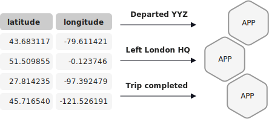

A push query is a form of query issued by a client that subscribes to a result
as it changes in real-time. A good example of a push query is subscribing to a
particular user's geographic location. The query requests the map coordinates,
and because it's a push query, any change to the location is "pushed" over a
long-lived connection to the client as soon as it occurs. This is useful for
building programmatically controlled microservices, real-time apps, or any sort
of asynchronous control flow.

Push queries are expressed using a SQL-like language. They can be used to query
either streams or tables for a particular key. Also, push queries aren't limited
to key look-ups. They support a full set of SQL, including filters, selects,
group bys, partition bys, and joins.

Push queries enable you to query a materialized view with a subscription to
the results. Push queries emit refinements to materialized views, which enable
reacting to new information in real-time. They’re a good fit for asynchronous
application flows. For request/response flows, see [Pull Query](pull.md).

Execute a push query by sending an HTTP request to the ksqlDB REST API, and
the API sends back a chunked response of indefinite length.

The result of a push query isn't persisted to a backing {{ site.ak }} topic.

Example push query
==================

Specify a push query by using the EMIT CHANGES clause in a SELECT statement.
The following statement shows how to select five events from a `pageviews`
stream.  

```sql
SELECT * FROM pageviews EMIT CHANGES LIMIT 5;
```

API Reference
=============

- [SELECT (Push Query)](../../developer-guide/ksqldb-reference/select-push-query.md)
- [SELECT (Pull Query)](../../developer-guide/ksqldb-reference/select-pull-query.md)

Page last revised on: {{ git_revision_date }}