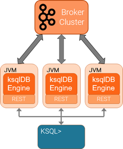

ksqlDB is a component of {{ site.cp }} and the ksqlDB binaries are located
at [Confluent Downloads](https://www.confluent.io/download/)
as a part of the {{ site.cp }} bundle.

ksqlDB must have access to a running {{ site.aktm }} cluster, which can
be in your data center, in a public cloud, {{ site.ccloud }}, etc.

Docker support
--------------

You can deploy ksqlDB by using
[Docker containers](install-ksqldb-with-docker.md).
Starting with {{ site.cp }} 4.1.2, Confluent maintains images at
[Docker Hub](https://hub.docker.com/r/confluentinc/cp-ksql-server/).
To start ksqlDB containers in configurations like "ksqlDB Headless
Server" and "Interactive Server with Interceptors", see
[Docker Configuration Parameters](https://docs.confluent.io/current/installation/docker/config-reference.html).

Watch the
[screencast of Installing and Running KSQL](https://www.youtube.com/embed/icwHpPm-TCA).

Supported Versions and Interoperability
---------------------------------------

You can use ksqlDB with compatible {{ site.cp }} and {{ site.aktm }}
versions.

|    ksqlDB version     | {{ site.version }} |
| --------------------- | ------------------ |
| Apache Kafka version  | 0.11.0 and later   |
| {{ site.cp }} version | > 3.3.0 and later  |

Installation Instructions
-------------------------

Follow the instructions at
[Confluent Platform Quick Start (Local)](https://docs.confluent.io/current/quickstart/ce-quickstart.html).

Also, you can install ksqlDB individually by using the
[confluent-ksql package](https://docs.confluent.io/current/installation/available_packages.html#confluent-ksql).
For more information, see
[Confluent Platform Packages](https://docs.confluent.io/current/installation/available_packages.html).

Scale Your ksqlDB Server Deployment
---------------------------------

You can scale ksqlDB by adding more capacity per server (vertically) or by
adding more servers (horizontally). Also, you can scale ksqlDB clusters
during live operations without loss of data. For more information, see
[Scaling ksqlDB](../capacity-planning.md#scaling-ksqldb).

Start the ksqlDB Server
-----------------------

The ksqlDB servers are run separately from the ksqlDB CLI client and {{ site.ak }}
brokers. You can deploy servers on remote machines, VMs, or containers,
and the CLI connects to these remote servers.

You can add or remove servers from the same resource pool during live
operations, to scale query processing. You can use different resource pools
to support workload isolation. For example, you could deploy separate pools
for production and for testing.

You can only connect to one ksqlDB server at a time. The ksqlDB CLI does not
support automatic failover to another ksqlDB Server.



Follow these instructions to start ksqlDB Server using the
`ksql-server-start` script.

!!! tip
	These instructions assume you are installing {{ site.cp }} by using ZIP
    or TAR archives. For more information, see [On-Premises
    Deployments](https://docs.confluent.io/current/installation/installing_cp/index.html).

### Specify your ksqlDB server configuration parameters

Specify the configuration parameters for your ksqlDB server. You can also set
any property for the Kafka Streams API, the Kafka producer, or the Kafka
consumer. The required parameters are `bootstrap.servers` and `listeners`.
You can specify the parameters in the ksqlDB properties file or the `KSQL_OPTS`
environment variable. Properties set with `KSQL_OPTS` take precedence over
those specified in the properties file.

A recommended approach is to configure a common set of properties
using the ksqlDB configuration file and override specific properties
as needed, using the `KSQL_OPTS` environment variable.

Here are the default settings:

```
    bootstrap.servers=localhost:9092
    listeners=http://0.0.0.0:8088
```

For more information, see [Configuring ksqlDB Server](server-config/index.md).

### Start a ksqlDB Server node

Start a server node by using the following command:

```bash
<path-to-confluent>/bin/ksql-server-start <path-to-confluent>/etc/ksql/ksql-server.properties
```

!!! tip
	You can view the ksqlDB server help text by running
    `<path-to-confluent>/bin/ksql-server-start --help`.

Have a look at [this page](server-config/index.md#non-interactive-headless-ksqldb-usage)
for instructions on running ksqlDB in non-interactive, "headless"
mode.

Start the ksqlDB CLI
--------------------

The ksqlDB CLI is a client that connects to the ksqlDB servers.

You can start the ksqlDB CLI by providing the connection information to
the ksqlDB server.

```bash
LOG_DIR=./ksql_logs <path-to-confluent>/bin/ksql http://localhost:8088
```

!!! important
	By default ksqlDB attempts to store its logs in a directory called `logs`
    that is relative to the location of the `ksql` executable. For example,
    if `ksql` is installed at `/usr/local/bin/ksql`, then it would attempt
    to store its logs in `/usr/local/logs`. If you are running `ksql` from
    the default {{ site.cp }} location, `<path-to-confluent>/bin`, you must
    override this default behavior by using the `LOG_DIR` variable.

After ksqlDB is started, your terminal should resemble this.

```
                  ===========================================
                  =       _              _ ____  ____       =
                  =      | | _____  __ _| |  _ \| __ )      =
                  =      | |/ / __|/ _` | | | | |  _ \      =
                  =      |   <\__ \ (_| | | |_| | |_) |     =
                  =      |_|\_\___/\__, |_|____/|____/      =
                  =                   |_|                   =
                  =  Event Streaming Database purpose-built =
                  =        for stream processing apps       =
                  ===========================================

Copyright 2017-2019 Confluent Inc.

CLI v{{ site.release }}, Server v{{ site.release }} located at http://ksqldb-server:8088

Having trouble? Type 'help' (case-insensitive) for a rundown of how things work!

ksql>
```

!!! tip
        You can view the ksqlDB CLI help text by running
        `<path-to-confluent>/bin/ksql --help`.

Configure ksqlDB for Confluent Cloud
------------------------------------

You can use ksqlDB with a {{ site.ak }} cluster in {{ site.ccloud }}. For more
information, see
[Connect ksqlDB to Confluent Cloud](https://docs.confluent.io/current/cloud/connect/ksql-cloud-config.html).

Page last revised on: {{ git_revision_date }}
