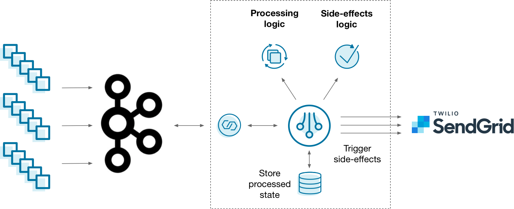

What is it?
-----------

An event-driven microservice is a pattern in which a piece of code only communicates with the outside world through messages called events. This technique can dramatically simplify an architecture because each microservice only receives and emits information from clearly defined communication channels. Because state is localized within each microservice, complexity is tightly contained.

{: class="centered-img" style="width: 90%"}

A common way that you might implement this architecture is to feed event streams into Kafka, read them with a stream processing framework, and trigger side-effects whenever something of interest happens — like sending an email with [Mailgun](https://www.mailgun.com/). This works, but it's up to you to blend your stream processing, state, and side-effects logic in a maintainable way. Is there a better approach?

Why ksqlDB?
-----------

Scaling stateful services is challenging. Coupling a stateful service with the responsibility of triggering side-effects makes it even harder. It’s up to you to manage both as if they were one, even though they might have completely different needs. If you want to change how side-effects behave, you also need to redeploy your stateful stream processor. ksqlDB helps simplify this by splitting things up: stateful stream processing is managed on a cluster of servers, while side-effects run inside your stateless application.

{: class="centered-img" style="width: 70%"}

Using ksqlDB, you can isolate complex stateful operations within ksqlDB’s runtime. Your app stays simple because it is stateless. It merely reads events from a Kafka topic and executes side-effects as needed.

Implement it
------------

Imagine that you work at a financial services company which clears many credit card transactions each day. You want to prevent malicious activity in your customer base. When a high number of transactions occurs in a narrow window of time, you want to notify the cardholder of suspicious activity.

This tutorial shows how to create an event-driven microservice that identifies suspicious activity and notifies customers. It demonstrates finding anomolies with ksqlDB and sending alert emails using a Kafka client with Mailgun.

### Start the stack

```yaml
---
version: '2'

services:
  zookeeper:
    image: confluentinc/cp-zookeeper:5.4.0
    hostname: zookeeper
    container_name: zookeeper
    ports:
      - "2181:2181"
    environment:
      ZOOKEEPER_CLIENT_PORT: 2181
      ZOOKEEPER_TICK_TIME: 2000

  broker:
    image: confluentinc/cp-enterprise-kafka:5.4.0
    hostname: broker
    container_name: broker
    depends_on:
      - zookeeper
    ports:
      - "29092:29092"
    environment:
      KAFKA_BROKER_ID: 1
      KAFKA_ZOOKEEPER_CONNECT: 'zookeeper:2181'
      KAFKA_LISTENER_SECURITY_PROTOCOL_MAP: PLAINTEXT:PLAINTEXT,PLAINTEXT_HOST:PLAINTEXT
      KAFKA_ADVERTISED_LISTENERS: PLAINTEXT://broker:9092,PLAINTEXT_HOST://localhost:29092
      KAFKA_OFFSETS_TOPIC_REPLICATION_FACTOR: 1
      KAFKA_GROUP_INITIAL_REBALANCE_DELAY_MS: 0
      KAFKA_TRANSACTION_STATE_LOG_MIN_ISR: 1
      KAFKA_TRANSACTION_STATE_LOG_REPLICATION_FACTOR: 1

  schema-registry:
    image: confluentinc/cp-schema-registry:5.4.1
    hostname: schema-registry
    container_name: schema-registry
    depends_on:
      - zookeeper
      - broker
    ports:
      - "8081:8081"
    environment:
      SCHEMA_REGISTRY_HOST_NAME: schema-registry
      SCHEMA_REGISTRY_KAFKASTORE_CONNECTION_URL: 'zookeeper:2181'

  ksqldb-server:
    image: confluentinc/ksqldb-server:0.8.1
    hostname: ksqldb-server
    container_name: ksqldb-server
    depends_on:
      - broker
      - schema-registry
    ports:
      - "8088:8088"
    environment:
      KSQL_LISTENERS: "http://0.0.0.0:8088"
      KSQL_BOOTSTRAP_SERVERS: "broker:9092"
      KSQL_KSQL_SCHEMA_REGISTRY_URL: "http://schema-registry:8081"
      KSQL_KSQL_LOGGING_PROCESSING_STREAM_AUTO_CREATE: "true"
      KSQL_KSQL_LOGGING_PROCESSING_TOPIC_AUTO_CREATE: "true"
      # Configuration to embed Kafka Connect support.
      KSQL_CONNECT_GROUP_ID: "ksql-connect-cluster"
      KSQL_CONNECT_BOOTSTRAP_SERVERS: "broker:9092"
      KSQL_CONNECT_KEY_CONVERTER: "io.confluent.connect.avro.AvroConverter"
      KSQL_CONNECT_VALUE_CONVERTER: "io.confluent.connect.avro.AvroConverter"
      KSQL_CONNECT_KEY_CONVERTER_SCHEMA_REGISTRY_URL: "http://schema-registry:8081"
      KSQL_CONNECT_VALUE_CONVERTER_SCHEMA_REGISTRY_URL: "http://schema-registry:8081"
      KSQL_CONNECT_VALUE_CONVERTER_SCHEMAS_ENABLE: "false"
      KSQL_CONNECT_CONFIG_STORAGE_TOPIC: "ksql-connect-configs"
      KSQL_CONNECT_OFFSET_STORAGE_TOPIC: "ksql-connect-offsets"
      KSQL_CONNECT_STATUS_STORAGE_TOPIC: "ksql-connect-statuses"
      KSQL_CONNECT_CONFIG_STORAGE_REPLICATION_FACTOR: 1
      KSQL_CONNECT_OFFSET_STORAGE_REPLICATION_FACTOR: 1
      KSQL_CONNECT_STATUS_STORAGE_REPLICATION_FACTOR: 1
      KSQL_CONNECT_PLUGIN_PATH: "/usr/share/kafka/plugins"

  ksqldb-cli:
    image: confluentinc/ksqldb-cli:0.8.1
    container_name: ksqldb-cli
    depends_on:
      - broker
      - ksqldb-server
    entrypoint: /bin/sh
    tty: true
```

```
docker-compose up
```

### Create the transactions stream

```
docker exec -it ksqldb-cli ksql http://ksqldb-server:8088
```

```sql
CREATE STREAM transactions (
    email_address VARCHAR,
    card_number VARCHAR,
    tx_id VARCHAR,
    timestamp VARCHAR,
    amount DECIMAL(12, 2)
) WITH (
    kafka_topic = 'transactions',
    key = 'tx_id',
    partitions = 8,
    value_format = 'avro',
    timestamp = 'timestamp',
    timestamp_format = 'yyyy-MM-dd''T''HH:mm:ss'
);
```

### Seed some transaction events

```sql
INSERT INTO transactions (
    email_address, card_number, tx_id, timestamp, amount
) VALUES (
    'michael@example.com',
    '358579699410099',
    'f88c5ebb-699c-4a7b-b544-45b30681cc39',
    '2020-04-22T03:20:00',
    50.25
);

INSERT INTO transactions (
    email_address, card_number, tx_id, timestamp, amount
) VALUES (
    'derek@example.com',
    '352642227248344',
    '0cf100ca-993c-427f-9ea5-e892ef350363',
    '2020-04-25T12:50:30',
    18.97
);

INSERT INTO transactions (
    email_address, card_number, tx_id, timestamp, amount
) VALUES (
    'colin@example.com',
    '373913272311617',
    'de9831c0-7cf1-4ebf-881d-0415edec0d6b',
    '2020-04-19T09:45:15',
    12.50
);

INSERT INTO transactions (
    email_address, card_number, tx_id, timestamp, amount
) VALUES (
    'michael@example.com',
    '358579699410099',
    '044530c0-b15d-4648-8f05-940acc321eb7',
    '2020-04-22T03:19:58',
    103.43
);

INSERT INTO transactions (
    email_address, card_number, tx_id, timestamp, amount
) VALUES (
    'derek@example.com',
    '352642227248344',
    '5d916e65-1af3-4142-9fd3-302dd55c512f',
    '2020-04-25T12:50:25',
    3200.80
);

INSERT INTO transactions (
    email_address, card_number, tx_id, timestamp, amount
) VALUES (
    'derek@example.com',
    '352642227248344',
    'd7d47fdb-75e9-46c0-93f6-d42ff1432eea',
    '2020-04-25T12:51:55',
    154.32
);

INSERT INTO transactions (
    email_address, card_number, tx_id, timestamp, amount
) VALUES (
    'michael@example.com',
    '358579699410099',
    'c5719d20-8d4a-47d4-8cd3-52ed784c89dc',
    '2020-04-22T03:20:10',
    78.73
);

INSERT INTO transactions (
    email_address, card_number, tx_id, timestamp, amount
) VALUES (
    'colin@example.com',
    '373913272311617',
    '2360d53e-3fad-4e9a-b306-b166b7ca4f64',
    '2020-04-19T09:45:35',
    234.65
);

INSERT INTO transactions (
    email_address, card_number, tx_id, timestamp, amount
) VALUES (
    'colin@example.com',
    '373913272311617',
    'de9831c0-7cf1-4ebf-881d-0415edec0d6b',
    '2020-04-19T09:44:03',
    150.00
);
```

### Create the anomalies table

```sql
CREATE TABLE possible_anomalies AS
    SELECT latest_by_offset(email_address) AS email_address,
           card_number,
           count(*) AS n_attempts
    FROM transactions
    WINDOW HOPPING (SIZE 30 SECONDS, ADVANCE BY 5 SECONDS)
    GROUP BY card_number
    HAVING count(*) >= 3 EMIT CHANGES;
```

### Consume the anomaly events

### Running this in production