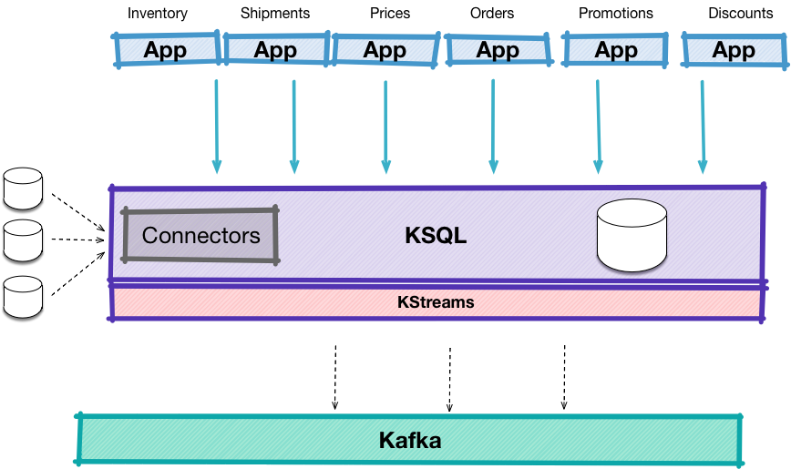

{{ site.kconnectlong }} is an open source component of {{ site.aktm }} that
simplifies loading and exporting data between Kafka and external systems.
ksqlDB provides functionality to manage and integrate with {{ site.kconnect }}:

-   Create Connectors
-   Describe Connectors
-   Import topics created by {{ site.kconnect }} to ksqlDB

API Reference
-------------

- [CREATE CONNECTOR](../developer-guide/ksqldb-reference/create-connector.md)
- [DESCRIBE CONNECTOR](../developer-guide/ksqldb-reference/describe-connector.md)
- [DROP CONNECTOR](../developer-guide/ksqldb-reference/drop-connector.md)
- [SHOW CONNECTORS](../developer-guide/ksqldb-reference/show-connectors.md)

Setup {{ site.kconnect }} Integration
-------------------------------------

There are two ways to deploy the ksqlDB-Connect integration:

1.  **External**: If a {{ site.kconnect }} cluster is available, set the
    `ksql.connect.url` property in your ksqlDB Server configuration file.
    The default value for this is `http://localhost:8083`.
2.  **Embedded**: ksqlDB can double as a {{ site.kconnect }} server and
    will run a
    [Distributed Mode](https://docs.confluent.io/current/connect/userguide.html#distributed-mode)
    cluster co-located on the ksqlDB server instance. To do this, supply a
    connect properties configuration file to the server and specify this
    file in the `ksql.connect.worker.config` property.

!!! note
	For environments that need to share connect clusters and provide
    predictable workloads, running {{ site.kconnect }} externally is the
    recommended deployment option.

### Plugins

ksqlDB doesn't ship with connectors pre-installed, so you must download and
install connectors. A good way to install connectors is by using
[Confluent Hub](https://www.confluent.io/hub/).

Natively Supported Connectors
-----------------------------

While it is possible to create, describe and list connectors of all
types, ksqlDB supports a few connectors natively. ksqlDB provides templates
to ease creation of connectors and custom code to explore topics created by
these connectors into ksqlDB:

-   [Kafka Connect JDBC Connector (Source and Sink)](https://docs.confluent.io/current/connect/kafka-connect-jdbc/index.html):
    because the JDBC connector doesn't populate the key automatically for
    the Kafka messages that it produces, ksqlDB supplies the ability to
    pass in `"key"='<column_name>'` in the `WITH` clause to extract a
    column from the value and make it the key.
