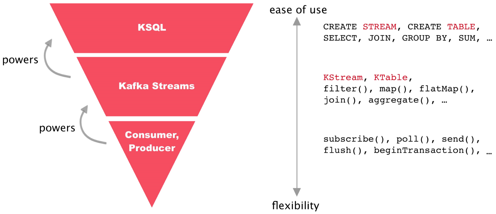

.. _ksql-and-kafka-streams:

KSQL and Kafka Streams
######################

KSQL is the streaming SQL engine for Apache Kafka®. With KSQL, you can write
real-time streaming applications by using a SQL-like query language.

Kafka Streams is the Apache Kafka® library for writing streaming applications
and microservices in Java and Scala.

KSQL is built on Kafka Streams and occupies the top of the stack in |cp|.

KSQL gives you the highest level of abstraction for implementing real-time
streaming business logic on Kafka topics. KSQL automates much of the complex
programming that's required for real-time operations on streams of data, so
that one line of KSQL can do the work of a dozen lines of Java and Kafka
Streams.

For example, to implement simple fraud-detection logic on a Kafka topic named
``payments``, you could write one line of KSQL:

.. code:: sql

    CREATE STREAM fraudulent_payments AS
     SELECT fraudProbability(data) FROM payments
     WHERE fraudProbability(data) > 0.8;

The equivalent Java code on Kafka Streams might resemble: 

.. code:: java

    // Example fraud-detection logic using the Kafka Streams API.
    object FraudFilteringApplication extends App {

      val builder: StreamsBuilder = new StreamsBuilder()
      val fraudulentPayments: KStream[String, Payment] = builder
        .stream[String, Payment]("payments-kafka-topic")
        .filter((_ ,payment) => payment.fraudProbability > 0.8)
      fraudulentPayments.to("fraudulent-payments-topic")

      val config = new java.util.Properties 
      config.put(StreamsConfig.APPLICATION_ID_CONFIG, "fraud-filtering-app")
      config.put(StreamsConfig.BOOTSTRAP_SERVERS_CONFIG, "kafka-broker1:9092")

      val streams: KafkaStreams = new KafkaStreams(builder.build(), config)
      streams.start()
    }

KSQL is easier to use, and Kafka Streams is more flexible. Which technology
you choose for your real-time streaming applications depends on a number of
considerations. Keep in mind that you can use both KSQL and Kafka Streams
together in your implementations.

Differences Between KSQL and Kafka Streams
******************************************

The following table summarizes some of the differences between KSQL and Kafka
Streams. 

+-------------------+----------------------+--------------------------------------------+
| Differences       | KSQL                 | Kafka Streams                              |
+===================+======================+============================================+
| You write:        | KSQL statements      | JVM applications                           |
+-------------------+----------------------+--------------------------------------------+
| Graphical UI      | Yes, in |c3|         | No                                         |
+-------------------+----------------------+--------------------------------------------+
| Console           | Yes                  | No                                         |
+-------------------+----------------------+--------------------------------------------+
| Data formats      | Avro, JSON, CSV      | Any data format, including Avro, JSON,     |
|                   |                      | CSV, Protobuf, XML                         |
+-------------------+----------------------+--------------------------------------------+
| REST API included | Yes                  | No, but you can implement your own         |
+-------------------+----------------------+--------------------------------------------+
| Runtime included  | Yes, the KSQL server | Applications run as standard JVM processes |
+-------------------+----------------------+--------------------------------------------+
| Queryable state   | No                   | Yes                                        |
+-------------------+----------------------+--------------------------------------------+

Developer Workflows
*******************

There are different workflows for KSQL and Kafka Streams when you develop
streaming applications.

KSQL
  You write KSQL queries interactively and view the results in real-time,
  either in the KSQL CLI or in |c3|. You can save a .sql file and deploy it to
  production as a "headless" application, which runs without a GUI, CLI, or REST
  interface on KSQL servers.

Kafka Streams
  You write code in Java or Scala, recompile, and run and test
  the application in an IDE, like IntelliJ. You deploy the application to
  production as a jar file that runs in a Kafka cluster.

KSQL and Kafka Streams: Where to Start?
***************************************

Use the following table to help you decide between KSQL and Kafka Streams as a
starting point for your real-time streaming application development.

+----------------------------------------------------+------------------------------------------------------+
| Start with KSQL when…                              | Start with Kafka Streams when…                       |
+====================================================+======================================================+
| * New to streaming and Kafka                       | * Prefer writing and deploying JVM applications      |
| * To quicken and broaden the adoption              |   like Java and Scala; for example, due to           |
|   and value of Kafka in your organization          |   people skills, tech environment                    |
| * Prefer an interactive experience with UI and CLI | * Use case is not naturally expressible through SQL, |
| * Prefer SQL to writing code in Java or Scala      |   for example, finite state machines                 |
| * Use cases include enriching data; joining        | * Building microservices                             |
|   data sources; filtering, transforming,           | * Must integrate with external services, or          |
|   and masking data; identifying anomalous events   |   use 3rd-party libraries (but KSQL UDFs may help)   |
| * Use case is naturally expressible by using SQL,  | * To customize or fine-tune a use case, for example, |
|   with optional help from User Defined Functions   |   with the Kafka Streams Processor API:              |
| * Want the power of Kafka Streams but you          |   custom join variants, or probabilistic counting at |
|   aren't on the JVM: use the KSQL REST API         |   very large scale with Count-Min Sketch             |
|   from Python, Go, C#, JavaScript, shell           | * Need queryable state, which KSQL doesn't support   |
+----------------------------------------------------+------------------------------------------------------+

Usually, KSQL isn't a good fit for BI reports, ad-hoc querying, or queries with random access patterns,
because it's a continuous query system on data streams.

To get started with KSQL, try the :ref:`ksql_tutorials`.

To get started with Kafka Streams, try the :ref:`streams_quickstart`.  

Next Steps
**********

* :ref:`ksql_quickstart-docker`
* :ref:`ksql-dev-guide`
* :ref:`streams_developer-guide`
