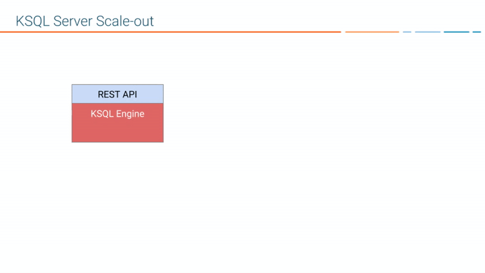
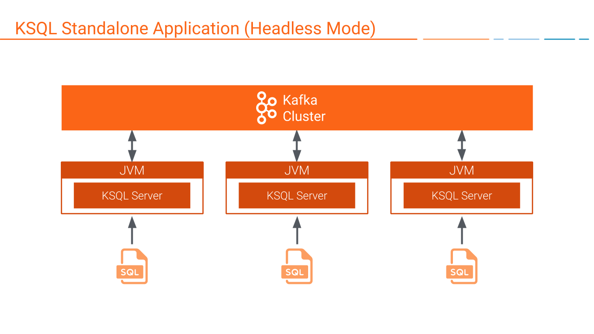
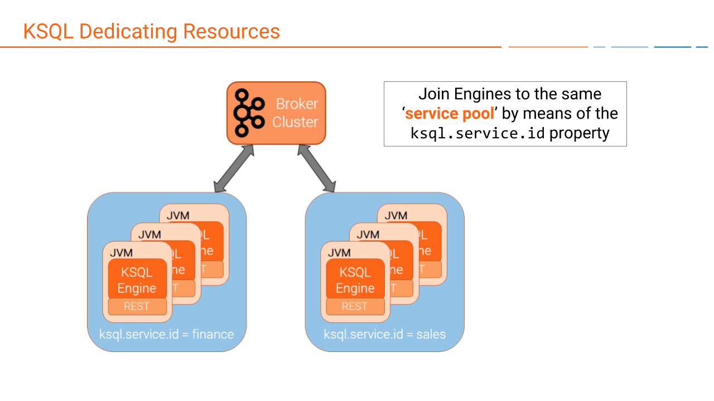
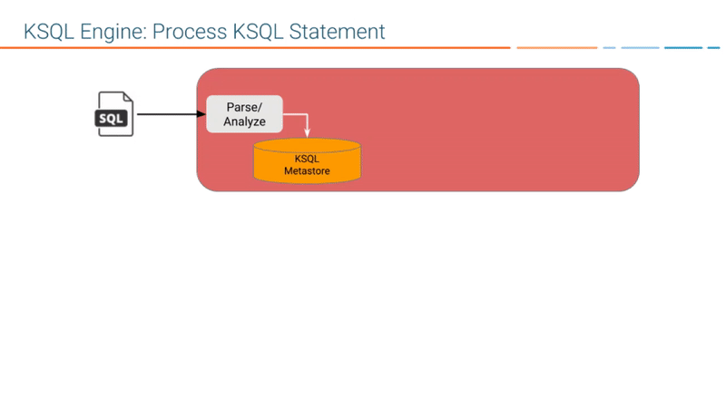
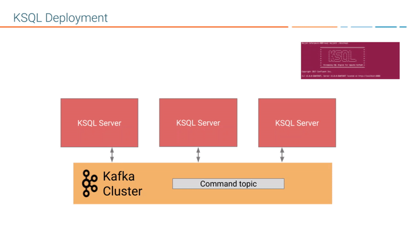
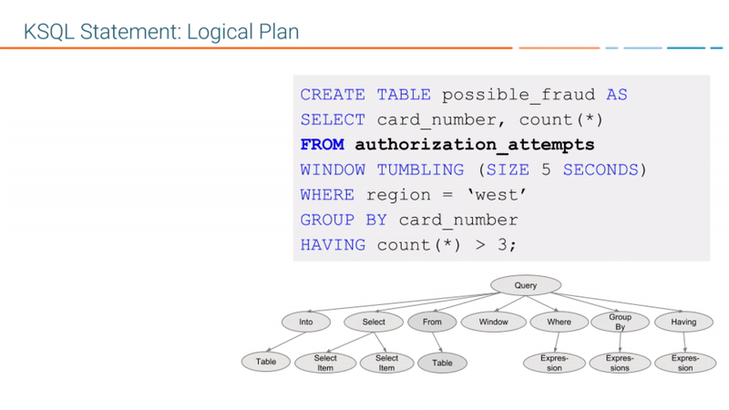
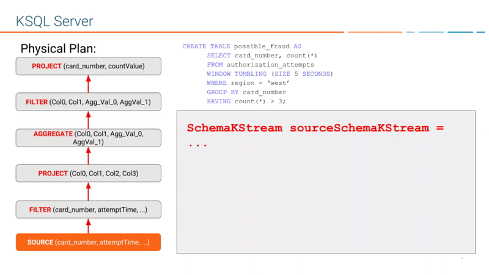

.. _ksql-architecture:

KSQL Architecture
#################

You can use KSQL to build event streaming applications from |ak-tm| topics by
using only SQL statements and queries. KSQL is built on Kafka Streams, so a
KSQL application communicates with a Kafka cluster like any other Kafka Streams
application.

KSQL Components
***************

KSQL has these main components:

* KSQL engine – processes KSQL statements and queries 
* REST interface – enables client access to the engine
* KSQL CLI – console that provides a command-line interface (CLI) to the engine
* KSQL UI – enables developing KSQL applications in |c3|

KSQL Server comprises the KSQL engine and the REST API. KSQL Server instances
communicate with the Kafka cluster, and you can add more of them as necessary
without restarting your applications.

.. image:: ../img/ksql-architecture-and-components.png
   :alt: Diagram showing architecture of KSQL
   :align: center

KSQL Engine
    The KSQL engine executes KSQL statements and queries. You define your
    application logic by writing KSQL statements, and the engine builds and
    runs the application on available KSQL servers. Each KSQL server instance
    runs a KSQL engine. Under the hood, the engine parses your KSQL statements
    and builds corresponding Kafka Streams topologies.
    
    The KSQL engine is implemented in the
    `KsqlEngine.java <https://github.com/confluentinc/ksql/blob/master/ksql-engine/src/main/java/io/confluent/ksql/KsqlEngine.java>`__
    class.

KSQL CLI
    The KSQL CLI provides a console with a command-line interface for the KSQL
    engine. Use the KSQL CLI to interact with KSQL Server instances and develop
    your streaming applications. The KSQL CLI is designed to be familiar to
    users of MySQL, Postgres, and similar applications.

    The KSQL CLI is implemented in the
    `io.confluent.ksql.cli <https://github.com/confluentinc/ksql/tree/master/ksql-cli/src/main/java/io/confluent/ksql/cli>`__
    package.

REST Interface
    The REST server interface enables communicating with the KSQL engine from
    the CLI, |c3|, or from any other REST client. For more information, see
    :ref:`ksql-rest-api`.
    
    The KSQL REST server is implemented in the
    `KsqlRestApplication.java <https://github.com/confluentinc/ksql/blob/master/ksql-rest-app/src/main/java/io/confluent/ksql/rest/server/KsqlRestApplication.java>`__
    class.

When you deploy your KSQL application, it runs on KSQL Server instances that
are independent of one another, are fault-tolerant, and can scale elastically
with load. For more information, see :ref:`ksql-deployment-modes`.

KSQL and Kafka Streams
**********************

KSQL is built on Kafka Streams, a robust stream processing framework that is
part of Apache Kafka. You can use KSQL and Kafka Streams together in your event
streaming applications. For more information on their relationship, see
:ref:`ksql-and-kafka-streams`. For more information on Kafka Streams, see
:ref:`streams_architecture`.

Also, you can implement custom logic and aggregations in your KSQL applications
by implementing User Defined Functions in Java. For more information, see
:ref:`ksql-udfs`.

KSQL Language Elements
**********************

Like traditional relational databases, KSQL supports two categories of
statements: Data Definition Language (DDL) and Data Manipulation Language (DML).

These categories are similar in syntax, data types, and expressions, but they
have different functions in KSQL Server.

Data Definition Language (DDL) Statements
    Imperative verbs that define metadata on the KSQL server by adding,
    changing, or deleting streams and tables. Data Definition Language
    statements modify metadata only and don't operate on data. You can use
    these statements with declarative DML statements.

    The DDL statements include:

    * CREATE STREAM 
    * CREATE TABLE
    * DROP STREAM
    * DROP TABLE
    * CREATE STREAM AS SELECT (CSAS) 
    * CREATE TABLE AS SELECT (CTAS)

Data Manipulation Language (DML) Statements
    Declarative verbs that read and modify data in KSQL streams and tables.
    Data Manipulation Language statements modify data only and don't change
    metadata. The KSQL engine compiles DML statements into Kafka Streams
    applications, which run on a Kafka cluster like any other Kafka Streams
    application.

    The DML statements include:

    * SELECT
    * INSERT INTO
    * CREATE STREAM AS SELECT (CSAS) 
    * CREATE TABLE AS SELECT (CTAS)

The CSAS and CTAS statements occupy both categories, because they perform
both a metadata change, like adding a stream, and they manipulate data, by
creating a derivative of existing records.

For more information, see :ref:`ksql_syntax_reference`.

.. _ksql-deployment-modes:

KSQL Deployment Modes
*********************

You can use these modes to deploy your KSQL streaming applications:

* Interactive – data exploration and pipeline development
* Headless – long-running production environments

In both deployment modes, KSQL enables distributing the processing load for your
KSQL applications across all KSQL Server instances, and you can add more KSQL
Server instances without restarting your applications.

.. note::

   All servers that run in a cluster must use the same deployment mode.

Interactive Deployment
====================== 

Use the interactive mode to develop your KSQL applications. When you deploy a
KSQL server in interactive mode, the REST interface is available for the KSQL
CLI and |c3| to connect to. 

.. image:: ../img/ksql-client-server-interactive-mode.png
   :alt: Diagram showing interactive KSQL deployment
   :align: center

In interactive mode, you can:

* Write statements and queries on the fly
* Start any number of server nodes: ``<path-to-confluent>/bin/ksql-server-start``
* Start one or more CLIs or REST Clients and point them to a server:
  ``<path-to-confluent>/bin/ksql https://<ksql-server-ip-address>:8090``

Command Topic
-------------

In interactive mode, KSQL shares statements with servers in the cluster over the
*command topic*. The command topic stores every KSQL statement, along with some
metadata that ensures the statements are built compatibly across KSQL restarts
and upgrades. KSQL names the command topic ``_confluent-ksql-<service id>command_topic``,
where ``<service id>`` is the value in the ``ksql.service.id`` property.

By convention, the ``ksql.service.id`` property should end with a separator character of some form,
for example a dash or underscore, as this makes the topic name easier to read.

.. _ksql-server-headless-deployment:

Headless Deployment
===================

Use headless mode to deploy your KSQL application to a production environment.
When you deploy a KSQL server in headless mode, the REST interface isn't
available, so you assign workloads to KSQL servers by using a SQL file. The SQL
file contains the KSQL statements and queries that define your application.
Headless mode is ideal for streaming ETL application deployments.

In headless mode you can:

* Start any number of server nodes
* Pass a SQL file with KSQL statements to execute:
  ``<path-to-confluent>bin/ksql-node query-file=path/to/myquery.sql``
* Version-control your queries and transformations as code
* Ensure resource isolation
* Leave resource management to dedicated systems, like Kubernetes

.. note::

   Headless mode deployments don't have a command topic.

.. _ksql-architecture-config-topic:

Config Topic
------------

In headless mode, you supply KSQL statements to each server in its SQL file. However
KSQL still needs to store some internal metadata to ensure that it builds queries
compatibly across restarts and upgrades. KSQL stores this metadata in an internal topic
called the *config topic*. KSQL names the config topic ``_confluent-ksql-<service id>_configs``,
where ``<service id>`` is the value in the ``ksql.service.id`` property.

Supported Operations in Headless and Interactive Modes
======================================================

The following table shows which KSQL operations are supported in headless and
interactive deployments.

+----------------------------------------------------+-------------------+---------------------+
| KSQL Operation                                     | Interactive KSQL  | Headless KSQL       |
+====================================================+===================+=====================+
| Describe a stream or table, including              | Supported         | Not Supported       |
| runtime stats (DESCRIBE, DESCRIBE EXTENDED)        |                   |                     |
+----------------------------------------------------+-------------------+---------------------+
| Explain a query, including runtime stats (EXPLAIN) | Supported         | Not Supported       |
+----------------------------------------------------+-------------------+---------------------+
| CREATE a stream or table                           | Supported         | Supported           |
+----------------------------------------------------+-------------------+---------------------+
| DROP a stream or table                             | Supported         | Not Supported       |
+----------------------------------------------------+-------------------+---------------------+
| List existing streams and tables (SHOW STREAMS,    | Supported         | Not Supported       |
| SHOW TABLES)                                       |                   |                     |
+----------------------------------------------------+-------------------+---------------------+
| List running queries (SHOW QUERIES)                | Supported         | Not Supported       |
+----------------------------------------------------+-------------------+---------------------+
| Run a script (RUN SCRIPT)                          | Supported         | Not Supported       |
+----------------------------------------------------+-------------------+---------------------+
| Set query properties (SET)                         | Supported         | Supported           |
+----------------------------------------------------+-------------------+---------------------+
| Show contents of a Kafka topic (PRINT)             | Supported         | Not Supported       |
+----------------------------------------------------+-------------------+---------------------+
| Show contents of a stream or table (SELECT)        | Supported         | Not Supported       |
+----------------------------------------------------+-------------------+---------------------+
| Show properties of a query (SHOW PROPERTIES)       | Supported         | Not Supported       |
+----------------------------------------------------+-------------------+---------------------+
| Show results of a query (SELECT)                   | Supported         | Not Supported       |
+----------------------------------------------------+-------------------+---------------------+
| TERMINATE a query                                  | Supported         | Not Supported       |
+----------------------------------------------------+-------------------+---------------------+
| Start and stop a KSQL Server instance              | Not with KSQL API | Not with KSQL API   |
+----------------------------------------------------+-------------------+---------------------+
| Cleanup and delete internal data (internal topics) | Supported         | Not with KSQL API   |
| of a KSQL cluster or application                   | (KSQL REST API)   |                     |
+----------------------------------------------------+-------------------+---------------------+

.. note::

   You can perform operations listed as "Not with KSQL API" manually. Also,
   you can use deployment tools, like Kubernetes or Ansible, and you can use
   the Kafka tools, like ``kafka-delete-records``.

Dedicating Resources
********************

Join KSQL engines to the same *service pool* by using the ``ksql.service.id``
property. The following diagram shows a Kafka cluster with separate workloads
for a ``finance`` pool and a ``sales`` pool. For more information, see
:ref:`ksql-service-id`.

To scale out, just add more KSQL server instances. There's no master node or 
coordination among them required. For more information, see
:ref:`ksql_capacity_planning`.

KSQL Query Lifecycle
********************

To create a streaming application with KSQL, you write KSQL statements and
queries. Each statement and query has a lifecycle with the following steps:

#. You :ref:`register a KSQL stream or table <ksql-query-lifecycle-register-stream>`
   from an existing Kafka topic with a DDL statement, like
   ``CREATE STREAM <my-stream> WITH <topic-name>``.
#. You :ref:`express your app <ksql-query-lifecycle-express-app>` by using a
   KSQL statement, like ``CREATE TABLE AS SELECT FROM <my-stream>``.
#. KSQL :ref:`parses your statement <ksql-query-lifecycle-parse-statement>`
   into an abstract syntax tree (AST).
#. KSQL uses the AST and :ref:`creates the logical plan <ksql-query-lifecycle-logical-plan>`
   for your statement.
#. KSQL uses the logical plan and :ref:`creates the physical plan <ksql-query-lifecycle-physical-plan>`
   for your statement.
#. KSQL generates and runs the Kafka Streams application.
#. You manage the application as a STREAM or TABLE with its corresponding
   persistent query.

.. _ksql-query-lifecycle-register-stream:

Register the Stream
===================

Register a stream or table by using the DDL statements, CREATE STREAM and
CREATE TABLE. For example, the following KSQL statement creates a stream named
``authorization_attempts`` that's backed by a topic named ``authorizations``.

.. code:: sql

    CREATE STREAM authorization_attempts
      (card_number VARCHAR, attemptTime BIGINT, ...)
      WITH (kafka_topic='authorizations', value_format=‘JSON’); 

KSQL writes DDL and DML statements to the *command topic*. Each KSQL
Server reads the statement from the command topic, parsing and analyzing
it.

The CREATE STREAM statement is a DDL statement, so the action is to update
the KSQL metadata.

Each KSQL server has an internal, in-memory metadata store, or *metastore*, that
it builds as it receives DDL statements. The metastore is an in-memory map.
For each new DDL statement, the KSQL engine adds an entry to the metastore.

For example, the metastore entry for the previous CREATE STREAM statement might
resemble:

+-------------------------+----------------------------------------------------------------------------------+
| Source Name             | Structured Data Source                                                           |
+=========================+==================================================================================+
| AUTHORIZATION_ATTEMPTS  | [DataSourceType: STREAM],                                                        |
|                         | [Schema:(card_number VARCHAR, attemptTime BIGINT, attemptRegion VARCHAR, ...)],  |
|                         | [Key: null],                                                                     |
|                         | [KsqlTopic: AUTHORIZATIONS],                                                     |
|                         | ...                                                                              |
+-------------------------+----------------------------------------------------------------------------------+

The KSQL metastore is implemented in the
`io.confluent.ksql.metastore <https://github.com/confluentinc/ksql/tree/master/ksql-metastore/src/main/java/io/confluent/ksql/metastore>`__
package.

.. _ksql-query-lifecycle-express-app:

Express Your Application as a KSQL Statement
============================================

Now that you have a stream, express your application's business logic by using
a KSQL statement. The following DML statement creates a ``possible_fraud`` table
from the ``authorization_attempts`` stream:

.. code:: sql

    CREATE TABLE possible_fraud AS
      SELECT card_number, count(*)
      FROM authorization_attempts
      WINDOW TUMBLING (SIZE 5 SECONDS)
      WHERE region = ‘west’
      GROUP BY card_number
      HAVING count(*) > 3; 

The KSQL engine translates the DML statement into a Kafka Streams application.
The application reads the source topic continuously, and whenever the
``count(*) > 3`` condition is met, it writes records to the ``possible_fraud``
table.

.. _ksql-query-lifecycle-parse-statement:

KSQL Parses Your Statement
==========================

To express your DML statement as a Kafka Streams application, the KSQL engine
starts by parsing the statement. The parser creates an abstract syntax tree
(AST). The KSQL engine uses the AST to plan the query.

The KSQL statement parser is based on `ANTLR <https://www.antlr.org/>`__ and is
implemented in the
`io.confluent.ksql.parser <https://github.com/confluentinc/ksql/tree/master/ksql-parser/src/main>`__
package.

.. _ksql-query-lifecycle-logical-plan:

KSQL Creates the Logical Plan
=============================

The KSQL engine creates the logical plan for the query by using the AST. For
the previous ``possible_fraud`` statement, the logical plan has the following
steps:

#. Define the source – FROM node
#. Apply the filter – WHERE clause
#. Apply aggregation – GROUP BY
#. Project – WINDOW
#. Apply post-aggregation filter – HAVING, applied to the result of GROUP BY
#. Project – for the result

.. _ksql-query-lifecycle-physical-plan:

KSQL Creates the Physical Plan
==============================

From the logical plan, the KSQL engine creates the physical plan, which is a
Kafka Streams DSL application with a schema.

The generated code is based on the KSQL classes, ``SchemaKStream`` and
``SchemaKTable``:

* A KSQL stream is rendered as a `SchemaKStream <https://github.com/confluentinc/ksql/blob/master/ksql-engine/src/main/java/io/confluent/ksql/structured/SchemaKStream.java>`__
  instance, which is a `KStream <https://docs.confluent.io/current/streams/javadocs/org/apache/kafka/streams/kstream/KStream.html>`__
  with a `Schema <https://kafka.apache.org/20/javadoc/org/apache/kafka/connect/data/Schema.html>`__.
* A KSQL table is rendered as a `SchemaKTable <https://github.com/confluentinc/ksql/blob/master/ksql-engine/src/main/java/io/confluent/ksql/structured/SchemaKTable.java>`__
  instance, which is a `KTable <https://docs.confluent.io/current/streams/javadocs/org/apache/kafka/streams/kstream/KTable.html>`__
  with a `Schema <https://kafka.apache.org/20/javadoc/org/apache/kafka/connect/data/Schema.html>`__.
* Schema awareness is provided by the `SchemaRegistryClient <https://github.com/confluentinc/schema-registry/blob/master/client/src/main/java/io/confluent/kafka/schemaregistry/client/SchemaRegistryClient.java>`__
  class.

The KSQL engine traverses the nodes of the logical plan and emits corresponding
Kafka Streams API calls:

#. Define the source – a ``SchemaKStream`` or ``SchemaKTable`` with info from
   the KSQL metastore
#. Filter – produces another ``SchemaKStream``
#. Project – ``select()`` method
#. Apply aggregation – Multiple steps: ``rekey()``, ``groupby()``, and
   ``aggregate()`` methods. KSQL may re-partition data if it's not keyed with
   a GROUP BY phrase.  
#. Filter – ``filter()`` method
#. Project – ``select()`` method for the result 

If the DML statement is CREATE STREAM AS SELECT or CREATE TABLE AS SELECT,
the result from the generated Kafka Streams application is a persistent query
that writes continuously to its output topic until the query is terminated.

.. graphics-file: https://docs.google.com/presentation/d/1CU2-r2ZiSG_cTa1UqFq4ZwJnq7imr89pXkJVYAlecp4/edit#slide=id.p64
.. graphics-file: https://docs.google.com/presentation/d/1IMBU414rxEt4HrvqvEjjRiyCxMJzcQytC8ypD0dsvTg/edit#slide=id.g4a42e8b1c4_0_19
