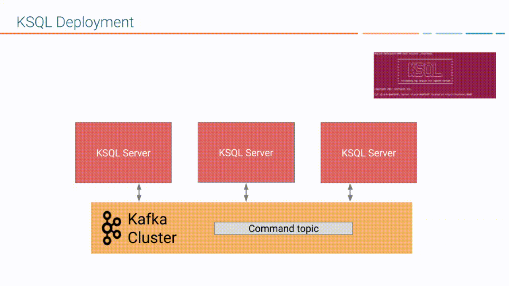
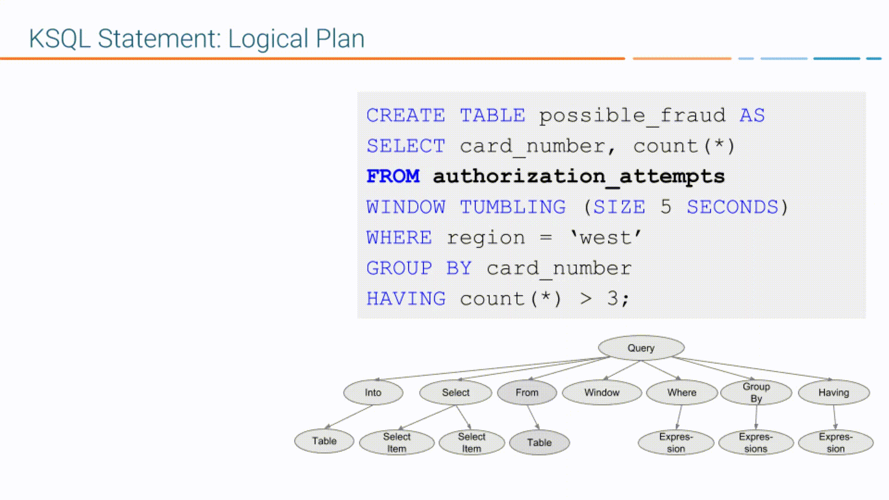

.. _ksql-architecture:

KSQL Architecture
#################

The architecture of KSQL enables you to build real-time streaming applications
from Kafka topics by using only SQL statements and queries. KSQL is built on
Kafka Streams, so a KSQL application runs on a  Kafka cluster like any other
Kafka Streams application.

KSQL Components
***************

KSQL has four main components:

* KSQL engine – processes KSQL statements and queries 
* REST interface – enables client access to the engine
* KSQL CLI – console that provides a command-line interface (CLI) to the engine
* KSQL UI – enables developing KSQL applications in |c3|

KSQL Server comprises the KSQL engine and the REST API. KSQL Server instances
communicate with the Kafka cluster and scale out with load as necessary. 

.. image:: ../img/ksql-architecture-and-components.png
   :alt: Diagram showing architecture of KSQL
   :align: center

KSQL Engine
    The KSQL engine executes KSQL statements and queries. You define your
    application logic by writing KSQL statements, and the engine builds and
    runs the application on available KSQL servers. Each KSQL server instance
    runs a KSQL engine. Under the hood, the engine parses your KSQL statements
    and builds corresponding Kafka Streams topologies.
    
    The KSQL engine is implemented in the
    `KsqlEngine.java <https://github.com/confluentinc/ksql/blob/master/ksql-engine/src/main/java/io/confluent/ksql/KsqlEngine.java>`__
    class.

KSQL CLI
    The KSQL CLI provides a console with a command-line interface for the KSQL
    engine. Use the KSQL CLI to interact with KSQL Server instances and develop
    your streaming applications. The KSQL CLI is designed to be familiar to
    users of MySQL, Postgres, and similar applications.

    The KSQL CLI is implemented in the
    `io.confluent.ksql.cli <https://github.com/confluentinc/ksql/tree/master/ksql-cli/src/main/java/io/confluent/ksql/cli>`__
    package.

REST Interface
    The REST server interface enables communicating with the KSQL engine from
    the CLI, |c3|, or from any other REST client. For more information, see
    :ref:`ksql-rest-api`.
    
    The KSQL REST server is implemented in the
    `KsqlRestApplication.java <https://github.com/confluentinc/ksql/blob/master/ksql-rest-app/src/main/java/io/confluent/ksql/rest/server/KsqlRestApplication.java>`__
    class.

When you deploy your KSQL application, it runs on KSQL Server instances that
are independent of one another, are fault-tolerant, and can scale elastically
with load. For more information, see :ref:`ksql-deployment-modes`.

KSQL and Kafka Streams
**********************

KSQL is built on Kafka Streams and occupies the top of the stack in |cp|.
You can use KSQL and Kafka Streams together in your streaming applications. 
For more information on their relationship, see :ref:`ksql-and-kafka-streams`.
For more information on Kafka Streams, see :ref:`streams_architecture`.

Also, you can create User Defined Functions in Java, to implement custom logic
and aggregations in your KSQL applications. For more information, see
:ref:`ksql-udfs`.

KSQL Language Elements
**********************

Like traditional relational databases, KSQL supports two categories of
statements: Data Definition Language (DDL) and Data Manipulation Language (DML).

These categories are similar in syntax, data types, and expressions, but they
have different functions on a KSQL server.

Data Definition Language (DDL) Statements
    Imperative verbs that define metadata on the KSQL server by adding,
    changing, or deleting streams and tables. Data Definition Language
    statements modify metadata only and don't operate on data. You can use
    these statements with declarative DML statements.

    The DDL statements include:

    * CREATE STREAM 
    * CREATE TABLE
    * DROP STREAM
    * DROP TABLE

Data Manipulation Language (DML) Statements
    Declarative verbs that read and modify data in KSQL streams and tables.
    Data Manipulation Language statements modify data only and don't change
    metadata. The KSQL engine compiles DML statements into Kafka Streams
    applications, which run on a Kafka cluster like any other Kafka Streams
    application.

    The DML statements include:

    * CREATE STREAM AS SELECT (CSAS) 
    * CREATE TABLE AS SELECT (CTAS)
    * SELECT
    * INSERT INTO

.. _ksql-deployment-modes:

KSQL Deployment Modes
*********************

KSQL supports three ways to deploy your streaming applications:

* Interactive – data exploration and pipeline development
* Headless – long-running production environments
* Embedded – KSQL statements and queries run directly in your Java
  applications

In all deployment modes, KSQL enables distributing the processing load for your
KSQL applications across all KSQL server instances, and scaling up and down
without restarting your applications.

Interactive Deployment
====================== 

Use the interactive mode to develop your KSQL applications. When you deploy a
KSQL server in interactive mode, the REST interface is available for the KSQL
CLI and |c3| to connect to. 

.. image:: ../img/ksql-client-server-interactive-mode.png
   :alt: Diagram showing interactive KSQL deployment
   :align: center

In interactive mode, you can:

* Write statements and queries on the fly
* Start any number of server nodes: ``bin/ksql-server-start``
* Start one or more CLIs or REST Clients and point them to a server: ``bin/ksql https://myksqlserver:8090``

Headless Deployment
===================

Use headless mode to deploy your KSQL application to a production environment.
When you deploy a KSQL server in headless mode, the REST interface isn't
available, so you assign workloads to KSQL servers by using a SQL file. The SQL
file contains the KSQL statements and queries that define your application.
Headless mode is ideal for streaming ETL application deployments.

.. image:: ../img/ksql-standalone-headless.png
   :alt: Diagram showing headless KSQL deployment
   :align: center

In headless mode you can:

* Start any number of server nodes
* Pass a SQL file with KSQL statements to execute: ``bin/ksql-node query-file=foo/bar.sql``
* Version-control your queries and transformations as code
* Ensure resource isolation
* Leave resource management to dedicated systems, like Kubernetes

Embedded Deployment
===================

Use embedded KSQL when you want to execute KSQL queries without starting a
separate KSQL server cluster. 

.. image:: ../img/ksql-embedded-in-application.png
   :alt: Diagram showing KSQL embedded in an application
   :align: center

In embedded mode you can:

* Embed your KSQL statements and queries directly in your Java application
* Generate and execute KSQL queries through the Java API
* Version-control your queries and transformations as code

In embedded mode, you deploy a JVM-based application by using the application
framework of your choice, like Spring, Grails, Jersey, VertX, or Ratpack. Your 
application executes KSQL queries without starting a separate KSQL cluster.
You embed the KSQL engine in your application, and you scale the application and
its stream processing the same way that you scale a Kafka Streams application or
KSQL cluster, by using a consumer group.

Dedicating Resources
====================

Join KSQL engines to the same *service pool* by using the ``ksql.service.id``
property. The following diagram shows a Kafka cluster with separate workloads
for a ``finance`` pool and a ``sales`` pool. For more information, see
:ref:`ksql-service-id`.

.. image:: ../img/ksql-dedicating-resources.png
   :alt: Diagram showing how to join KSQL engines to the same service pool
   :align: center

To scale out, just add more KSQL server instances. There's no master node or 
coordination among them required. For more information, see
:ref:`ksql_capacity_planning`.

KSQL Query Lifecycle
********************

To create a streaming application with KSQL, you write KSQL statements and
queries. Each statement and query has a lifecycle with the following steps:

#. You register a KSQL stream or table from an existing Kafka topic with a DDL
   statement, like CREATE STREAM <my-stream> WITH <topic-name>.
#. You express your app by using a DML statement, like CREATE TABLE AS SELECT
   FROM <my-stream>.
#. KSQL parses your statement into an abstract syntax tree (AST).
#. KSQL uses the AST to create the logical plan for your statement.
#. KSQL uses the logical plan to create the physical plan for your statement.
#. KSQL generates and runs the Kafka Streams application.
#. You manage the application as a STREAM or TABLE with its corresponding
   persistent query.

.. image:: ../img/ksql-query-lifecycle.gif
   :alt: Diagram showing how the KSQL query lifecycle for a KSQL statement
   :align: center

Register the Stream
===================

Register a stream or table by using the DDL statements, CREATE STREAM and
CREATE TABLE. For example, the following KSQL statement creates a stream named
``authorization_attempts`` that's backed by a topic named ``authorizations``.

.. code:: sql

    CREATE STREAM authorization_attempts 
      (card_number VARCHAR, attemptTime BIGINT, ...)
      WITH (kafka_topic='authorizations', value_format=‘JSON’);

KSQL writes the DDL statement to the *command topic*. Each KSQL server reads the
statement from the command topic and parses/analyzes the statement.

For the CREATE STREAM statement, the action is to update the KSQL metastore.

Each KSQL server has an internal, in-memory metadata store, or *metastore*, that
it builds when it receives DDL statements. The metastore is an in-memory map.
For each DDL statement, the KSQL engine adds an entry to the metastore.

For example, the metastore entry for the previous CREATE STREAM statement might
resemble:  

+-------------------------+----------------------------------------------------------------------------------+
| Source Name             | Structured Data Source                                                           |
+=========================+==================================================================================+
| AUTHORIZATION_ATTEMPTS  | [DataSourceType: STREAM],                                                        |
|                         | [Schema:(card_number VARCHAR, attemptTime BIGINT, attemptRegion VARCHAR, ...)],  |
|                         | [Key: null],                                                                     |
|                         | [KsqlTopic: AUTHORIZATIONS],                                                     |
|                         | ...                                                                              |
+-------------------------+----------------------------------------------------------------------------------+

The KSQL metastore is implemented in the
`io.confluent.ksql.metastore <https://github.com/confluentinc/ksql/tree/master/ksql-metastore/src/main/java/io/confluent/ksql/metastore>`__
package.

Express Your Application as a KSQL Statement
============================================

Now that you have a stream, express your application's business logic by using
a KSQL statement. The following DML statement creates a ``possible_fraud`` table
from the ``authorization_attempts`` stream:

.. code:: sql

    CREATE TABLE possible_fraud AS
      SELECT card_number, count(*)
      FROM authorization_attempts 
      WINDOW TUMBLING (SIZE 5 SECONDS)
      WHERE region = ‘west’
      GROUP BY card_number
      HAVING count(*) > 3; 

The KSQL engine translates the DML statement into a Kafka Streams application.
The application reads the source topic continuously, and whenever the
``count(*) > 3`` condition is met, it writes records to the ``possible_fraud``
table.

KSQL Parses Your Statement
==========================

To express your DML statement as a Kafka Streams application, the KSQL engine
starts by parsing the statement. The parser creates an abstract syntax tree
(AST). The KSQL engine uses the AST to plan the query.

The KSQL statement parser is based on `ANTLR <https://www.antlr.org/>`__ and is
implemented in the
`io.confluent.ksql.parser <https://github.com/confluentinc/ksql/tree/master/ksql-parser/src/main>`__
package.

KSQL Creates the Logical Plan
=============================

The KSQL engine creates the logical plan for the query by using the AST:

#. Define the source – FROM node in the AST
#. Filter – WHERE clause
#. Aggregation – GROUP BY
#. Projection – WINDOW
#. Post-aggregation filter – HAVING, applied to the result of the aggregation
#. Projection – for the result

KSQL Creates the Physical Plan
==============================

From the logical plan, the KSQL engine creates the physical plan, which is a Kafka
Streams DSL application with a schema.

* KSQL Stream – rendered as `SchemaKStream.java <https://github.com/confluentinc/ksql/blob/master/ksql-engine/src/main/java/io/confluent/ksql/structured/SchemaKStream.java>`__,
  which is a KStream with Schema
* KSQL Table – rendered as `SchemaKTable.java <https://github.com/confluentinc/ksql/blob/master/ksql-engine/src/main/java/io/confluent/ksql/structured/SchemaKTable.java>`__,
  which is a KTable with Schema
* Schema awareness – provided by the `SchemaRegistryClient <https://github.com/confluentinc/schema-registry/blob/master/client/src/main/java/io/confluent/kafka/schemaregistry/client/SchemaRegistryClient.java>`__.

The KSQL engine traverses the logical plan and emits Kafka Streams API calls:

#. Define the source – SchemaKStream or SchemaKTable with info from the KSQL metastore
#. Filter – produces another SchemaKStream
#. Projection – the SELECT function
#. Apply aggregation – Multiple steps: rekey, groupby, aggregate. May need to re-partition data if it's not keyed with a GROUP BY phrase.  
#. Filter – HAVING
#. Projection for result – select()

.. image:: ../img/ksql-statement-physical-plan.gif
   :alt: Diagram showing how the KSQL engine creates a physical plan for a KSQL statement
   :align: center

.. graphics-file: https://docs.google.com/presentation/d/1CU2-r2ZiSG_cTa1UqFq4ZwJnq7imr89pXkJVYAlecp4/edit#slide=id.p64
.. graphics-file: https://docs.google.com/presentation/d/1IMBU414rxEt4HrvqvEjjRiyCxMJzcQytC8ypD0dsvTg/edit#slide=id.g4a42e8b1c4_0_19