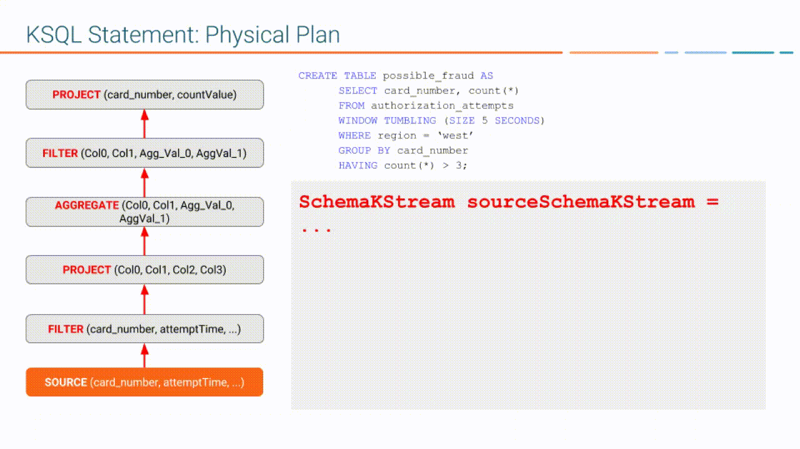

.. _ksql-architecture:

KSQL Architecture
#################

For more information, see :ref:`streams_architecture`.

KSQL Server comprises the KSQL Engine, which processes KSQL queries, and the
REST API, which enables access to the engine.

KSQL Engine executes KSQL statements

KSQL Language Elements
**********************

Like traditional relational databases, KSQL supports two categories of
statements: Data Definition Language (DDL) and Data Manipulation Language (DML).

These two categories are similar in syntax, data types, and expressions, but
they have different functions on a KSQL server.

Data Definition Language (DDL) Statements
    Imperative verbs that modify metadata on the KSQL server by adding,
    changing, or deleting streams and tables. Data Definition Language
    statements modify metadata only and don't operate on data. You can use
    these statements with declarative DML statements.

    define metadata for you

    The DDL statements include:

    * CREATE TABLE
    * CREATE STREAM
    * DROP STREAM
    * DROP TABLE

Data Manipulation Language (DML) Statements
    Declarative verbs that read and modify data in KSQL streams and tables.
    Data Manipulation Language statements modify data only and don't change
    metadata. The KSQL engine compiles DML statements into Kafka Streams
    applications, which run on a Kafka cluster like any other Streams application.

    The DML statements include:

    * CREATE TABLE AS SELECT (CTAS)
    * CREATE STREAM AS SELECT (CSAS)
    * SELECT
    * INSERT INTO

KSQL Deployment Modes
*********************

Deployment
Two modes: non-interactive, aka "headless", 
Long-running production deployments
Resource isolation
No REST API
KSQL servers with a SQL file

Interactive service, which enables data exploration and pipeline design.
REST API
Command topic
(animated gif)

To scale out, just add more KSQL server instances. There's no master node or 
coordination among them required.

KSQL Query Lifecycle
********************

.. code: sql

    CREATE STREAM authorization_attempts 
      (card_number VARCHAR, attemptTime BIGINT, ...)
      WITH (kafka_topic='authorizations', value_format=‘JSON’);

DDL statement is written to the command topic
Each server reads the DDL statement
Parse/analyze the statement -- action is to update the KSQL metastore
each server has an internal in-memory metastore that they build when they receive DDL statements
Add an entry to the metastore 
metastore is an in-memory map

+-------------------------+----------------------------------------------------------------------------------+
| Source Name             | Structured Data Source                                                           |
+=========================+==================================================================================+
| AUTHORIZATION_ATTEMPTS  | [DataSourceType: STREAM],                                                        |
|                         | [Schema:(card_number VARCHAR, attemptTime BIGINT, attemptRegion VARCHAR, ...)],  |
|                         | [Key: null],                                                                     |
|                         | [KsqlTopic: AUTHORIZATIONS],                                                     |
|                         | ...                                                                              |
+-------------------------+----------------------------------------------------------------------------------+

Now that we have a stream, we want to express our application by using a KSQL
statement. The following DML statement creates a table from the
``authorization_attempts`` stream:

.. code: sql

    CREATE TABLE possible_fraud AS
      SELECT card_number, count(*)
      FROM authorization_attempts 
      WINDOW TUMBLING (SIZE 5 SECONDS)
      WHERE region = ‘west’
      GROUP BY card_number
      HAVING count(*) > 3; 

The KSQL engine translates the DML statement into a Kafka Streams application,
which reads the source topic continuously, processes records, and when the
condition is met, writes records to the output topic.

.. image:: ../img/ksql-statement-logical-plan.gif
   :alt: Diagram showing how the KSQL engine creates a logical plan for a KSQL statement

parser creates an Abstract Syntax TRee
parser based on adlib

Using the AST, KSQL engine creates the logical plan:

#. First step is the source (FROM node in AST)
#. Filter (WHERE clause)
#. Aggregation (GROUP BY), projection (WINDOW)
#. Post-aggregation filter (HAVING applies to result of aggregation)
#. Projection for result

From the logical plan, KSQL engine creates the physical plan, which is a specific kind of Kafka Streams
application with a schema.

Kafka Streams DSL with schema. 
KStream  → SchemaKStream (KStream + Schema)
KTable     → SchemaKTable (KTable + Schema) 

Traverse the logical plan and create a Kafka Streams application

#. First step is the source (SchemaKStream with info from metastore)
#. Filter, which produces another SchemaKStream
#. Projection, which is the SELECT function
#. Apply aggregation (multiple steps, may need to re-partition data if it's not keyed by GROUP BY phrase) rekey, groupby, aggregate
#. Filter (HAVING)
#. Projection for result (select())

