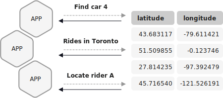

A pull query is a form of query issued by a client that retrieves a result as
of "now", like a query against a traditional RDBS. 

As a dual to the [push query](push.md) example, a pull query for a geographic
location would ask for the current map coordinates of a particular user.
Because it's a pull query, it returns immediately with a finite result and
closes its connection. This is ideal for rendering a user interface once, at
page load time. It's generally a good fit for any sort of synchronous control
flow.

Pull queries enable you to fetch the current state of a materialized view.
Because materialized views are incrementally updated as new events arrive,
pull queries run with predictably low latency. They're a great match for
request/response flows. For asynchronous application flows, see
[Push Query](push.md).

Execute a pull query by sending an HTTP request to the ksqlDB REST API, and
the API responds with a single response.

Pull query features and limitations
-----------------------------------

- Pull queries are expressed using a strict subset of ANSI SQL.
- Pull queries are currently available only against materialized aggregate
  tables, which means tables that are created by using a persistent query
  with a GROUP BY clause.
- For non-windowed aggregations, pull queries only support looking up events
  by key.
- WHERE clauses can only have constraints on the key column for non-windowed tables.

- In addition, windowed tables support bounds on `WINDOWSTART` and `WINDOWEND` using operators
  `<=`, `<`, `=`, `>`, `>=`.
- JOIN, PARTITION BY, GROUP BY and WINDOW clauses aren't supported.
- SELECT statements can contain column arithmetic and function calls.
- The result of a pull query isn't persisted anywhere.

Example pull query
------------------

The following pull query gets all events for the specified user that have a
timestamp within the specified time window. 

```sql
SELECT * FROM user_location
  WHERE userId = 'user19r7t33'
    AND '2019-10-02T21:31:16' <= WINDOWSTART AND WINDOWEND <= '2019-10-03T21:31:16';
```

API Reference
-------------

- [SELECT (Pull Query)](../../developer-guide/ksqldb-reference/select-pull-query.md)
- [SELECT (Push Query)](../../developer-guide/ksqldb-reference/select-push-query.md)
