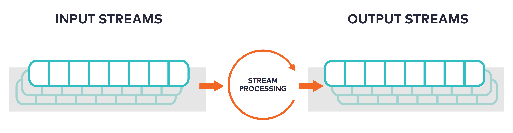

<script type="text/javascript">
        window.location = 'https://docs.confluent.io/platform/current/ksqldb/concepts/stream-processing.html';
</script>



Creating a collection with an enforced schema over a new or existing
{{ site.aktm }} topic is useful but has limited utility by itself for creating
an application. When you declare a collection, you can only work with the
events in their current form. But a critical part of creating streaming
applications is transforming, filtering, joining, and aggregating events.

In ksqlDB, you manipulate events by deriving new collections from existing
ones and describing the changes between them. When a collection is updated with
a new event, ksqlDB updates the collections that are derived from it in
real-time. This rich form of computing is known formally as stream processing,
because it creates programs that operate continually over unbounded streams of
events, *ad infinitum*. These processes stop only when you explicitly terminate
them.

The general pattern for stream processing in ksqlDB is to create a new
collection by using the `SELECT` statement on an existing collection. The
result of the inner `SELECT` feeds into the outer declared collection. You
don't need to declare a schema when deriving a new collection, because ksqlDB
infers the column names and types from the inner `SELECT` statement. 
The value of the `ROWTIME` pseudo column
defines the timestamp of the record written to {{ site.ak }}, and the value of
the `ROWPARTITION` and `ROWOFFSET` pseudo columns define the partition and offset
of the source record, respectively. The value of system columns
can not be set in the `SELECT`.

Here are a few examples of deriving between the different collection types.

Derive a new stream from an existing stream
-------------------------------------------

Given the following stream:

```sql
CREATE STREAM rock_songs (artist VARCHAR, title VARCHAR)
    WITH (kafka_topic='rock_songs', partitions=2, value_format='avro');
```

You can derive a new stream with all of the song titles transformed to
uppercase:

```sql
CREATE STREAM title_cased_songs AS
    SELECT artist, UCASE(title) AS capitalized_song
    FROM rock_songs
    EMIT CHANGES;
```

Each time a new song is inserted into the `rock_songs` topic, the uppercase
version of the title is appended to the `title_cased_songs` stream.

Deriving a new table from an existing stream
--------------------------------------------

Given the following table and stream:

```sql
CREATE TABLE products (product_name VARCHAR PRIMARY KEY, cost DOUBLE)
    WITH (kafka_topic='products', partitions=1, value_format='json');

CREATE STREAM orders (product_name VARCHAR KEY)
    WITH (kafka_topic='orders', partitions=1, value_format='json');
```

You can create a table that aggregates rows from the `orders` stream, while
also joining the stream on the `products` table to enrich the `orders` data:

```sql
CREATE TABLE order_metrics AS
    SELECT p.product_name, COUNT(*) AS count, SUM(p.cost) AS revenue
    FROM orders o JOIN products p ON p.product_name = o.product_name
    GROUP BY p.product_name EMIT CHANGES;
```

This aggregate table keeps track of the total number of orders of each product,
along with the total amount of revenue generated by each product.

Deriving a new table from an existing table
-------------------------------------------

Given the following aggregate table:

```sql
CREATE TABLE page_view_metrics AS
    SELECT url, location_id, COUNT(*) AS count
    FROM page_views GROUP BY url EMIT CHANGES;
```

You can derive another table that filters out rows from the `page_view_metrics`
table:

```sql
CREATE TABLE page_view_metrics_mountain_view AS
    SELECT url, count FROM page_view_metrics
    WHERE location_id = 42 EMIT CHANGES;
```

Deriving a new stream from multiple streams
-------------------------------------------

Given the following two streams:

```sql
CREATE STREAM impressions (user VARCHAR KEY, impression_id BIGINT, url VARCHAR)
    WITH (kafka_topic='impressions', partitions=1, value_format='json');

CREATE STREAM clicks (user VARCHAR KEY, url VARCHAR)
    WITH (kafka_topic='clicks', partitions=1, value_format='json');
```

You can create a derived stream that joins the `impressions` and `clicks`
streams to output rows indicating that a given impression has been clicked
within one minute of the initial ad impression:

```sql
CREATE STREAM clicked_impressions AS
    SELECT * FROM impressions i JOIN clicks c WITHIN 1 minute ON i.user = c.user
    WHERE i.url = c.url
    EMIT CHANGES;
```

Any time an `impressions` row is received, followed within one minute by a
`clicks` row having the same `user`, a row is emitted into the
`clicked_impressions` stream.
