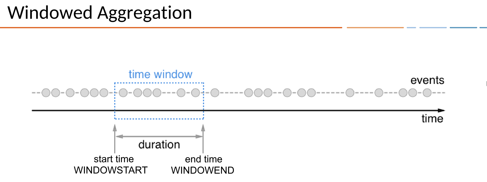

.. _time-and-windows-in-ksql-queries:

Time and Windows in KSQL
########################

.. image:: ../img/ksql-stream-records.png
   :alt: Diagram showing records in a KSQL stream

In KSQL, a record is an immutable representation of an event in time. Each
record carries a timestamp, which determines its position on the time axis.

This is the default timestamp that KSQL uses for processing the record. The
timestamp is set either by the producer application or by the Kafka broker,
depending on the topic's configuration. Records may be out-of-order within
the stream. 

Timestamps are used by time-dependent operations, like aggregations and joins.

Time Semantics
**************

Timestamps have different meanings, depending on the implementation.
A record's timestamp can refer to the time when the event occurred, or
when the record was ingested into Kafka, or when the record was processed.
These times are *event-time*, *ingestion-time*, and *processing-time*. 

Event-time
    The time when a record is created by the data source. Achieving event-time
    semantics requires embedding timestamps in records when an event occurs and
    the record is produced.

    For example, if the record is a geo-location change reported by a GPS sensor
    in a car, the associated event-time is the time when the GPS sensor captured
    the location change.

Ingestion-time
    The time when a record is stored in a topic partition by a Kafka broker.
    Ingestion-time is similar to event-time, as a timestamp is embedded in the
    record, but the ingestion timestamp is generated when the Kafka broker appends
    the record to the target topic.
    
    Ingestion-time may approximate event-time reasonably well if the time
    difference between creation of the record and its ingestion into Kafka
    is sufficiently small. This means that ingestion-time may be an alternative
    for use cases where event-time semantics aren't possible.
    
    You may face this situation when data producers don't embed timestamps in
    records, as in older versions of Kafka’s Java producer client, or when the
    producer can't assign timestamps directly, like when it doesn't have access
    to a local clock.

Processing-time
    The time when the record is consumed by a stream processing application.
    The processing-time may happen immediately after ingestion-time, or it may
    happen much later, in milliseconds, hours, or days.

    For example, imagine an analytics application that reads and processes the
    geo-location data reported from car sensors, and presents it to a
    fleet-management dashboard. In this case, processing-time in the analytics
    application might be many minutes or hours after the event-time, as cars
    can move out of mobile reception for periods of time and have to buffer
    records locally.

Timestamp Assignment
====================

A record's timestamp is set either by the record's producer or by the Kafka
broker, depending on the topic's timestamp configuration. The topic's
`message.timestamp.type <https://docs.confluent.io/current/installation/configuration/topic-configs.html#message-timestamp-type>`__
setting can be either ``CreateTime`` or ``LogAppendTime``.

CreateTime
    The broker uses the the record's timestamp as set by the producer. This setting
    enforces event-time semantics.

LogAppendTime
    The broker overwrites the record's timestamp with the broker's local time
    when it appends the record to the topic's log. This setting enforces
    ingestion-time semantics. If ``LogAppendTime`` is configured, the producer
    has no control over the timestamp.

KSQL doesn't support processing-time operations directly, but you can implement
user-defined functions (UDFs) that access the current time. For more
information, see :ref:`ksql-udfs`.

By default, when KSQL imports a topic to create a stream, it uses the record's
timestamp, but you can add the WITH(TIMESTAMP='some-field') clause to use a
different field from the record's value as the timestamp. The optional TIMESTAMP_FORMAT
property indicates how KSQL should parse the field. The field you specify can
be an event-time or an ingestion-time. This approach implements *payload-time*
semantics.

.. important::

    If you use the WITH(timestamp=...) clause, this timestamp must be expressible
    as a Unix epoch time in milliseconds, which is the number of milliseconds
    that have elapsed since 1 January 1970 at midnight UTC/GMT.

    When working with time you should also make sure that additional
    aspects of time, like time zones and calendars, are correctly synchronized – or
    at least understood and traced – throughout your streaming data pipelines. It
    helps to agree on specifying time information in UTC or in Unix time,
    like seconds since the Unix epoch, everywhere in your system.

    Don't mix streams or tables that have different time semantics.

Timestamps of KSQL Output Streams
=================================

When a KSQL application writes new records to Kafka, it assigns timestamps
to the records it creates. Timestamps are assigned based on context:

* When new output records are generated by processing an input record directly,
  output record timestamps are inherited from input record timestamps.
* When new output records are generated by a periodic function, the output record
  timestamp is defined as the current internal time of the stream task.
* For aggregations, the timestamp of the resulting update record is taken from
  the latest input record that triggered the update.

Producers and Timestamps
========================

A producer application can set the timestamp on its records to any value, but
usually, it choses a sensible event-time or the current wall-clock time.

If the topic's `message.timestamp.type <https://docs.confluent.io/current/installation/configuration/topic-configs.html#message-timestamp-type>`__ 
configuration is set to ``CreateTime``, the following holds for the producer:

* When a producer record is created, it contains no timestamp, by default.
* The producer can set the timestamp on the record explicitly.
* If the timestamp isn't set when the producer application calls the
  ``producer.send()`` method, the current wall-clock time is set automatically.

In all three cases, the time semantics are considered to be event-time.

Timestamp Extractors
====================

When KSQL imports a topic to create a stream, it gets the timestamp from the
topic's messages by using a *timestamp extractor* class. Timestamp extractors
implement the `TimestampExtractor <https://docs.confluent.io/current/streams/javadocs/org/apache/kafka/streams/processor/TimestampExtractor.html>`__
interface.

Concrete implementations of timestamp extractors may retrieve or compute
timestamps based on the actual contents of data records, like an embedded
timestamp field, to provide event-time or ingestion-time semantics, or they
may use any other approach, like returning the current wall-clock time at the
time of processing to implement processing-time semantics.

By creating a custom timestamp extractor class, you can enforce different notions
or semantics of time, depending on the requirements of your business logic. For
more information see :ref:`streams_developer-guide_timestamp-extractor`.

Windows in KSQL Queries
***********************

Representing time consistently enables aggregation operations on streams and
tables, like SUM, that have distinct time boundaries. In KSQL, these boundaries
are named *time windows*.

Windowing lets you control how to group records that have the same key for
stateful operations, like aggregations or joins, into time spans. KSQL tracks
windows per record key.

When using windows in your KSQL queries, aggregate functions are applied only
to the records that occur within a specific time window. Records that arrive
late are handled as you might expect: although the time window they belong to
has expired, the late records are still associated with the correct window.

You can specify a retention period for the window in your KSQL queries. This
retention period controls how long KSQL waits for out-of-order or late-arriving
records for a given window. If a record arrives after the retention period of a
window has passed, the record is discarded and isn't processed in that window.

.. Note for version 5.1
    Starting in KSQL 5.1, a *grace period* configuration determines how long
    to wait before closing a window. Retention time is still a valid parameter
    that defines for how long the potentially closed window is stored. This
    enables accessing the window with interactive queries, even if it's closed.

In the real world, late-arriving records are always possible, and your KSQL
applications must account for them properly. The system's time semantics
determine how late records are handled. For processing-time, the semantics are
“when the record is being processed”, which means that the notion of late records
isn't applicable because, by definition, no record can be late.

Late-arriving records are considered “late” only for event-time and ingestion-time
semantics. In both cases, KSQL is able to handle late-arriving records properly.

.. important::

    KSQL is based on the Unix epoch time in the UTC timezone, and this can affect
    time windows. For example, if you define a 24-hour tumbling time window, it will
    be in the UTC timezone, which may not be appropriate if you want to have daily
    windows in your timezone.

Window Types
============

There are three ways to define time windows in KSQL.

.. image:: ../img/ksql-window-aggregation.png
   :alt: Diagram showing three types of time windows in KSQL streams: tumbling, hopping, and session

Tumbling Window
---------------

All time windows are of the same size and adjacent to each other, which
means that whenever a window ends, the next window starts.

For example, if you want to compute the the five highest-value orders
per zip code per hour in an ``orders`` stream, you might run a query like this:

.. code:: sql

    SELECT orderzip_code, TOPK(order_total, 5) FROM orders
      WINDOW TUMBLING (SIZE 1 HOUR) GROUP BY order_zipcode;

Here's another example: to detect potential credit card fraud in an
``authorization_attempts`` stream, you might run a query for the number of
authorization attempts on a particular card that's greater than three, during
a time interval of five seconds.

.. code:: sql

    SELECT card_number, count(*) FROM authorization_attempts
      WINDOW TUMBLING (SIZE 5 SECONDS)
      GROUP BY card_number HAVING count(*) > 3;

The tumbling window's start time is inclusive, but the end time is exclusive.
This is important for non-overlapping windows, in which each record must be
contained in exactly one window.

Hopping Window
--------------

All time windows are of the same size, but they might overlap, depending
on the length of time specified in the ADVANCE BY property.

For example, if you want to count the pageviews for only ``Region_6`` by female
users for a hopping window of 30 seconds that advances by 10 seconds, you might
run a query like this:

.. code:: sql

    SELECT regionid, count(*) FROM pageviews 
      WINDOW HOPPING (SIZE 30 SECONDS, ADVANCE BY 10 SECONDS)
      WHERE UCASE(gender)='FEMALE' AND LCASE (regionid) LIKE '%_6'
      GROUP BY regionid;

The hopping window's start time is inclusive, but the end time is exclusive.
This is important for non-overlapping windows, in which each record must be
contained in exactly one window.

Session Window
--------------

A new window starts if the last event that arrived is further back in time
than a specified session timeout time.

For example, to count the number of pageviews per region for session windows
with a session inactivity gap of 60 seconds, you might run the following query,
which "sessionizes" the input data and performs the counting/aggregation step
per region:

.. code:: sql

    SELECT regionid, count(*) FROM pageviews
      WINDOW SESSION (60 SECONDS)
      GROUP BY regionid;

The start and end times for a session window are both inclusive, in contrast to
time windows. There is always a record in the session window with both the start
and end timestamps, because the timestamp of the first and last record in the
window define the session window's start and end time.

Windowed Joins
--------------

KSQL supports using windows in JOIN queries. 

For example, to find orders that have shipped within the last hour, you might
run a query like:

.. code:: sql

    SELECT o.order_id, o.total_amount, o.customer_name, s.shipment_id, s.warehouse
      FROM new_orders o
      INNER JOIN shipments s
        WITHIN 1 HOURS
        ON o.order_id = s.order_id;

Next Steps
**********

* :ref:`create-a-stream-with-ksql`
* :ref:`ksql_quickstart-docker`
* For a realistic example that manipulates timestamps and uses windows in KSQL
  queries, see `KSQL in Action: Real-Time Streaming ETL from Oracle Transactional Data <https://www.confluent.io/blog/ksql-in-action-real-time-streaming-etl-from-oracle-transactional-data>`__.
