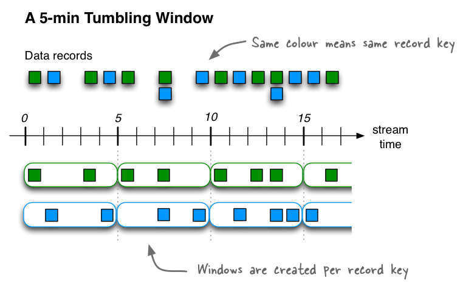
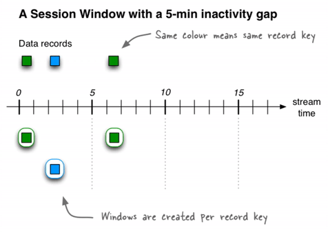

!!! important
      This page refers to timestamps as a field in records. For information
      on the TIMESTAMP data type, see [Timestamp types](../reference/sql/data-types.md).


In ksqlDB, a record is an immutable representation of an event in time.
Each record carries a timestamp, which determines its position on the
time axis.

This is the default timestamp that ksqlDB uses for processing the record.
The timestamp is set either by the producer application or by the
{{ site.aktm }} broker, depending on the topic's configuration. Records
may be out-of-order within the stream.

Timestamps are used by time-dependent operations, like aggregations and
joins.

Time semantics
--------------

Timestamps have different meanings, depending on the implementation. A
record's timestamp can refer to the time when the event occurred, or
when the record was ingested into Kafka, or when the record was
processed. These times are *event-time*, *ingestion-time*, and
*processing-time*.

### Event-time

The time when a record is created by the data source. Achieving
event-time semantics requires embedding timestamps in records when
an event occurs and the record is produced.

For example, if the record is a geo-location change reported by a GPS sensor
in a car, the associated event-time is the time when the GPS sensor captured
the location change.

### Ingestion-time

The time when a record is stored in a topic partition by a {{ site.ak }}
broker. Ingestion-time is similar to event-time, as a timestamp is
embedded in the record, but the ingestion timestamp is generated
when the Kafka broker appends the record to the target topic.

Ingestion-time can approximate event-time if the time difference
between the creation of the record and its ingestion into {{ site.ak }}
is small.

For use cases where event-time semantics aren't possible, ingestion-time
may be an alternative. Consider using ingestion-time when data producers
don't embed timestamps in records, as in older versions of {{ site.ak }}'s
Java producer client, or when the producer can't assign timestamps directly,
like when it doesn't have access to a local clock.

### Processing-time

The time when the record is consumed by a stream processing
application. The processing-time can occur immediately after
ingestion-time, or it may be delayed by milliseconds, hours,
days, or longer.

For example, imagine an analytics application that reads and
processes the geo-location data reported from car sensors, and
presents it to a fleet-management dashboard. In this case,
processing-time in the analytics application might be many minutes
or hours after the event-time, as cars can move out of mobile
reception for periods of time and have to buffer records locally.

### Stream-time

The maximum timestamp seen over all processed records so far.

!!! important
    Don't mix streams or tables that have different time semantics.

### Timestamp assignment

A record's timestamp is set either by the record's producer or by the
{{ site.ak }} broker, depending on the topic's timestamp configuration. The
topic's
[message.timestamp.type](https://docs.confluent.io/platform/current/installation/configuration/topic-configs.html#topicconfigs_message.timestamp.type)
setting can be either `CreateTime` or `LogAppendTime`.

- **CreateTime:** The broker uses the record's timestamp as set by the
  producer. This setting enforces event-time semantics.
- **LogAppendTime:** The broker overwrites the record's timestamp with the
  broker's local time when it appends the record to the topic's log. This
  setting enforces ingestion-time semantics. If `LogAppendTime` is
  configured, the producer has no control over the timestamp.

ksqlDB doesn't support processing-time operations directly, but you can
implement user-defined functions (UDFs) that access the current time.
For more information, see [Functions](functions.md).

By default, when ksqlDB imports a topic to create a stream, it uses the
record's timestamp, but you can add the WITH(TIMESTAMP='some-field')
clause to use a different field from the record's value as the
timestamp. The optional TIMESTAMP_FORMAT property indicates how ksqlDB
should parse the field. The field you specify can be an event-time or an
ingestion-time. This approach implements *payload-time* semantics.

!!! important
      If you use the WITH(TIMESTAMP=...) clause, this timestamp must be
      expressible as a Unix epoch time in milliseconds, which is the number of
      milliseconds that have elapsed since 1 January 1970 at midnight UTC/GMT.
      Also, you can specify the timestamp as a string when you provide a
      TIMESTAMP_FORMAT. For more information, see
      [Timestamp Formats](/reference/sql/time/#timestamp-formats).

When working with time you should also make sure that additional aspects
of time, like time zones and calendars, are correctly synchronized — or
at least understood and traced — throughout your streaming data
pipelines. It helps to agree on specifying time information in UTC or in
Unix time, like seconds since the Unix epoch, everywhere in your system.

### Timestamps of ksqlDB output streams

When a ksqlDB application writes new records to {{ site.ak }}, timestamps
are assigned to the records it creates. ksqlDB uses the underlying
{{ site.kstreams }} implementation for computing timestamps. Timestamps are
assigned based on context:

- When new output records are generated by processing an input record
  directly, output record timestamps are inherited from input record
  timestamps.
- When new output records are generated by a periodic function, the
  output record timestamp is defined as the current internal time of
  the stream task.
- For stateless operations, the input record timestamp is passed through.
  For `flatMap` and siblings that emit multiple records, all output records
  inherit the timestamp from the corresponding input record.

### Timestamps for aggregations and joins

For aggregations and joins, timestamps are computed by using the following
rules.

* For joins (stream-stream, table-table) that have left and right input
  records, the timestamp of the output record is assigned `max(left.ts, right.ts)`.
* For stream-table joins, the output record is assigned the timestamp from the
  stream record.
* For aggregations, the `max` timestamp is computed over all
  records, per key, either globally (for non-windowed) or per-window.

### Producers and timestamps

A producer application can set the timestamp on its records to any
value, but usually, it choses a sensible event-time or the current
wall-clock time.

If the topic's
[message.timestamp.type](https://docs.confluent.io/platform/current/installation/configuration/topic-configs.html#topicconfigs_message.timestamp.type)
configuration is set to `CreateTime`, the following holds for the
producer:

-   When a producer record is created, it contains no timestamp, by
    default.
-   The producer can set the timestamp on the record explicitly.
-   If the timestamp isn't set when the producer application calls the
    `producer.send()` method, the current wall-clock time is set
    automatically.

In all three cases, the time semantics are considered to be event-time.

### Timestamp extractors

When ksqlDB imports a topic to create a stream, it gets the timestamp from
the topic's messages by using a *timestamp extractor* class. Timestamp
extractors implement the
[TimestampExtractor](https://docs.confluent.io/current/streams/javadocs/org/apache/kafka/streams/processor/TimestampExtractor.html)
interface.

Concrete implementations of timestamp extractors may retrieve or compute
timestamps based on the actual contents of data records, like an
embedded timestamp field, to provide event-time or ingestion-time
semantics, or they may use any other approach, like returning the
current wall-clock time at the time of processing to implement
processing-time semantics.

By creating a custom timestamp extractor class, you can enforce
different notions or semantics of time, depending on the requirements of
your business logic. For more information see
[default.timestamp.extractor](https://docs.confluent.io/current/streams/developer-guide/config-streams.html#default-timestamp-extractor).

Windows in SQL queries
----------------------

Representing time consistently enables aggregation operations on streams
and tables, like SUM, that have distinct time boundaries. In ksqlDB, these
boundaries are named *windows*.


A window has a start time and an end time, which you access in your
queries by using the WINDOWSTART and WINDOWEND system columns.

!!! important
      ksqlDB is based on the Unix epoch time in the UTC timezone, and this can
      affect time windows. For example, if you define a 24-hour tumbling time
      window, it will be in the UTC timezone, which may not be appropriate if
      you want to have daily windows in your timezone.

Windowing lets you control how to group records that have the same key
for stateful operations, like aggregations or joins, into time spans.
ksqlDB tracks windows per record key.

!!! note

    - A related operation is *grouping*, which groups all records that have
      the same key to ensure that records are properly partitioned, or
      "keyed", for subsequent operations. When you use the GROUP BY clause in
      a query, windowing enables you to further sub-group the records of a
      key.
    - Windowing queries must group by the keys that are selected in the query.

When using windows in your SQL queries, aggregate functions are applied
only to the records that occur within a specific time window. Records
that arrive out-of-order are handled as you might expect: although the
window end time has passed, the out-of-order records are still
associated with the correct window.

### Window types

There are three ways to define time windows in ksqlDB: hopping windows,
tumbling windows, and session windows. Hopping and tumbling windows are
time windows, because they are defined by fixed durations that you
specify. Session windows are dynamically sized based on incoming data
and defined by periods of activity separated by gaps of inactivity.

| Window type                         | Behavior      | Description                                             |
|-------------------------------------|---------------|---------------------------------------------------------|
| [Tumbling Window](#tumbling-window) | Time-based    | Fixed-duration, non-overlapping, gap-less windows       |
| [Hopping Window](#hopping-window)   | Time-based    | Fixed-duration, overlapping windows                     |
| [Session Window](#session-window)   | Session-based | Dynamically-sized, non-overlapping, data-driven windows |


#### Hopping window

Hopping windows are based on time intervals. They model fixed-sized,
possibly overlapping windows. A hopping window is defined by two
properties: the window's duration and its advance, or "hop", interval.
The advance interval specifies how far a window moves forward in time
relative to the previous window. For example, you can configure a
hopping window with a duration of five minutes and an advance interval
of one minute. Because hopping windows can overlap, and usually they do,
a record can belong to more than one such window.

All hopping windows have the same duration, but they might overlap,
depending on the length of time specified in the ADVANCE BY property.


For example, if you want to count the pageviews for only `Region_6` by
female users for a hopping window of 30 seconds that advances by 10
seconds, you might run a query like this:

```sql
SELECT regionid, COUNT(*) FROM pageviews
  WINDOW HOPPING (SIZE 30 SECONDS, ADVANCE BY 10 SECONDS)
  WHERE UCASE(gender)='FEMALE' AND LCASE (regionid) LIKE '%_6'
  GROUP BY regionid
  EMIT CHANGES;
```

The hopping window's start time is inclusive, but the end time is
exclusive. This is important for non-overlapping windows, in which each
record must be contained in exactly one window.

#### Tumbling window

Tumbling windows are a special case of hopping windows. Like hopping
windows, tumbling windows are based on time intervals. They model
fixed-size, non-overlapping, gap-less windows. A tumbling window is
defined by a single property: the window's duration. A tumbling window
is a hopping window whose window duration is equal to its advance
interval. Since tumbling windows never overlap, a record will belong to
one and only one window.

All tumbling windows are the same size and adjacent to each other, which
means that whenever a window ends, the next window starts.



For example, if you want to compute the five highest-value orders
per zip code per hour in an `orders` stream, you might run a query like
this:

```sql
SELECT orderzip_code, TOPK(order_total, 5) FROM orders
  WINDOW TUMBLING (SIZE 1 HOUR) GROUP BY order_zipcode
  EMIT CHANGES;
```

Here's another example: to detect potential credit card fraud in an
`authorization_attempts` stream, you might run a query for the number of
authorization attempts on a particular card that's greater than three,
during a time interval of five seconds.

```sql
SELECT card_number, count(*) FROM authorization_attempts
  WINDOW TUMBLING (SIZE 5 SECONDS)
  GROUP BY card_number HAVING COUNT(*) > 3
  EMIT CHANGES;
```

The tumbling window's start time is inclusive, but the end time is
exclusive. This is important for non-overlapping windows, in which each
record must be contained in exactly one window.

#### Session window

A session window aggregates records into a session, which represents a
period of activity separated by a specified gap of inactivity, or
"idleness". Any records with timestamps that occur within the inactivity
gap of existing sessions are merged into the existing sessions. If a
record's timestamp occurs outside of the session gap, a new session is
created.

A new session window starts if the last record that arrived is further
back in time than the specified inactivity gap.

Session windows are different from the other window types, because:

-   ksqlDB tracks all session windows independently across keys, so
    windows of different keys typically have different start and end
    times.
-   Session window durations vary. Even windows for the same key
    typically have different durations.

Session windows are especially useful for user behavior analysis.
Session-based analyses range from simple metrics, like counting user
visits on a news website or social platform, to more complex metrics,
like customer-conversion funnel and event flows.



For example, to count the number of pageviews per region for session
windows with a session inactivity gap of 60 seconds, you might run the
following query, which *sessionizes* the input data and performs the
counting/aggregation step per region:

```sql
SELECT regionid, COUNT(*) FROM pageviews
  WINDOW SESSION (60 SECONDS)
  GROUP BY regionid
  EMIT CHANGES;
```

The start and end times for a session window are both inclusive, in
contrast to time windows.

A session window contains at least one record. It's not possible for a
session window to have zero records.

If a session window contains exactly one record, the record's ROWTIME
timestamp is identical to the window's own start and end times. Access
these by using the WINDOWSTART and WINDOWEND system columns.

If a session window contains two or more records, then the
earliest/oldest record's ROWTIME timestamp is identical to the
window's start time, and the latest/newest record's ROWTIME timestamp
is identical to the window's end time.

### Windowed joins

ksqlDB supports using windows in JOIN queries by using the WITHIN clause.

For example, to find orders that have shipped within the last hour from
an `orders` stream and a `shipments` stream, you might run a query like:

```sql
SELECT o.order_id, o.total_amount, o.customer_name, s.shipment_id, s.warehouse
  FROM new_orders o
  INNER JOIN shipments s
    WITHIN 1 HOURS
    ON o.order_id = s.order_id
    EMIT CHANGES;
```

For more information on joins, see
[Join Event Streams with ksqlDB](../developer-guide/joins/join-streams-and-tables.md).

### Out-of-order events

Frequently, events that belong to a window can arrive out-of-order, for
example, over slow networks, and a grace period may be required to ensure the
events are accepted into the window. ksqlDB enables configuring this behavior
for each of the window types and uses a default of 24 hours when no grace
period is specified. Set this value explicitly to fit your scenario. 

For example, to allow events to be accepted for up to two hours after the window ends, 
you might run a query like:

```sql
SELECT orderzip_code, TOPK(order_total, 5) FROM orders
  WINDOW TUMBLING (SIZE 1 HOUR, GRACE PERIOD 2 HOURS) 
  GROUP BY order_zipcode
  EMIT CHANGES;
```

Events that arrive after the grace period has passed are called *late* and aren't
included in the aggregation result.

### Window emission

By default, a windowed aggregate is updated (a new row is emitted) whenever
a new event enters the window for the specified grouping key(s), which enables
a real-time snapshot of the current aggregate value. Each window continues to be
updated until the end of the grace period. The default grace period is 24 hours.

!!! tip
    Tune the update frequency by using the
    [ksql.streams.cache.max.bytes.buffering](/reference/server-configuration/#ksqlstreamscachemaxbytesbuffering)
    and [ksql.streams.commit.interval.ms](/reference/server-configuration/#ksqlstreamscommitintervalms)
    configuration settings.

The following built-in columns are useful to identify windows and when they're
emitted:

- WINDOWSTART: time the window started (in Unix time)
- WINDOWEND: time the window ended or will end (in Unix time)
- ROWTIME: time the current update of the window was updated (in Unix time).
  You can use ROWTIME in the aggregate, for example, using the MAX function,
  to know when the window was updated.

For example, the following SELECT statement counts the number of orders in each
five-minute tumbling window. Also, the output has fields that show the start
and end time for each window.

```sql
SELECT orderzip_code, 
  from_unixtime(WINDOWSTART) as Window_Start,
  from_unixtime(WINDOWEND) as Window_End,
  from_unixtime(max(ROWTIME)) as Window_Emit,
  count(orderId) as number_of_orders
FROM orders
  WINDOW TUMBLING (SIZE 5 minute, GRACE PERIOD 1 minute)
  GROUP BY order_zipcode
  EMIT CHANGES;
```

Running the previous query on the following example input emits windows that
have a SIZE of 5 minutes each. The ROWTIME for each message determines which
window receives the message. 

<style type="text/css">
.tg  {border-collapse:collapse;border-spacing:0;}
.tg td{border-color:black;border-style:solid;border-width:1px;font-family:Arial, sans-serif;font-size:14px;
  overflow:hidden;padding:10px 5px;word-break:normal;}
.tg th{border-color:black;border-style:solid;border-width:1px;font-family:Arial, sans-serif;font-size:14px;
  font-weight:normal;overflow:hidden;padding:10px 5px;word-break:normal;}
.tg .tg-m0ac{background-color:#656565;color:#ffffff;font-weight:bold;text-align:center;vertical-align:top}
.tg .tg-b67n{background-color:#96FFFB;text-align:center;vertical-align:top}
.tg .tg-8phe{background-color:#9AFF99;text-align:center;vertical-align:top}
.tg .tg-w0k3{background-color:#9AFF99;font-weight:bold;text-align:center;vertical-align:top}
</style>
<table class="tg">
<thead>
  <tr>
    <th class="tg-m0ac"><span style="font-weight:bold">Message order</span></th>
    <th class="tg-m0ac"><span style="font-weight:bold">order_zipcode</span></th>
    <th class="tg-m0ac"><span style="font-weight:bold">Event time</span></th>
    <th class="tg-m0ac"><span style="font-weight:bold">OrderID</span></th>
  </tr>
</thead>
<tbody>
  <tr>
    <td class="tg-b67n"><span style="background-color:#96FFFB">1</span></td>
    <td class="tg-b67n"><span style="background-color:#96FFFB">94041</span></td>
    <td class="tg-b67n"><span style="background-color:#96FFFB">12h00mn02s</span></td>
    <td class="tg-b67n"><span style="background-color:#96FFFB">100_1</span></td>
  </tr>
  <tr>
    <td class="tg-b67n"><span style="background-color:#96FFFB">2</span></td>
    <td class="tg-b67n"><span style="background-color:#96FFFB">94041</span></td>
    <td class="tg-b67n"><span style="background-color:#96FFFB">12h01mn23s</span></td>
    <td class="tg-b67n"><span style="background-color:#96FFFB">100_2</span></td>
  </tr>
  <tr>
    <td class="tg-b67n"><span style="background-color:#96FFFB">3</span></td>
    <td class="tg-b67n"><span style="background-color:#96FFFB">94041</span></td>
    <td class="tg-b67n"><span style="background-color:#96FFFB">12h03mn00s</span></td>
    <td class="tg-b67n"><span style="background-color:#96FFFB">100_3</span></td>
  </tr>
  <tr>
    <td class="tg-8phe"><span style="background-color:#9AFF99">4</span></td>
    <td class="tg-8phe"><span style="background-color:#9AFF99">94041</span></td>
    <td class="tg-w0k3"><span style="background-color:#9AFF99">12h05mn30s</span></td>
    <td class="tg-8phe"><span style="background-color:#9AFF99">100_4</span></td>
  </tr>
  <tr>
    <td class="tg-b67n"><span style="background-color:#96FFFB">5</span></td>
    <td class="tg-b67n"><span style="background-color:#96FFFB">94041</span></td>
    <td class="tg-b67n"><span style="background-color:#96FFFB">12h04mn00s</span></td>
    <td class="tg-b67n"><span style="background-color:#96FFFB">100_5</span></td>
  </tr>
  <tr>
    <td class="tg-8phe"><span style="background-color:#9AFF99">6</span></td>
    <td class="tg-8phe"><span style="background-color:#9AFF99">98041</span></td>
    <td class="tg-w0k3"><span style="background-color:#9AFF99">12h06mn10s</span></td>
    <td class="tg-8phe"><span style="background-color:#9AFF99">100_6</span></td>
  </tr>
</tbody>
</table>

The following table shows the actual windows that are emitted when the previous
SELECT statement runs on the example input events. The output has two tumbling
windows, both with a SIZE of 5 minutes:

- Window between 12:00 and 12:05 (`12h00mn00s` - `12h05mn00s`), colored blue 
- Window between 12:05 and 12:10 (`12h05mn00s` - `12h10mn00s`), colored green

<style type="text/css">
.tg  {border-collapse:collapse;border-spacing:0;}
.tg td{border-color:black;border-style:solid;border-width:1px;font-family:Arial, sans-serif;font-size:14px;
  overflow:hidden;padding:10px 5px;word-break:normal;}
.tg th{border-color:black;border-style:solid;border-width:1px;font-family:Arial, sans-serif;font-size:14px;
  font-weight:normal;overflow:hidden;padding:10px 5px;word-break:normal;}
.tg .tg-lzqt{background-color:#656565;border-color:inherit;color:#ffffff;font-weight:bold;text-align:center;vertical-align:top}
.tg .tg-gdc4{background-color:#96fffb;border-color:inherit;text-align:center;vertical-align:top}
.tg .tg-4m7p{background-color:#9aff99;border-color:inherit;text-align:center;vertical-align:top}
.tg .tg-84w4{background-color:#9aff99;border-color:inherit;font-weight:bold;text-align:center;vertical-align:top}
</style>
<table class="tg">
<thead>
  <tr>
    <th class="tg-lzqt">Message order</th>
    <th class="tg-lzqt">order_zipcode</th>
    <th class="tg-lzqt">Window_Start</th>
    <th class="tg-lzqt">Window_End</th>
    <th class="tg-lzqt">Window_Emit</th>
    <th class="tg-lzqt">number_of_orders</th>
  </tr>
</thead>
<tbody>
  <tr>
    <td class="tg-gdc4">1</td>
    <td class="tg-gdc4">94041</td>
    <td class="tg-gdc4">12h00mn00s</td>
    <td class="tg-gdc4">12h05mn00s</td>
    <td class="tg-gdc4">12h00mn02s</td>
    <td class="tg-gdc4">1</td>
  </tr>
  <tr>
    <td class="tg-gdc4">2</td>
    <td class="tg-gdc4">94041</td>
    <td class="tg-gdc4">12h00mn00s</td>
    <td class="tg-gdc4">12h05mn00s</td>
    <td class="tg-gdc4">12h01mn23s</td>
    <td class="tg-gdc4">2</td>
  </tr>
  <tr>
    <td class="tg-gdc4">3</td>
    <td class="tg-gdc4">94041</td>
    <td class="tg-gdc4">12h00mn00s</td>
    <td class="tg-gdc4">12h05mn00s</td>
    <td class="tg-gdc4">12h03mn00s</td>
    <td class="tg-gdc4">3</td>
  </tr>
  <tr>
    <td class="tg-4m7p">4</td>
    <td class="tg-4m7p">94041</td>
    <td class="tg-84w4">12h05mn00s</td>
    <td class="tg-84w4">12h10mn00s</td>
    <td class="tg-84w4">12h05mn30s</td>
    <td class="tg-4m7p">1</td>
  </tr>
  <tr>
    <td class="tg-gdc4">5</td>
    <td class="tg-gdc4">94041</td>
    <td class="tg-gdc4">12h00mn00s</td>
    <td class="tg-gdc4">12h05mn00s</td>
    <td class="tg-gdc4">12h04mn00s</td>
    <td class="tg-gdc4">4</td>
  </tr>
  <tr>
    <td class="tg-4m7p">6</td>
    <td class="tg-4m7p">98041</td>
    <td class="tg-84w4">12h05mn00s</td>
    <td class="tg-84w4">12h10mn00s</td>
    <td class="tg-84w4">12h06mn10s</td>
    <td class="tg-4m7p">2</td>
  </tr>
</tbody>
</table>

### Window retention 

For each window type, you can configure the number of windows in the past that ksqlDB retains. This 
capability is very useful for interactive applications that use ksqlDB as their primary 
serving data store.

For example, to retain the computed windowed aggregation results for a week, 
you might run the following query:

```sql
CREATE TABLE pageviews_per_region AS
  SELECT regionid, COUNT(*) FROM pageviews
  WINDOW HOPPING (SIZE 30 SECONDS, ADVANCE BY 10 SECONDS, RETENTION 7 DAYS, GRACE PERIOD 30 MINUTES)
  WHERE UCASE(gender)='FEMALE' AND LCASE (regionid) LIKE '%_6'
  GROUP BY regionid
  EMIT CHANGES;
```

Note that the specified retention period should be larger than the sum of window size and any grace
period.

### Window final results

In ksqlDB, windowed aggregations update their results continuously. As new data
arrives for a window, freshly computed results are emitted downstream. For many
applications, this is ideal, since fresh results are always available, and
ksqlDB is designed to make programming continuous computations seamless.

However, some applications need to take action only on the final result of a
windowed computation. Common examples include sending alerts or delivering
results to a system that doesn't support updates.

Suppose that you have an hourly windowed count of events per user. If you want
to send an alert when a user has less than three events in an hour, you have a
real challenge. All users would match this condition at first, until they
accrue enough events, so you can’t simply send an alert when someone matches
the condition; you have to wait until you know you won’t see any more events
for a particular window, and then send the alert.

ksqlDB offers a clean way to define this logic: after defining your windowed
aggregation, you can suppress the intermediate results, emitting the final
count for each user when the window is closed.

Specify EMIT FINAL in your SELECT statement to suppress intermediate results.

