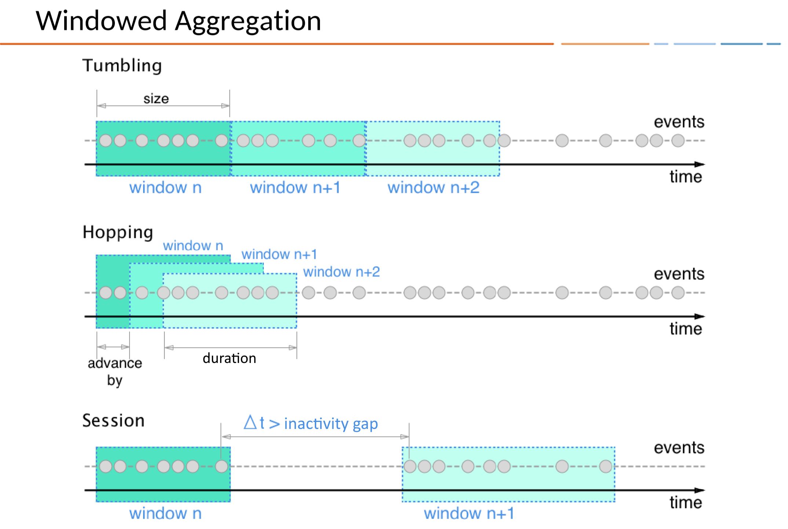

.. _time-and-windows:

Time and Windows in KSQL
########################

In KSQL, a record is an immutable representation of an event in time. Each
record carries a timestamp. This is the default timestamp that KSQL uses for
processing the record. The timestamp is set either by the producer application
or by the Kafka broker, depending on the topic's configuration.

The timestamp has different meanings depending on the implementation.
A record's timestamp can refer to the time when the event occurred, or
when the record was ingested into Kafka, or when the record was processed.
These times are *event-time*, *ingestion-time*, and *processing-time*. 

Event-time
    The time when a record is created by the data source. Achieving event-time
    semantics requires embedding timestamps in records when an event occurs and
    the record is produced.

    For example, if the record is a geo-location change reported by a GPS sensor
    in a car, the associated event-time is the time when the GPS sensor captured
    the location change.

Ingestion-time
    The time when a record is stored in a topic partition by a Kafka broker.
    Ingestion-time is similar to event-time, as a timestamp is embedded in the
    record, but the ingestion timestamp is generated when the Kafka broker appends
    the record to the target topic.
    
    Ingestion-time may approximate event-time reasonably well if the time
    difference between creation of the record and its ingestion into Kafka
    is sufficiently small. This means that ingestion-time may be an alternative
    for use cases where event-time semantics aren't possible.
    
    You may face this situation when data producers don't embed timestamps in
    records, as in older versions of Kafka’s Java producer client, or when the
    producer can't assign timestamps directly, like when it doesn't have access
    to a local clock.

Processing-time
    The time when the record is consumed by a stream processing application.
    The processing-time may happen immediately after ingestion-time, or it may
    happen much later, in milliseconds, hours, or days.

    For example, imagine an analytics application that reads and processes the
    geo-location data reported from car sensors, and presents it to a
    fleet-management dashboard. In this case, processing-time in the analytics
    application might be milliseconds or seconds after event-time, like for
    real-time pipelines based on Apache Kafka and KSQL, or it might be hours,
    like for batch pipelines based on Apache Hadoop or Apache Spark.

A record's timestamp is set either by the record's producer or by the Kafka
broker, depending on the topic's timestamp configuration. The topic's
`message.timestamp.type <https://docs.confluent.io/current/installation/configuration/topic-configs.html#message-timestamp-type>`__
setting can be either ``CreateTime`` or ``LogAppendTime``.

CreateTime
    The broker uses the the record's timestamp as set by the producer. This setting
    enforces event-time semantics.

LogAppendTime
    The broker overwrites the record's timestamp with the broker's local time
    when it appends the record to the topic's log. This setting enforces
    ingestion-time semantics. If ``LogAppendTime`` is configured, the producer
    has no control over the timestamp.

KSQL doesn't support processing-time operations directly, but you can implement
user-defined functions (UDFs) that access the current time. For more
information, see :ref:`ksql-udfs`.

By default, when KSQL imports a topic to create a stream, it uses the record's
timestamp, but you can add the WITH(TIMESTAMP='some-field') clause to use a
different field from the record's value as the timestamp. The optional TIMESTAMP_FORMAT
property indicates how KSQL should parse the field. The field you specify can
be an event-time or an ingestion-time.

.. important::

    If you use the WITH(timestamp=...) clause, this timestamp must be expressible
    as Unix epoch time in milliseconds, which is the number of milliseconds
    that have elapsed since 1 January 1970 at midnight UTC/GMT.

    When working with time you should also make sure that additional
    aspects of time, like time zones and calendars, are correctly synchronized – or
    at least understood and traced – throughout your streaming data pipelines. It often
    helps, for example, to agree on specifying time information in UTC or in Unix time,
    like seconds since the Unix epoch.

    KSQL is based on the Unix epoch time in the UTC timezone, and this can affect
    time windows. For example, if you define a 24-hour tumbling time window, it will
    be in the UTC timezone, which may not be appropriate if you want to have daily
    windows in your timezone.

    Don't mix topics that have different time semantics.

When a KSQL application writes records to Kafka, it assigns timestamps to the
new records. Timestamps are assigned based on the context:

* When new output records are generated by processing an input record directly,
  output record timestamps are inherited from input record timestamps.
* When new output records are generated by a periodic function, the output record
  timestamp is defined as the current internal time of the stream task.
* For aggregations, the timestamp of the resulting update record is taken from
  the latest input record that triggered the update.

 (The producer can chose to set the timestamp to any time they like, but most
 often chose either some sensible 'event-time' or the current time, which would
 be equivalent to 'ingestion-time'. If they don't set a timestamp it's set to
 'ingestion-time' by Kafka.)

If ``CreateTime`` is set, the following holds for the producer:

* if a `ProducerRecord`` is created, by default it contains no timestamp
* users can set the timestamp on ``ProducerRecord`` explicitly
* if the timestamp is not set, on ``producer.send()`` the current wall-clock time will be set automatically
Note, that we consider all three cases as "event-time" and don't distinguish them in our current terminology.
I agree, that semantically we could follow Andy's suggestion, but I believe this would make it more complex 
for users to understand the subtle differences. Thus, I would prefer to stay with our current (maybe simplified) terminology.

https://kafka.apache.org/11/javadoc/org/apache/kafka/clients/producer/ProducerRecord.html

The record also has an associated timestamp. If the user did not provide a timestamp, the producer will stamp the record with its current time. The timestamp eventually used by Kafka depends on the timestamp type configured for the topic.

If the topic is configured to use CreateTime, the timestamp in the producer record will be used by the broker.
If the topic is configured to use LogAppendTime, the timestamp in the producer record will be overwritten by the broker with the broker local time when it appends the message to its log.
In either of the cases above, the timestamp that has actually been used will be returned to user in RecordMetadata

https://docs.confluent.io/current/streams/javadocs/org/apache/kafka/streams/processor/TimestampExtractor.html

KSQL assigns a timestamp to every data record by using *timestamp extractors*,
which are per-record timestamps that describe the progress of a stream over time.

Concrete implementations of timestamp extractors may retrieve or compute timestamps
based on the actual contents of data records such as an embedded timestamp field to provide
event-time or ingestion-time semantics, or use any other approach such as returning the
current wall-clock time at the time of processing, thereby yielding processing-time semantics
to stream processing applications.

Developers can thus enforce different notions/semantics of time depending on their business needs.

Timestamps are used by time-dependent operations, like joins. Records may be
out-of-order within the stream.

Representing time consistently enables aggregation operations on streams,
like SUM, that have time boundaries.

Windowing
*********

Windowing lets you control how to group records that have the same key for stateful
operations such as aggregations or joins into so-called windows. Windows are tracked
per record key.

When working with windows, you can specify a retention period for the window.
This retention period controls how long KSQL waits for out-of-order or late-arriving records
for a given window. If a record arrives after the retention period of a window has passed,
the record is discarded and will not be processed in that window.

In 5.1, we added a new configuration that we call "grace period" that determines how long
we wait before we close a window. Retention time is still a valid parameter that defines
how long we store the (potentially) closed window -- we do this to allow to access the
window via Interactive Queries even if it's already closed.

Late-arriving records are always possible in the real world and should be properly accounted
for in your applications. It depends on the effective time semantics how late records are handled.
In the case of processing-time, the semantics are “when the record is being processed”, which means
that the notion of late records is not applicable as, by definition, no record can be late.
Hence, late-arriving records can only be considered as such (i.e. as arriving “late”) for
event-time or ingestion-time semantics. In both cases, KSQL is able to properly
handle late-arriving records.

.. image:: ../img/ksql-window.png

Session Window start and end time are both inclusive (in contrast to time-windows),
and there is always a record in the session window with the start and end timestamps
(because the timestamp of the first and last record in the window define window start and end time).
