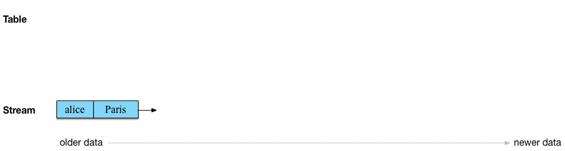

.. _aggregate-streaming-data-with-ksql:

Aggregate Streaming Data With KSQL
##################################

KSQL supports several aggregate functions, like COUNT and SUM. You can use
these to build stateful aggregates on streaming data. For the full list, see
:ref:`ksql_aggregate_functions`.

Here are some examples that show how to aggregate data from an inbound stream
of pageview records, named ``pageviews``.

Aggregate Results in a KSQL Table
*********************************

The result of an aggregate query in KSQL is always a table, because KSQL
computes the aggregate for each key, and possibly for each window per key, and
updates these results as it processes new input data for a key.

Assume that you want to count the number of pageviews per region. The following
query uses the COUNT function to count the pageviews from the time you start the
query until you terminate it. The query uses the CREATE TABLE AS SELECT statement,
because the result of the query is a KSQL table.

.. code:: sql

    CREATE TABLE pageviews_per_region AS \
      SELECT regionid, \
             COUNT(*) \
      FROM pageviews \
      GROUP BY regionid;

Tombstone Records
=================

An important difference between tables and streams is that a record with a
non-null key and a null value has a special semantic meaning: in a table, this
kind of record is a *tombstone*, which tells KSQL to “DELETE this key from the
table”. For a stream, null is a value like any other, with no special meaning.

Aggregate Over Windows
**********************

KSQL supports aggregation using tumbling, hopping, and session windows.

In a windowed aggregation, the first seen message is written into the table for
a particular key as a null. Downstream applications reading the data will see
nulls, and if an application can't handle null values, it may need a separate
stream that filters these null records with a WHERE clause.

Aggregate Records Over a Tumbling Window
========================================

This query computes the pageview count per region per minute:

.. code:: sql

    CREATE TABLE pageviews_per_region_per_minute AS \
      SELECT regionid, \
             COUNT(*) \
      FROM pageviews \
      WINDOW TUMBLING (SIZE 1 MINUTE) \
      GROUP BY regionid;

To count the pageviews for “Region_6” by female users every
30 seconds, you can change the previous query to the following:

.. code:: sql

    CREATE TABLE pageviews_per_region_per_30secs AS \
      SELECT regionid, \
             COUNT(*) \
      FROM pageviews \
      WINDOW TUMBLING (SIZE 30 SECONDS) \
      WHERE UCASE(gender)='FEMALE' AND LCASE(regionid)='region_6' \
      GROUP BY regionid;

Aggregate Records Over a Hopping Window
=======================================

This query computes the count for a hopping window of 30 seconds that advances
by 10 seconds.

UCASE and LCASE functions are used to convert the values of ``gender``
and ``regionid`` columns to uppercase and lowercase, so that you can match
them correctly. KSQL also supports the LIKE operator for prefix, suffix,
and substring matching.

.. code:: sql

    CREATE TABLE pageviews_per_region_per_30secs10secs AS \
      SELECT regionid, \
             COUNT(*) \
      FROM pageviews \
      WINDOW HOPPING (SIZE 30 SECONDS, ADVANCE BY 10 SECONDS) \
      WHERE UCASE(gender)='FEMALE' AND LCASE (regionid) LIKE '%_6' \
      GROUP BY regionid;

Aggregate Records Over a Session Window
=======================================

The following query counts the number of pageviews per region for session
windows, with a session inactivity gap of 60 seconds. This query *sessionizes*
the input data and performs the counting step per region.

.. code:: sql

    CREATE TABLE pageviews_per_region_per_session AS \
      SELECT regionid, \
             COUNT(*) \
      FROM pageviews \
      WINDOW SESSION (60 SECONDS) \
      GROUP BY regionid;

For more information, see :ref:`time-and-windows-in-ksql-queries`.

Next Steps
**********

* Watch the screencast of `Aggregations in KSQL <https://www.youtube.com/embed/db5SsmNvej4>`_ on YouTube.
* `Aggregating Data <https://www.confluent.io/stream-processing-cookbook/ksql-recipes/aggregating-data>`__
* `Detecting Abnormal Transactions <https://www.confluent.io/stream-processing-cookbook/ksql-recipes/detecting-abnormal-transactions>`__
* `Inline Streaming Aggregation <https://www.confluent.io/stream-processing-cookbook/ksql-recipes/inline-streaming-aggregation>`__