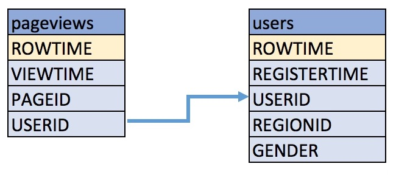

.. Avro note

.. note::
    - To use Avro, you must have Confluent Schema Registry enabled and set ``ksql.schema.registry.url`` in the KSQL
      server configuration file. See :ref:`install_ksql-avro-schema`.
    - Avro field names are not case sensitive in KSQL. This matches the KSQL column name behavior.

.. demo

Learn More
    Watch the `screencast of the KSQL demo <https://www.youtube.com/embed/A45uRzJiv7I>`_ on YouTube.

    .. raw:: html

          

              <iframe src="https://www.youtube.com/embed/A45uRzJiv7I" frameborder="0" allowfullscreen style="position: absolute; top: 0; left: 0; width: 100%; height: 100%;"></iframe>
          

.. CLI welcome

.. code:: bash

                          ===========================================
                          =        _  __ _____  ____  _             =
                          =       | |/ // ____|/ __ \| |            =
                          =       | ' /| (___ | |  | | |            =
                          =       |  <  \___ \| |  | | |            =
                          =       | . \ ____) | |__| | |____        =
                          =       |_|\_\_____/ \___\_\______|       =
                          =                                         =
                          =  Streaming SQL Engine for Apache Kafka® =
                          ===========================================

        Copyright 2018 Confluent Inc.

        CLI v4.1.0, Server v4.1.0 located at http://localhost:8088

        Having trouble? Type 'help' (case-insensitive) for a rundown of how things work!

        ksql>

.. basics tutorial

------------------------------
Create Topics and Produce Data
------------------------------

Create and produce data to the Kafka topics ``pageviews`` and ``users``. These steps use the KSQL datagen that is included
|cp|.

1. Create the ``pageviews`` topic and produce data using the data generator. The following example continuously generates data with a
   value in DELIMITED format.

   .. code:: bash

       $ <path-to-confluent>/bin/ksql-datagen quickstart=pageviews format=delimited topic=pageviews maxInterval=500

2. Produce Kafka data to the ``users`` topic using the data generator. The following example continuously generates data with a value in
   JSON format.

   .. code:: bash

       $ <path-to-confluent>/bin/ksql-datagen quickstart=users format=json topic=users maxInterval=100

.. tip:: You can also produce Kafka data using the ``kafka-console-producer`` CLI provided with |cp|.

-------------------
Launch the KSQL CLI
-------------------
To launch the CLI, run the following command. It will route the CLI logs to the ``.ksql_logs`` directory. By default,
the CLI will look for a KSQL Server running at ``http://localhost:8088``.

.. code:: bash

   $ LOG_DIR=./ksql_logs <path-to-confluent>/bin/ksql

After KSQL is started, your terminal should resemble this.

.. include:: ../includes/ksql-includes.rst
  :start-line: 19
  :end-line: 40

.. _create-a-stream-and-table:

-------------------------
Create a Stream and Table
-------------------------

These examples query messages from Kafka topics called ``pageviews`` and ``users`` using the following schemas:

#. Create a stream ``pageviews_original`` from the Kafka topic ``pageviews``, specifying the ``value_format`` of ``DELIMITED``.

   Describe the new STREAM. Notice that KSQL created additional columns called ``ROWTIME``, which corresponds to the Kafka message timestamp,
   and ``ROWKEY``, which corresponds to the Kafka message key.

   .. code:: bash

        ksql> CREATE STREAM pageviews_original (viewtime bigint, userid varchar, pageid varchar) WITH \
        (kafka_topic='pageviews', value_format='DELIMITED');

   Your output should resemble:

   .. code:: bash

         Message
        ---------------
         Stream created
        ---------------

   .. tip:: You can run ``DESCRIBE pageviews_original;`` to describe the stream.

#. Create a table ``users_original`` from the Kafka topic ``users``, specifying the ``value_format`` of ``JSON``.

   .. code:: bash

    ksql> CREATE TABLE users_original (registertime BIGINT, gender VARCHAR, regionid VARCHAR, userid VARCHAR) WITH \
    (kafka_topic='users', value_format='JSON', key = 'userid');

   Your output should resemble:

   .. code:: bash

         Message
        ---------------
         Table created
        ---------------

   .. tip:: You can run ``DESCRIBE users_original;`` to describe the table.

#. Optional: Show all streams and tables.

   .. code:: bash

       ksql> SHOW STREAMS;

        Stream Name              | Kafka Topic              | Format
       -----------------------------------------------------------------
        PAGEVIEWS_ORIGINAL       | pageviews                | DELIMITED

       ksql> SHOW TABLES;

        Table Name        | Kafka Topic       | Format    | Windowed
       --------------------------------------------------------------
        USERS_ORIGINAL    | users             | JSON      | false

-------------
Write Queries
-------------

These examples write queries using KSQL.

**Note:** By default KSQL reads the topics for streams and tables from
the latest offset.

#. Use ``SELECT`` to create a query that returns data from a STREAM. This query includes the ``LIMIT`` keyword to limit
   the number of rows returned in the query result. Note that exact data output may vary because of the randomness of the data generation.

   .. code:: bash

       ksql> SELECT pageid FROM pageviews_original LIMIT 3;

   Your output should resemble:

   .. code:: bash

       Page_24
       Page_73
       Page_78
       LIMIT reached for the partition.
       Query terminated

#. Create a persistent query by using the ``CREATE STREAM`` keywords to precede the ``SELECT`` statement. The results from this
   query are written to the ``PAGEVIEWS_ENRICHED`` Kafka topic. The following query enriches the ``pageviews`` STREAM by
   doing a ``LEFT JOIN`` with the ``users_original`` TABLE on the user ID.

   .. code:: bash

    ksql> CREATE STREAM pageviews_enriched AS SELECT users_original.userid AS userid, pageid, regionid, gender \
    FROM pageviews_original LEFT JOIN users_original ON pageviews_original.userid = users_original.userid;

   Your output should resemble:

   .. code:: bash

         Message
        ----------------------------
         Stream created and running
        ----------------------------

   .. tip:: You can run ``DESCRIBE pageviews_enriched;`` to describe the stream.

#. Use ``SELECT`` to view query results as they come in. To stop viewing the query results, press ``<ctrl-c>``. This stops printing to the
   console but it does not terminate the actual query. The query continues to run in the underlying KSQL application.

   .. code:: bash

       ksql> SELECT * FROM pageviews_enriched;

   Your output should resemble:

   .. code:: bash

       1519746861328 | User_4 | User_4 | Page_58 | Region_5 | OTHER
       1519746861794 | User_9 | User_9 | Page_94 | Region_9 | MALE
       1519746862164 | User_1 | User_1 | Page_90 | Region_7 | FEMALE
       ^CQuery terminated

#. Create a new persistent query where a condition limits the streams content, using ``WHERE``. Results from this query
   are written to a Kafka topic called ``PAGEVIEWS_FEMALE``.

   .. code:: bash

    ksql> CREATE STREAM pageviews_female AS SELECT * FROM pageviews_enriched WHERE gender = 'FEMALE';

   Your output should resemble:

   .. code:: bash

         Message
        ----------------------------
         Stream created and running
        ----------------------------

   .. tip:: You can run ``DESCRIBE pageviews_female;`` to describe the stream.

#. Create a new persistent query where another condition is met, using ``LIKE``. Results from this query are written to the
   ``pageviews_enriched_r8_r9`` Kafka topic.

   .. code:: bash

       ksql> CREATE STREAM pageviews_female_like_89 WITH (kafka_topic='pageviews_enriched_r8_r9', \
       value_format='DELIMITED') AS SELECT * FROM pageviews_female WHERE regionid LIKE '%_8' OR regionid LIKE '%_9';

   Your output should resemble:

   .. code:: bash

         Message
        ----------------------------
         Stream created and running
        ----------------------------

#. Create a new persistent query that counts the pageviews for each region and gender combination in a
   :ref:`tumbling window <windowing-tumbling>` of 30 seconds when the count is greater than 1. Results from this query
   are written to the ``PAGEVIEWS_REGIONS`` Kafka topic in the Avro format. KSQL will register the Avro schema with the
   configured schema registry when it writes the first message to the ``PAGEVIEWS_REGIONS`` topic.

   .. code:: bash

    ksql> CREATE TABLE pageviews_regions WITH (value_format='avro') AS SELECT gender, regionid , COUNT(*) AS numusers \
    FROM pageviews_enriched WINDOW TUMBLING (size 30 second) GROUP BY gender, regionid HAVING COUNT(*) > 1;

   Your output should resemble:

   .. code:: bash

         Message
        ---------------------------
         Table created and running
        ---------------------------

   .. tip:: You can run ``DESCRIBE pageviews_regions;`` to describe the table.

#. Optional: View results from the above queries using ``SELECT``.

   .. code:: bash

       ksql> SELECT gender, regionid, numusers FROM pageviews_regions LIMIT 5;

   Your output should resemble:

   .. code:: bash

       FEMALE | Region_6 | 3
       FEMALE | Region_1 | 4
       FEMALE | Region_9 | 6
       MALE | Region_8 | 2
       OTHER | Region_5 | 4
       LIMIT reached for the partition.
       Query terminated
       ksql>

#.  Optional: Show all persistent queries.

    .. code:: bash

        ksql> SHOW QUERIES;

    Your output should resemble:

    .. code:: bash

        Query ID                      | Kafka Topic              | Query String
        ----------------------------------------------------------------------------------------------------------------------------------------------------------------------------------------------------------------------------------------------------------------------------------------------
        CTAS_PAGEVIEWS_REGIONS        | PAGEVIEWS_REGIONS        | CREATE TABLE pageviews_regions WITH (value_format='avro') AS SELECT gender, regionid , COUNT(*) AS numusers FROM pageviews_female WINDOW TUMBLING (size 30 second) GROUP BY gender, regionid HAVING COUNT(*) > 1;
        CSAS_PAGEVIEWS_FEMALE         | PAGEVIEWS_FEMALE         | CREATE STREAM pageviews_female AS SELECT users_original.userid AS userid, pageid, regionid, gender FROM pageviews_original LEFT JOIN users_original ON pageviews_original.userid = users_original.userid WHERE gender = 'FEMALE';
        CSAS_PAGEVIEWS_FEMALE_LIKE_89 | pageviews_enriched_r8_r9 | CREATE STREAM pageviews_female_like_89 WITH (kafka_topic='pageviews_enriched_r8_r9', value_format='DELIMITED') AS SELECT * FROM pageviews_female WHERE regionid LIKE '%_8' OR regionid LIKE '%_9';
        ----------------------------------------------------------------------------------------------------------------------------------------------------------------------------------------------------------------------------------------------------------------------------------------------

------------------
Terminate and Exit
------------------

KSQL
----

**Important:** Queries will continuously run as KSQL applications until
they are manually terminated. Exiting KSQL does not terminate persistent
queries.

#. From the output of ``SHOW QUERIES;`` identify a query ID you would
   like to terminate. For example, if you wish to terminate query ID
   ``CTAS_PAGEVIEWS_REGIONS``:

   .. code:: bash

       ksql> TERMINATE CTAS_PAGEVIEWS_REGIONS;

#. Run this command to exit the KSQL CLI.

   .. code:: bash

       ksql> exit

.. enable JMX metrics

To enable JMX metrics, set ``JMX_PORT`` before starting the KSQL server:

.. code:: bash

    $ export JMX_PORT=1099 && \
      <path-to-confluent>/bin/ksql-server-start <path-to-confluent>/etc/ksql/ksql-server.properties

.. log limitations

.. important:: By default KSQL attempts to store its logs in a directory called ``logs`` that is relative to the location
               of the ``ksql`` executable. For example, if ``ksql`` is installed at ``/usr/local/bin/ksql``, then it would
               attempt to store its logs in ``/usr/local/logs``. If you are running ``ksql`` from the default |cp|
               location, ``<path-to-confluent>/bin``, you must override this default behavior by using the ``LOG_DIR`` variable.

               For example, to store your logs in the ``ksql_logs`` directory within your current working directory, run this
               command when starting the KSQL CLI:

               .. code:: bash

                    $ LOG_DIR=./ksql_logs <path-to-confluent>/bin/ksql
