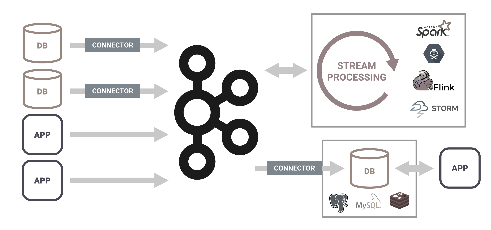
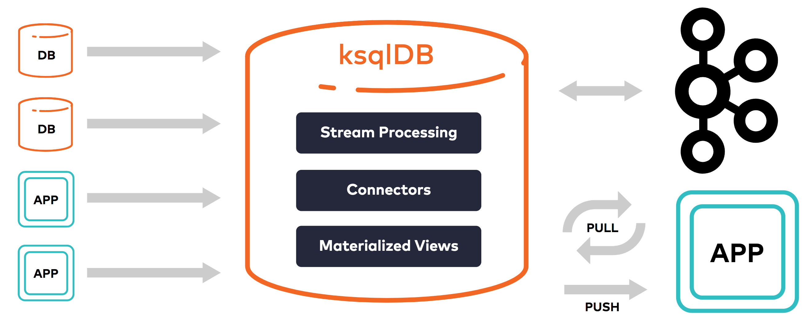
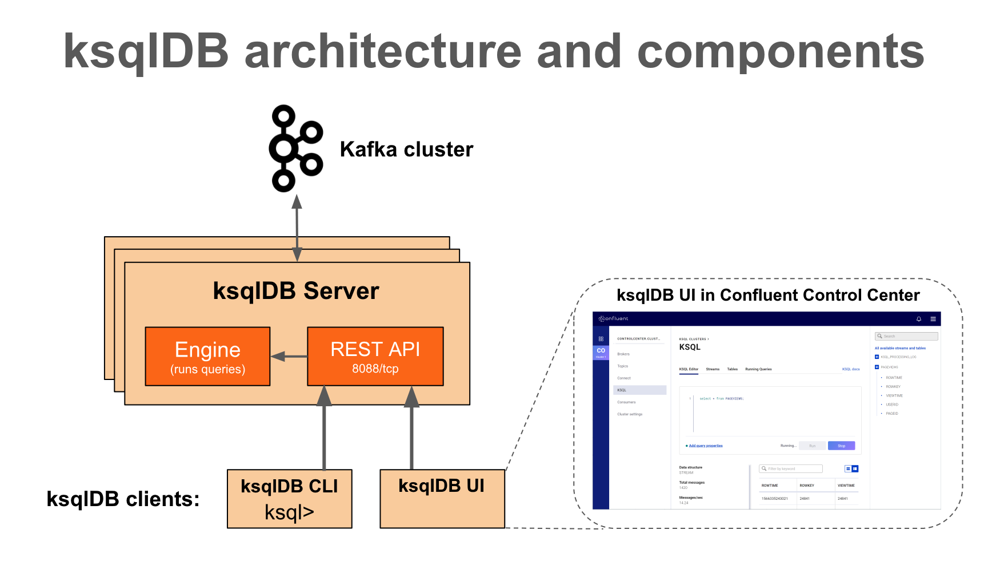

What is ksqlDB?
---------------

ksqlDB is an event streaming database purpose-built to help developers create
stream processing applications on top of {{ site.aktm }}.

Why use ksqlDB to build stream processing applications?
-------------------------------------------------------

In today’s world, applications that leverage stream processing need a
heavyweight architecture that requires integrating several distributed
systems together. These architectures often include a fleet of connectors
or agents for acquiring events from the outside world, durable storage to house
these events, a stream processing framework for processing the events, and a
database to serve aggregations of events to applications.

Unfortunately, the parts don't fit together as well as you'd hope; all of these
systems are complex, and each integration is a small project to figure out.
It's like trying to build a car out of parts, but the parts come from different
manufacturers who don't talk to each other.

It shouldn't be this difficult to build stream processing applications.

ksqlDB greatly reduces the operational complexity required to build stream
processing applications, which enables you to build real-time systems without
requiring significant time and overhead. It combines the power of real-time
stream processing with the approachable feel of a database, through
a familiar, lightweight SQL syntax. And because ksqlDB is natively powered by
{{ site.aktm }}, it seamlessly leverages the underlying, battle-tested event
streaming platform.

What are the components of ksqlDB?
----------------------------------

These are the core categories that are foundational to building an app:
collections, materialized views, and queries.

### Collections

Collections provide durable storage for sequences of events. ksqlDB offers
two kinds of collections: streams and tables. Both operate under a simple
key/value model. 

- **Streams** are immutable, append-only collections. They're useful for
  representing a series of historical facts. Adding multiple events with the
  same key means that they are simply appended to the end of the stream.
- **Tables** are mutable collections. They let you represent the latest version
  of each value per key. They're helpful for modeling change over time, and
  they're often used to represent aggregations.

Because ksqlDB leverages {{ site.ak }} for its storage layer, creating a new
collection equates to defining a stream or a table over a {{ site.aktm }}
topic. You can declare a collection over an existing topic, or ksqlDB can
create a new topic for the collection at declaration time. For more information,
see [Collections](concepts/collections/index.md).

### Materialized Views

Materialized views are derived representations of streams or tables. They
enable you to create new collections over existing streams or tables.
Materialized views are perpetually kept up to date as new events arrive. This
means that you can chain materialized views together to create many
representations of the same data. Materialized views are especially useful for
maintaining aggregated tables of data. For more information,
see [Materialized Views](concepts/materialized-views.md).

### Queries

While materialized views allow you to maintain state, queries enable you to
access these materializations from applications or microservices. Applications
can query materialized views with *pull queries* and *push queries*.

- **Pull queries** enable you to fetch the current state of a materialized view.
  Because materialized views are updated incrementally as new events arrive,
  pull queries run with predictably low latency. They're a good fit for
  request/response flows.
- **Push queries** enable you to subscribe to materialized view updates and
  stream changes. When new events arrive, push queries emit refinements, so
  your event streaming applications can react to new information in real-time.
  They’re a good fit for asynchronous application flows.

### What Can I Do With ksqlDB?

Streaming ETL
:   Apache Kafka is a popular choice for powering data pipelines. ksqlDB
    makes it simple to transform data within the pipeline, readying
    messages to cleanly land in another system.

Real-time Monitoring and Analytics

:   Track, understand, and manage infrastructure, applications, and data
    feeds by quickly building real-time dashboards, generating metrics,
    and creating custom alerts and messages.

Data exploration and discovery

:   Navigate and browse through your data in {{ site.ak }}.

Anomaly detection

:   Identify patterns and spot anomalies in real-time data with
    millisecond latency, enabling you to properly surface out-of-the-ordinary
    events and to handle fraudulent activities separately.

Personalization

:   Create data driven real-time experiences and insight for users.

Sensor data and IoT

:   Understand and deliver sensor data how and where it needs to be.

Customer 360-view

:   Achieve a comprehensive understanding of your customers across every
    interaction through a variety of channels, where new information is
    continuously incorporated in real-time.

# How does it fit in my architecture?

ksqlDB Server

:   The ksqlDB server runs the engine that executes SQL queries. This
    includes processing, reading, and writing data to and from the
    target {{ site.ak }} cluster.

    ksqlDB servers form ksqlDB clusters and can run in containers, virtual
    machines, and bare-metal machines. You can add and remove servers
    to/from the same ksqlDB cluster during live operations to scale ksqlDB's
    processing capacity as desired. You can deploy different ksqlDB clusters
    to achieve workload isolation.

ksqlDB CLI

:   You can write SQL queries interactively by using the ksqlDB command
    line interface (CLI). The ksqlDB CLI acts as a client to ksqlDB
    Server.

ksqlDB servers, clients, queries, and applications run outside of {{ site.ak }}
brokers, in separate JVM instances, or in separate clusters entirely.

Supported Versions and Interoperability
---------------------------------------

You can use {{ site.ak }} with compatible {{ site.cp }} and {{ site.aktm }}
versions.

|    ksqlDB version     | {{ site.ksqldbversion }} |
| --------------------- | ------------------------ |
| Apache Kafka version  | 0.11.0 and later         |

