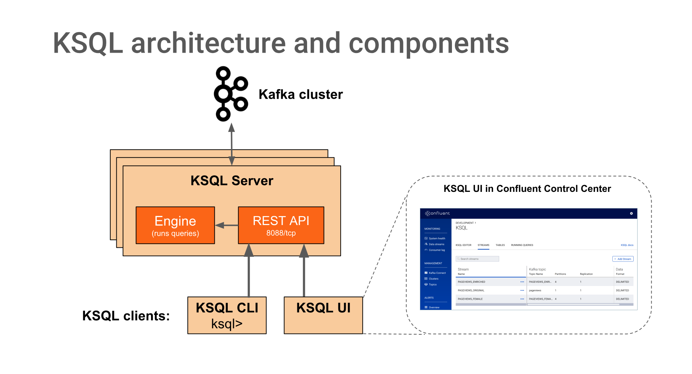

.. _ksql_home:

KSQL
====

What Is KSQL?
-------------

KSQL is the streaming SQL engine for |ak-tm|. It provides an easy-to-use yet powerful interactive SQL
interface for stream processing on Kafka, without the need to write code in a programming language such as Java or
Python. KSQL is scalable, elastic, fault-tolerant, and real-time. It supports a wide range of streaming operations,
including data filtering, transformations, aggregations, joins, windowing, and sessionization.

.. include:: includes/ksql-includes.rst
    :start-after: demo_start
    :end-before: demo_end

What Can I Do With KSQL?
------------------------

Streaming ETL
    Apache Kafka is a popular choice for powering data pipelines. KSQL makes it simple to transform data within the pipeline, readying messages to cleanly land in another system.

Real-time Monitoring and Analytics
    Track, understand, and manage infrastructure, applications, and data feeds by quickly building real-time dashboards, generating metrics, and creating custom alerts and messages.

Data exploration and discovery
    Navigate and browse through your data in Kafka.

Anomaly detection
    Identify patterns and spot anomalies in real-time data with millisecond latency, allowing you to properly surface out of the ordinary events and to handle fraudulent activities separately.

Personalization
    Create data driven real-time experiences and insight for users.

Sensor data and IoT
    Understand and deliver sensor data how and where it needs to be.

Customer 360-view
    Achieve a comprehensive understanding of your customers across every interaction through a variety of channels, where new information is continuously incorporated in real-time.

What Are the Components?
------------------------

KSQL Server
    The KSQL server runs the engine that executes KSQL queries. This includes processing, reading, and writing data to
    and from the target Kafka cluster.

    KSQL servers form KSQL clusters and can run in containers, virtual machines, and bare-metal machines. You can add
    and remove servers to/from the same KSQL cluster during live operations to elastically scale KSQL's processing
    capacity as desired. You can deploy different KSQL clusters to achieve workload isolation.

KSQL CLI
    You can interactively write KSQL queries by using the KSQL command line interface (CLI). The KSQL CLI acts as a
    client to the KSQL server. For production scenarios you may also configure KSQL servers to run in non-interactive
    "headless" configuration, thereby preventing KSQL CLI access.

KSQL servers, clients, queries, and applications run outside of Kafka brokers,
in separate JVM instances, or in separate clusters entirely. 

KSQL Resources
--------------

- The `Stream Processing Cookbook <https://www.confluent.io/product/ksql/stream-processing-cookbook>`__
  contains KSQL recipes that provide in-depth tutorials and recommended deployment scenarios.
- Check out :ref:`ksql_tutorials` to learn about stream processing with KSQL.
- Watch the `screencast of What Can I Do With KSQL? <https://www.youtube.com/embed/euz0isNG1SQ>`_ on YouTube.

Supported Versions and Interoperability
---------------------------------------

.. _ksql-supported-versions:

.. include:: includes/ksql-supported-versions.rst

KSQL Documentation
------------------

.. toctree::
    :titlesonly:
    :maxdepth: 2

    quickstart
    installation/index
    concepts/index
    developer-guide/index
    operations
    capacity-planning
    tutorials/index
    faq
    changelog
    troubleshoot-ksql
