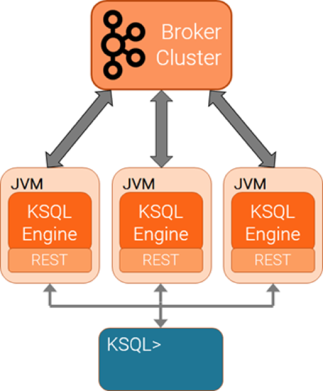

.. _install_overview:

Installing KSQL
===============

KSQL is a component of |cp| and the KSQL binaries are located at `https://www.confluent.io/download/ <https://www.confluent.io/download/>`_
as a part of the |cp| bundle.

KSQL must have access to a running Kafka cluster, which can be in your data center, in a public cloud, |ccloud|, etc.

Docker support
    You can deploy KSQL in Docker, however the current release does not yet ship with ready-to-use KSQL Docker images for
    production. These images are coming soon.

.. contents::
    :local:

.. _install_ksql-server:

------------------------
Starting the KSQL Server
------------------------

The KSQL servers are run separately from the KSQL CLI client and Kafka brokers. You can deploy servers on remote machines,
VMs, or containers and then the CLI connects to these remote servers.

You can add or remove servers from the same resource pool during live operations, to elastically scale query processing. You
can use different resource pools to support workload isolation. For example, you could deploy separate pools for production
and for testing.

You can only connect to one KSQL server at a time. The KSQL CLI does not support automatic failover to another KSQL server.

Follow these instructions to start KSQL server using the ``ksql-server-start`` script.

Tip
    For development and testing purposes, you can also use Confluent CLI to start |cp|, including KSQL, on a single host.
    For more information, see :ref:`quickstart`.

#.  Customize the KSQL ``<path-to-confluent>/etc/ksql/ksql-server.properties`` file.  The required parameters are ``bootstrap.servers``
    and ``listeners``. You can also set any property the Kafka Streams API, the Kafka producer, or the Kafka consumer.
    For a description of common configurations and how to set them, see :ref:`configuring-ksql`.

    Here are the default settings:

    .. code:: bash

        bootstrap.servers=localhost:9092
        listeners=http://localhost:8088
        ui.enabled=true

    You can also set or override any of the KSQL server properties by specifying them in the ``KSQL_OPTS`` environment variable.
    The properties are standard java system properties, for example, ``KSQL_OPTS=-Dbootstrap.servers=myhost:9090``
    Any properties set in this way take precedence over those specified in the ``ksql-server.properties`` file. This allows you to deploy a
    common set of properties and override specific properties as needed.

#.  Start a server node with this command:

    .. code:: bash

        $ <path-to-confluent>/bin/ksql-server-start <path-to-confluent>/etc/ksql/ksql-server.properties

    or with overriding properties:

    .. code:: bash
        $ KSQL_OPTS=-Dui.enabled=false <path-to-confluent>/bin/ksql-server-start <path-to-confluent>/etc/ksql/ksql-server.properties

.. tip:: You can view the KSQL server help text by running ``<path-to-confluent>/bin/ksql-server-start --help``.

         .. code:: bash

                NAME
                        server - KSQL Cluster

                SYNOPSIS
                        server [ {-h | --help} ] [ --queries-file <queriesFile> ] [--]
                                <config-file>

                OPTIONS
                        -h, --help
                            Display help information

                        --queries-file <queriesFile>
                            Path to the query file on the local machine.

                        --
                            This option can be used to separate command-line options from the
                            list of arguments (useful when arguments might be mistaken for
                            command-line options)

                        <config-file>
                            A file specifying configs for the KSQL Server, KSQL, and its
                            underlying Kafka Streams instance(s). Refer to KSQL documentation
                            for a list of available configs.

                            This option may occur a maximum of 1 times

.. _install_ksql-cli:

---------------------
Starting the KSQL CLI
---------------------

The KSQL CLI is a client that connects to the KSQL servers.

You can start the KSQL CLI by providing the connection information to the KSQL server.

.. code:: bash

    $ LOG_DIR=./ksql_logs <path-to-confluent>/bin/ksql http://localhost:8088

.. include:: ../includes/ksql-includes.rst
    :start-line: 338
    :end-line: 349

After KSQL is started, your terminal should resemble this.

.. include:: ../includes/ksql-includes.rst
    :start-line: 19
    :end-line: 40

Tip
    You can view the KSQL CLI help text by running ``<path-to-confluent>/bin/ksql --help``.

    .. code:: bash

            NAME
                    ksql - KSQL CLI

            SYNOPSIS
                    ksql [ --config-file <configFile> ] [ {-h | --help} ]
                            [ --output <outputFormat> ]
                            [ --query-row-limit <streamedQueryRowLimit> ]
                            [ --query-timeout <streamedQueryTimeoutMs> ] [--] <server>

            OPTIONS
                    --config-file <configFile>
                        A file specifying configs for Ksql and its underlying Kafka Streams
                        instance(s). Refer to KSQL documentation for a list of available
                        configs.

                    -h, --help
                        Display help information

                    --output <outputFormat>
                        The output format to use (either 'JSON' or 'TABULAR'; can be changed
                        during REPL as well; defaults to TABULAR)

                    --query-row-limit <streamedQueryRowLimit>
                        An optional maximum number of rows to read from streamed queries

                        This options value must fall in the following range: value >= 1

                    --query-timeout <streamedQueryTimeoutMs>
                        An optional time limit (in milliseconds) for streamed queries

                        This options value must fall in the following range: value >= 1

                    --
                        This option can be used to separate command-line options from the
                        list of arguments (useful when arguments might be mistaken for
                        command-line options)

                    <server>
                        The address of the Ksql server to connect to (ex:
                        http://confluent.io:9098)

                        This option may occur a maximum of 1 times
                            
                            
-----------------------------
Configuring KSQL for |ccloud|
-----------------------------

You can use KSQL with a Kafka cluster in |ccloud|. For more information, see :ref:`install_ksql-ccloud`.
