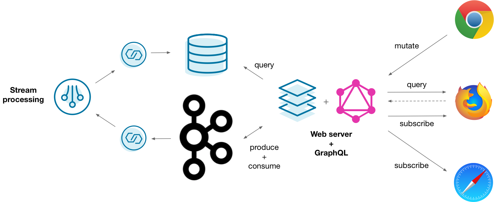
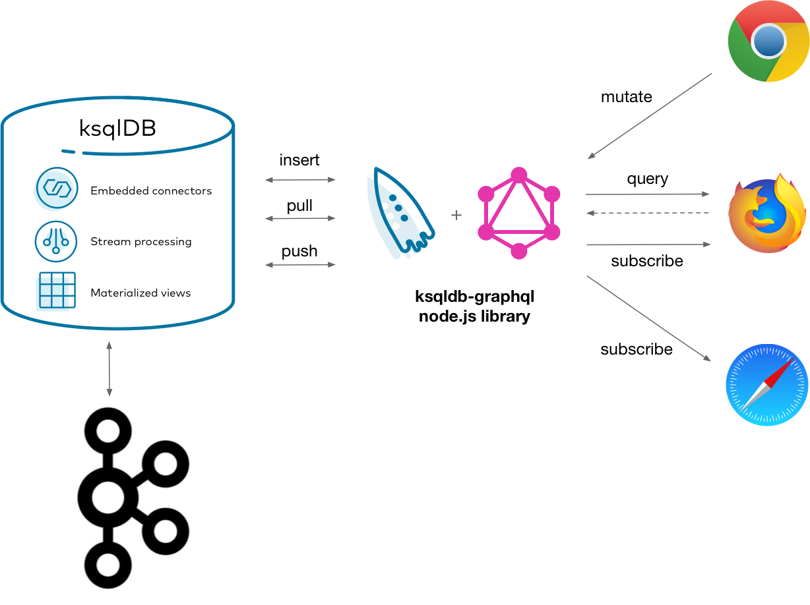

What is it?
-----------

An application backend is a software service that provides an API for a frontend application to interact with. When a frontend application displays information, it usually needs to communicate over a network to retrieve it. And when it lets users manipulate that information, it needs some way of persisting those changes.

There are a vast number of patterns for doing this with different technologies. But what they generally amount to is providing some way to write, read, and stream information between a frontend and backend.

{: class="centered-img" style="width: 90%"}

An increasingly popular way of doing this is by persisting all incoming events in Kafka and materializing them into views with a stream processor. The views are stored in a database. A web server issues interacts with both Kafka and the database to serve traffic and is ultimately fronted by GraphQL. This works, but it’s a lot to handle. Could you get the same solution with less complexity?

Why ksqlDB?
-----------

Connecting all of those systems in the right way is tricky. In addition to managing all the moving parts, it’s on you to make sure that data correctly flows from one component to the next. ksqlDB makes it easy to build an application backend by trimming down the number of components. It also provides a simple interface for writing, reading, and streaming events.

{: class="centered-img" style="width: 70%"}

Using ksqlDB and it’s out of the box GraphQL library, you can easily publish a powerful, modern API for your backend. It’s primitives for writing events, querying state, and subscribing to streams cleanly map onto the demands of today’s frontend applications.

Implement it
------------

Suppose that you're building a simple scoreboard application. Players score points in an imaginary game. The running totals for each player are dispayed and updated in a browser in real-time.

This full stack tutorial shows how to query and subscribe to a materialized cache of ongoing scores in ksqlDB. It demonstrates producing synthetic events with a data generator connector, forwarding them into Kafka, processing them with ksqlDB, and displaying them with React and GraphQL.

### Get the connectors

```
docker run --rm -v $PWD/confluent-hub-components:/share/confluent-hub-components confluentinc/ksqldb-server:{{ site.release }} confluent-hub install --no-prompt mdrogalis/voluble:0.3.0
```

### Start the stack

```yaml
---
version: '2'

services:
  zookeeper:
    image: confluentinc/cp-zookeeper:{{ site.cprelease }}
    hostname: zookeeper
    container_name: zookeeper
    ports:
      - "2181:2181"
    environment:
      ZOOKEEPER_CLIENT_PORT: 2181
      ZOOKEEPER_TICK_TIME: 2000

  broker:
    image: confluentinc/cp-enterprise-kafka:{{ site.cprelease }}
    hostname: broker
    container_name: broker
    depends_on:
      - zookeeper
    ports:
      - "29092:29092"
    environment:
      KAFKA_BROKER_ID: 1
      KAFKA_ZOOKEEPER_CONNECT: 'zookeeper:2181'
      KAFKA_LISTENER_SECURITY_PROTOCOL_MAP: PLAINTEXT:PLAINTEXT,PLAINTEXT_HOST:PLAINTEXT
      KAFKA_ADVERTISED_LISTENERS: PLAINTEXT://broker:9092,PLAINTEXT_HOST://localhost:29092
      KAFKA_OFFSETS_TOPIC_REPLICATION_FACTOR: 1
      KAFKA_GROUP_INITIAL_REBALANCE_DELAY_MS: 0
      KAFKA_TRANSACTION_STATE_LOG_MIN_ISR: 1
      KAFKA_TRANSACTION_STATE_LOG_REPLICATION_FACTOR: 1

  schema-registry:
    image: confluentinc/cp-schema-registry:{{ site.cprelease }}
    hostname: schema-registry
    container_name: schema-registry
    depends_on:
      - zookeeper
      - broker
    ports:
      - "8081:8081"
    environment:
      SCHEMA_REGISTRY_HOST_NAME: schema-registry
      SCHEMA_REGISTRY_KAFKASTORE_CONNECTION_URL: 'zookeeper:2181'

  ksqldb-server:
    image: confluentinc/ksqldb-server:{{ site.release }}
    hostname: ksqldb-server
    container_name: ksqldb-server
    depends_on:
      - broker
      - schema-registry
    ports:
      - "8088:8088"
    volumes:
      - "./confluent-hub-components/:/usr/share/kafka/plugins/"
    environment:
      KSQL_LISTENERS: "http://0.0.0.0:8088"
      KSQL_BOOTSTRAP_SERVERS: "broker:9092"
      KSQL_KSQL_SCHEMA_REGISTRY_URL: "http://schema-registry:8081"
      KSQL_KSQL_LOGGING_PROCESSING_STREAM_AUTO_CREATE: "true"
      KSQL_KSQL_LOGGING_PROCESSING_TOPIC_AUTO_CREATE: "true"
      # Configuration to embed Kafka Connect support.
      KSQL_CONNECT_GROUP_ID: "ksql-connect-cluster"
      KSQL_CONNECT_BOOTSTRAP_SERVERS: "broker:9092"
      KSQL_CONNECT_KEY_CONVERTER: "io.confluent.connect.avro.AvroConverter"
      KSQL_CONNECT_VALUE_CONVERTER: "io.confluent.connect.avro.AvroConverter"
      KSQL_CONNECT_KEY_CONVERTER_SCHEMA_REGISTRY_URL: "http://schema-registry:8081"
      KSQL_CONNECT_VALUE_CONVERTER_SCHEMA_REGISTRY_URL: "http://schema-registry:8081"
      KSQL_CONNECT_VALUE_CONVERTER_SCHEMAS_ENABLE: "false"
      KSQL_CONNECT_CONFIG_STORAGE_TOPIC: "ksql-connect-configs"
      KSQL_CONNECT_OFFSET_STORAGE_TOPIC: "ksql-connect-offsets"
      KSQL_CONNECT_STATUS_STORAGE_TOPIC: "ksql-connect-statuses"
      KSQL_CONNECT_CONFIG_STORAGE_REPLICATION_FACTOR: 1
      KSQL_CONNECT_OFFSET_STORAGE_REPLICATION_FACTOR: 1
      KSQL_CONNECT_STATUS_STORAGE_REPLICATION_FACTOR: 1
      KSQL_CONNECT_PLUGIN_PATH: "/usr/share/kafka/plugins"

  ksqldb-cli:
    image: confluentinc/ksqldb-cli:{{ site.release }}
    container_name: ksqldb-cli
    depends_on:
      - broker
      - ksqldb-server
    entrypoint: /bin/sh
    tty: true
```

```
docker exec -it ksqldb-cli ksql http://ksqldb-server:8088
```

```sql
SET 'auto.offset.reset' = 'earliest';
```

### Set up the score stream

```sql
CREATE STREAM score_events (
    player VARCHAR,
    points VARCHAR
) WITH (
    kafka_topic = 'score_events',
    partitions = 1,
    value_format = 'avro'
);
```

### Start the data generator

```sql
CREATE SOURCE CONNECTOR points_generator WITH (
    'connector.class' = 'io.mdrogalis.voluble.VolubleSourceConnector',
    'genv.score_events.player.with' = 'Player #{number.number_between ''1'',''6''}',
    'genv.score_events.points.with' = '#{number.number_between ''1'',''20''}',
    'global.throttle.ms' = '500'
);
```

### Make the scoreboard

```sql
CREATE TABLE scoreboard AS
    SELECT player,
           SUM (CAST(points AS INT)) AS points
    FROM score_events
    GROUP BY player
    EMIT CHANGES;
```

```sql
SELECT * FROM scoreboard EMIT CHANGES;
```


### Seed the profile data

```sql
CREATE STREAM player_events (
    player VARCHAR,
    avatar VARCHAR
) WITH (
    kafka_topic = 'player_events',
    partitions = 1,
    value_format = 'avro'
);
```

```sql
INSERT INTO player_events (
    player, avatar
) VALUES (
    'Player 1', 'https://cdn0.iconfinder.com/data/icons/avatar-vol-2-4/512/9-128.png'
);

INSERT INTO player_events (
    player, avatar
) VALUES (
    'Player 2', 'https://cdn0.iconfinder.com/data/icons/avatar-vol-2-4/512/6-128.png'
);

INSERT INTO player_events (
    player, avatar
) VALUES (
    'Player 3', 'https://cdn0.iconfinder.com/data/icons/avatar-vol-2-4/512/2-128.png'
);

INSERT INTO player_events (
    player, avatar
) VALUES (
    'Player 4', 'https://cdn0.iconfinder.com/data/icons/avatar-vol-2-4/512/4-128.png'
);

INSERT INTO player_events (
    player, avatar
) VALUES (
    'Player 5', 'https://cdn0.iconfinder.com/data/icons/avatar-vol-2-4/512/10-128.png'
);
```

```sql
CREATE TABLE player_profiles AS
    SELECT player, LATEST_BY_OFFSET(avatar) AS avatar
    FROM player_events
    GROUP BY player
    EMIT CHANGES;
```

### GraphQL stuff

### Tear down the stack

When you're done, tear down the stack by running:

```
docker-compose down
```

### Running this in production


Next steps
----------

Want to learn more? Try another use case tutorial:

- [Materialized view/cache](materialized.md)
- [Streaming ETL pipeline](etl.md)
- [Event-driven microservice](event-driven-microservice.md)