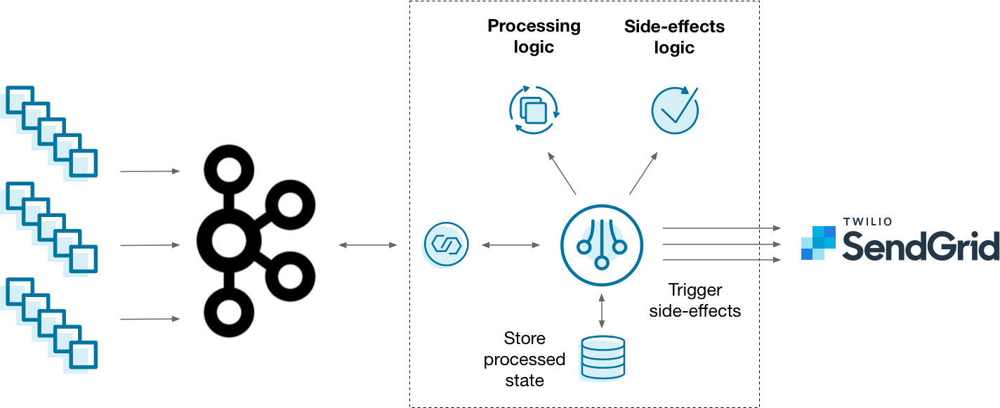
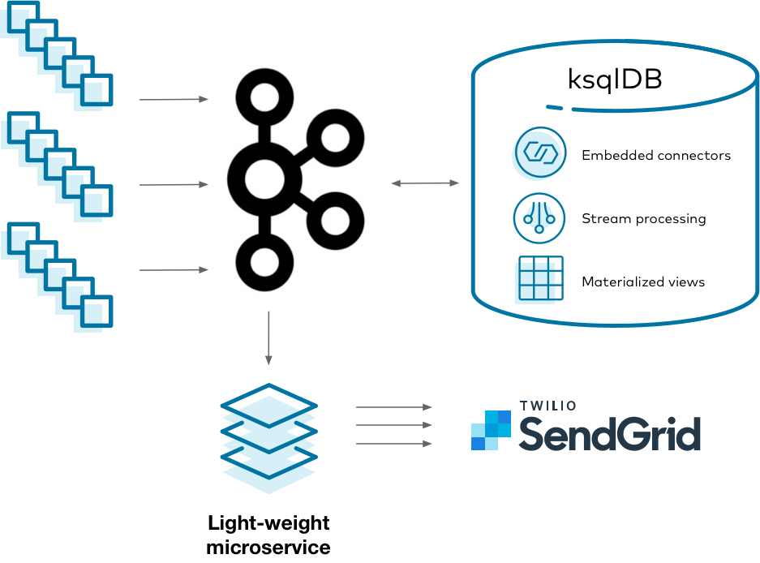

<script type="text/javascript">
        window.location = 'https://docs.confluent.io/platform/current/ksqldb/tutorials/event-driven-microservice.html';
</script>

# Event-driven microservice

## What is it?

An event-driven microservice is a pattern in which a piece of code only communicates with the outside world through messages called events. This technique can dramatically simplify an architecture because each microservice only receives and emits information from clearly defined communication channels. Because state is localized within each microservice, complexity is tightly contained.

{: class="centered-img" style="width: 90%"}

A common way that you might implement this architecture is to feed event streams into {{ site.ak }}, read them with a stream processing framework, and trigger side-effects whenever something of interest happens — like sending an email with [Twilio SendGrid](https://sendgrid.com/). This works, but it's up to you to blend your stream processing, state, and side-effects logic in a maintainable way. Is there a better approach?

## Why ksqlDB?

Scaling stateful services is challenging. Coupling a stateful service with the responsibility of triggering side-effects makes it even harder. It’s up to you to manage both as if they were one, even though they might have completely different needs. If you want to change how side-effects behave, you also need to redeploy your stateful stream processor. ksqlDB helps simplify this by splitting things up: stateful stream processing is managed on a cluster of servers, while side-effects run inside your stateless microservice.

{: class="centered-img" style="width: 70%"}

Using ksqlDB, you can isolate complex stateful operations within ksqlDB’s runtime. Your app stays simple because it is stateless. It merely reads events from a Kafka topic and executes side-effects as needed.

## Implement it

Imagine that you work at a financial services company which clears many credit card transactions each day. You want to prevent malicious activity in your customer base. When a high number of transactions occurs in a narrow window of time, you want to notify the cardholder of suspicious activity.

This tutorial shows how to create an event-driven microservice that identifies suspicious activity and notifies customers. It demonstrates finding anomalies with ksqlDB and sending alert emails using a simple Kafka consumer with SendGrid.

### Start the stack

To get started, create the following `docker-compose.yml` file. This specifies all the infrastructure that you'll need to run this tutorial:

```yaml
---
version: '2'

services:
  zookeeper:
    image: confluentinc/cp-zookeeper:{{ site.cprelease }}
    hostname: zookeeper
    container_name: zookeeper
    ports:
      - "2181:2181"
    environment:
      ZOOKEEPER_CLIENT_PORT: 2181
      ZOOKEEPER_TICK_TIME: 2000

  broker:
    image: confluentinc/cp-kafka:{{ site.cprelease }}
    hostname: broker
    container_name: broker
    depends_on:
      - zookeeper
    ports:
      - "29092:29092"
    environment:
      KAFKA_BROKER_ID: 1
      KAFKA_ZOOKEEPER_CONNECT: 'zookeeper:2181'
      KAFKA_LISTENER_SECURITY_PROTOCOL_MAP: PLAINTEXT:PLAINTEXT,PLAINTEXT_HOST:PLAINTEXT
      KAFKA_ADVERTISED_LISTENERS: PLAINTEXT://broker:9092,PLAINTEXT_HOST://localhost:29092
      KAFKA_OFFSETS_TOPIC_REPLICATION_FACTOR: 1
      KAFKA_GROUP_INITIAL_REBALANCE_DELAY_MS: 0
      KAFKA_TRANSACTION_STATE_LOG_MIN_ISR: 1
      KAFKA_TRANSACTION_STATE_LOG_REPLICATION_FACTOR: 1

  schema-registry:
    image: confluentinc/cp-schema-registry:{{ site.cprelease }}
    hostname: schema-registry
    container_name: schema-registry
    depends_on:
      - zookeeper
      - broker
    ports:
      - "8081:8081"
    environment:
      SCHEMA_REGISTRY_HOST_NAME: schema-registry
      SCHEMA_REGISTRY_KAFKASTORE_BOOTSTRAP_SERVERS: "PLAINTEXT://broker:9092"

  ksqldb-server:
    image: confluentinc/ksqldb-server:{{ site.ksqldbversion }}
    hostname: ksqldb-server
    container_name: ksqldb-server
    depends_on:
      - broker
      - schema-registry
    ports:
      - "8088:8088"
    environment:
      KSQL_LISTENERS: "http://0.0.0.0:8088"
      KSQL_BOOTSTRAP_SERVERS: "broker:9092"
      KSQL_KSQL_SCHEMA_REGISTRY_URL: "http://schema-registry:8081"
      KSQL_KSQL_LOGGING_PROCESSING_STREAM_AUTO_CREATE: "true"
      KSQL_KSQL_LOGGING_PROCESSING_TOPIC_AUTO_CREATE: "true"
      # Configuration to embed Kafka Connect support.
      KSQL_CONNECT_GROUP_ID: "ksql-connect-cluster"
      KSQL_CONNECT_BOOTSTRAP_SERVERS: "broker:9092"
      KSQL_CONNECT_KEY_CONVERTER: "org.apache.kafka.connect.storage.StringConverter"
      KSQL_CONNECT_VALUE_CONVERTER: "io.confluent.connect.avro.AvroConverter"
      KSQL_CONNECT_VALUE_CONVERTER_SCHEMA_REGISTRY_URL: "http://schema-registry:8081"
      KSQL_CONNECT_CONFIG_STORAGE_TOPIC: "_ksql-connect-configs"
      KSQL_CONNECT_OFFSET_STORAGE_TOPIC: "_ksql-connect-offsets"
      KSQL_CONNECT_STATUS_STORAGE_TOPIC: "_ksql-connect-statuses"
      KSQL_CONNECT_CONFIG_STORAGE_REPLICATION_FACTOR: 1
      KSQL_CONNECT_OFFSET_STORAGE_REPLICATION_FACTOR: 1
      KSQL_CONNECT_STATUS_STORAGE_REPLICATION_FACTOR: 1
      KSQL_CONNECT_PLUGIN_PATH: "/usr/share/kafka/plugins"

  ksqldb-cli:
    image: confluentinc/ksqldb-cli:{{ site.ksqldbversion }}
    container_name: ksqldb-cli
    depends_on:
      - broker
      - ksqldb-server
    entrypoint: /bin/sh
    tty: true
```

Bring up the stack by running:

```
docker-compose up
```

### Create the transactions stream

Connect to ksqlDB's server by using its interactive CLI. Run the following command from your host:

```
docker exec -it ksqldb-cli ksql http://ksqldb-server:8088
```

Before you issue more commands, tell ksqlDB to start all queries from earliest point in each topic:

```sql
SET 'auto.offset.reset' = 'earliest';
```

We want to model a stream of credit card transactions from which we'll look for anomalous activity. To do that, create a ksqlDB stream to represent the transactions. Each transaction has a few key pieces of information, like the card number, amount, and email address that it's associated with. Because the specified topic (`transactions`) does not exist yet, ksqlDB creates it on your behalf.

```sql
CREATE STREAM transactions (
    tx_id VARCHAR KEY,
    email_address VARCHAR,
    card_number VARCHAR,
    timestamp VARCHAR,
    amount DECIMAL(12, 2)
) WITH (
    kafka_topic = 'transactions',
    partitions = 8,
    value_format = 'avro',
    timestamp = 'timestamp',
    timestamp_format = 'yyyy-MM-dd''T''HH:mm:ss'
);
```

Notice that this stream is configured with a custom `timestamp` to signal that [event-time](../../concepts/time-and-windows-in-ksqldb-queries/#event-time) should be used instead of [processing-time](../../concepts/time-and-windows-in-ksqldb-queries/#processing-time). What this means is that when ksqlDB does time-related operations over the stream, it uses the `timestamp` column to measure time, not the current time of the operating system. This makes it possible to handle out-of-order events.

The stream is also configured to use the `Avro` format for the value part of the underlying {{ site.ak }} records that it generates. Because ksqlDB has been configured with {{ site.sr }} (as part of the Docker Compose file), the schemas of each stream and table are centrally tracked. We'll make use of this in our microservice later.

### Seed some transaction events

With the stream in place, seed it with some initial events. Run these statements at the CLI:

```sql
INSERT INTO transactions (
    email_address, card_number, tx_id, timestamp, amount
) VALUES (
    'michael@example.com',
    '358579699410099',
    'f88c5ebb-699c-4a7b-b544-45b30681cc39',
    '2020-04-22T03:19:58',
    50.25
);

INSERT INTO transactions (
    email_address, card_number, tx_id, timestamp, amount
) VALUES (
    'derek@example.com',
    '352642227248344',
    '0cf100ca-993c-427f-9ea5-e892ef350363',
    '2020-04-22T12:50:30',
    18.97
);

INSERT INTO transactions (
    email_address, card_number, tx_id, timestamp, amount
) VALUES (
    'colin@example.com',
    '373913272311617',
    'de9831c0-7cf1-4ebf-881d-0415edec0d6b',
    '2020-04-22T09:45:15',
    12.50
);

INSERT INTO transactions (
    email_address, card_number, tx_id, timestamp, amount
) VALUES (
    'michael@example.com',
    '358579699410099',
    '044530c0-b15d-4648-8f05-940acc321eb7',
    '2020-04-22T03:19:54',
    103.43
);

INSERT INTO transactions (
    email_address, card_number, tx_id, timestamp, amount
) VALUES (
    'derek@example.com',
    '352642227248344',
    '5d916e65-1af3-4142-9fd3-302dd55c512f',
    '2020-04-22T12:50:25',
    3200.80
);

INSERT INTO transactions (
    email_address, card_number, tx_id, timestamp, amount
) VALUES (
    'derek@example.com',
    '352642227248344',
    'd7d47fdb-75e9-46c0-93f6-d42ff1432eea',
    '2020-04-22T12:51:55',
    154.32
);

INSERT INTO transactions (
    email_address, card_number, tx_id, timestamp, amount
) VALUES (
    'michael@example.com',
    '358579699410099',
    'c5719d20-8d4a-47d4-8cd3-52ed784c89dc',
    '2020-04-22T03:19:32',
    78.73
);

INSERT INTO transactions (
    email_address, card_number, tx_id, timestamp, amount
) VALUES (
    'colin@example.com',
    '373913272311617',
    '2360d53e-3fad-4e9a-b306-b166b7ca4f64',
    '2020-04-22T09:45:35',
    234.65
);

INSERT INTO transactions (
    email_address, card_number, tx_id, timestamp, amount
) VALUES (
    'colin@example.com',
    '373913272311617',
    'de9831c0-7cf1-4ebf-881d-0415edec0d6b',
    '2020-04-22T09:44:03',
    150.00
);
```

### Create the anomalies table

If a single credit card is transacted many times within a short duration, there's probably something suspicious going on. A table is an ideal choice to model this because you want to aggregate events over time and find activity that spans multiple events. Run the following statement:

```sql
CREATE TABLE possible_anomalies WITH (
    kafka_topic = 'possible_anomalies',
    VALUE_AVRO_SCHEMA_FULL_NAME = 'io.ksqldb.tutorial.PossibleAnomaly'
)   AS
    SELECT card_number AS `card_number_key`,
           as_value(card_number) AS `card_number`,
           latest_by_offset(email_address) AS `email_address`,
           count(*) AS `n_attempts`,
           sum(amount) AS `total_amount`,
           collect_list(tx_id) AS `tx_ids`,
           WINDOWSTART as `start_boundary`,
           WINDOWEND as `end_boundary`
    FROM transactions
    WINDOW TUMBLING (SIZE 30 SECONDS, RETENTION 1000 DAYS)
    GROUP BY card_number
    HAVING count(*) >= 3
    EMIT CHANGES;
```

Here's what this statement does:

- For each credit card number, 30 second [tumbling windows](../../concepts/time-and-windows-in-ksqldb-queries/#tumbling-window) are created to group activity. A new row is inserted into the table when at least 3 transactions take place inside a given window.
- The window retains data for the last `1000` days based on each row's timestamp. In general, you should choose your retention carefully. It is a trade-off between storing data longer and having larger state sizes. The very long retention period used in this tutorial is useful because the timestamps are fixed at the time of writing this and won't need to be adjusted often to account for retention.
- The credit card number is selected twice. In the first instance, it becomes part of the underlying {{ site.ak }} record key, because it's present in the `group by` clause, which is used for sharding. In the second instance, the `as_value` function is used to make it available in the value, too. This is generally for convenience.
- The individual transaction IDs and amounts that make up the window are collected as lists.
- The last transaction's email address is "carried forward" with `latest_by_offset`.
- Column aliases are surrounded by backticks, which tells ksqlDB to use exactly that case. ksqlDB uppercases identity names by default.
- The underlying {{ site.ak }} topic for this table is explicitly set to `possible_anomalies`.
- The Avro schema that ksqlDB generates for the value portion of its records is recorded under the namespace `io.ksqldb.tutorial.PossibleAnomaly`. You'll use this later in the microservice.

Check what anomalies the table picked up. Run the following statement to select a stream of events emitted from the table:

```sql
SELECT * FROM possible_anomalies EMIT CHANGES;
```

This should yield a single row. Three transactions for card number `358579699410099` were recorded with timestamps within a single 30-second tumbling window:

```
+--------------------+--------------------+--------------------+--------------------+--------------------+--------------------+--------------------+--------------------+--------------------+--------------------+
|card_number_key     |WINDOWSTART         |WINDOWEND           |card_number         |email_address       |n_attempts          |total_amount        |tx_ids              |start_boundary      |end_boundary        |
+--------------------+--------------------+--------------------+--------------------+--------------------+--------------------+--------------------+--------------------+--------------------+--------------------+
|358579699410099     |1587525570000       |1587525600000       |358579699410099     |michael@example.com |3                   |232.41              |[f88c5ebb-699c-4a7b-|1587525570000       |1587525600000       |
|                    |                    |                    |                    |                    |                    |                    |b544-45b30681cc39, c|                    |                    |
|                    |                    |                    |                    |                    |                    |                    |5719d20-8d4a-47d4-8c|                    |                    |
|                    |                    |                    |                    |                    |                    |                    |d3-52ed784c89dc, 044|                    |                    |
|                    |                    |                    |                    |                    |                    |                    |530c0-b15d-4648-8f05|                    |                    |
|                    |                    |                    |                    |                    |                    |                    |-940acc321eb7]      |                    |                    |
```

You can also print out the contents of the underlying {{ site.ak }} topic for this table, which you will programmatically access in the microservice:

```sql
PRINT 'possible_anomalies' FROM BEGINNING;
```

### Create a Kafka client project

Notice that so far, all the heavy lifting happens inside of ksqlDB. ksqlDB takes care of the stateful stream processing. Triggering side-effects will be delegated to a light-weight service that consumes from a Kafka topic. You want to send an email each time an anomaly is found. To do that, you'll implement a simple, scalable microservice. In practice, you might use [Kafka Streams](https://kafka.apache.org/documentation/streams/) to handle this piece, but to keep things simple, just use a {{ site.ak }} consumer client.

Start by creating a `pom.xml` file for your microservice. This simple microservice will run a loop, reading from the `possible_anomalies` {{ site.ak }} topic and sending an email for each event it receives. Dependencies are declared on {{ site.ak }}, Avro, SendGrid, and a few other things:

```xml
<project xmlns="http://maven.apache.org/POM/4.0.0" xmlns:xsi="http://www.w3.org/2001/XMLSchema-instance" xsi:schemaLocation="http://maven.apache.org/POM/4.0.0 http://maven.apache.org/xsd/maven-4.0.0.xsd">
  <modelVersion>4.0.0</modelVersion>

  <groupId>io.ksqldb</groupId>
  <artifactId>email-sender</artifactId>
  <version>0.0.1</version>

  <properties>
    <!-- Keep versions as properties to allow easy modification -->
    <java.version>8</java.version>
    <confluent.version>{{ site.cprelease }}</confluent.version>
    <kafka.version>2.5.0</kafka.version>
    <avro.version>1.9.1</avro.version>
    <slf4j.version>1.7.30</slf4j.version>
    <sendgrid.version>4.4.8</sendgrid.version>
    <!-- Maven properties for compilation -->
    <project.build.sourceEncoding>UTF-8</project.build.sourceEncoding>
    <project.reporting.outputEncoding>UTF-8</project.reporting.outputEncoding>
  </properties>

  <repositories>
    <repository>
      <id>confluent</id>
      <name>Confluent</name>
      <url>https://packages.confluent.io/maven/</url>
    </repository>
  </repositories>

  <pluginRepositories>
    <pluginRepository>
      <id>confluent</id>
      <url>https://packages.confluent.io/maven/</url>
    </pluginRepository>
  </pluginRepositories>

  <dependencies>  
    <!-- Add the Kafka dependencies -->
    <dependency>
      <groupId>io.confluent</groupId>
      <artifactId>kafka-avro-serializer</artifactId>
      <version>${confluent.version}</version>
    </dependency>
    <dependency>
      <groupId>org.apache.kafka</groupId>
      <artifactId>kafka-clients</artifactId>
      <version>${kafka.version}</version>
    </dependency>
    <dependency>
      <groupId>org.apache.avro</groupId>
      <artifactId>avro</artifactId>
      <version>${avro.version}</version>
    </dependency>
    <dependency>
      <groupId>org.slf4j</groupId>
      <artifactId>slf4j-log4j12</artifactId>
      <version>${slf4j.version}</version>
    </dependency>
    <dependency>
      <groupId>com.sendgrid</groupId>
      <artifactId>sendgrid-java</artifactId>
      <version>${sendgrid.version}</version>
    </dependency>
  </dependencies>

  <build>
    <plugins>
      <plugin>
        <groupId>org.apache.maven.plugins</groupId>
        <artifactId>maven-compiler-plugin</artifactId>
        <version>3.8.1</version>
        <configuration>
          <source>${java.version}</source>
          <target>${java.version}</target>
          <compilerArgs>
            <arg>-Xlint:all</arg>
          </compilerArgs>
        </configuration>
      </plugin>
      <plugin>
        <groupId>org.apache.avro</groupId>
        <artifactId>avro-maven-plugin</artifactId>
        <version>${avro.version}</version>
        <executions>
          <execution>
            <phase>generate-sources</phase>
            <goals>
              <goal>schema</goal>
            </goals>
            <configuration>
              <sourceDirectory>${project.basedir}/src/main/avro</sourceDirectory>
              <outputDirectory>${project.build.directory}/generated-sources</outputDirectory>
              <enableDecimalLogicalType>true</enableDecimalLogicalType>
            </configuration>
          </execution>
        </executions>
      </plugin>
      <plugin>
        <groupId>io.confluent</groupId>
        <artifactId>kafka-schema-registry-maven-plugin</artifactId>
        <version>${confluent.version}</version>
        <configuration>
          <schemaRegistryUrls>
            <param>http://localhost:8081</param>
          </schemaRegistryUrls>
          <outputDirectory>src/main/avro</outputDirectory>
          <subjectPatterns>
            <param>possible_anomalies-value</param>
          </subjectPatterns>
          <prettyPrintSchemas>true</prettyPrintSchemas>
        </configuration>
      </plugin>
    </plugins>
  </build>
</project>
```

Create the directory structure for the rest of the project:

```
mkdir -p src/main/java/io/ksqldb/tutorial src/main/resources src/main/avro
```

To ensure that your microservice logs output to the console, create the following file at `src/main/resources/log4j.properties`:

```
# Root logger option
log4j.rootLogger=WARN, stdout
 
# Direct log messages to stdout
log4j.appender.stdout=org.apache.log4j.ConsoleAppender
log4j.appender.stdout.Target=System.err
log4j.appender.stdout.layout=org.apache.log4j.PatternLayout
log4j.appender.stdout.layout.ConversionPattern=%d{yyyy-MM-dd HH:mm:ss} %-5p %c{1}:%L - %m%n
```

### Download and compile the Avro schemas

Before you can begin coding your microservice, you'll need access to the Avro schemas that the {{ site.ak }} topic is serialized with. Confluent has [a Maven plugin](https://docs.confluent.io/current/schema-registry/develop/maven-plugin.html) that makes this simple, which you might have already noticed is present in the `pom.xml` file. Run the following command, which downloads the required Avro schema out of {{ site.sr }} to your local machine:

```
mvn schema-registry:download
```

You should now have a file called `src/main/avro/possible_anomalies-value.avsc`. This is the Avro schema generated by ksqlDB for the value portion of the {{ site.ak }} records of the `possible_anomalies` topic.

Next, compile the Avro schema into a Java file. The [Avro Maven plugin](https://avro.apache.org/docs/current/gettingstartedjava.html) (already added to the `pom.xml` file, too) makes this simple:

```
mvn generate-sources
```

You should now have a file called `target/generated-sources/io/ksqldb/tutorial/PossibleAnomaly.java` containing the compiled Java code.

### Write the Kafka consumer code

Now we can write the code that triggers side effects when anomalies are found. Add the following Java file at `src/main/java/io/ksqldb/tutorial/EmailSender.java`. This is a simple program that consumes events from {{ site.ak }} and sends an email with SendGrid for each one it finds. There are a few constants to fill in, including a SendGrid API key. You can get one by signing up for SendGrid.

```java
package io.ksqldb.tutorial;

import org.apache.kafka.clients.consumer.ConsumerConfig;
import org.apache.kafka.clients.consumer.ConsumerRecord;
import org.apache.kafka.clients.consumer.ConsumerRecords;
import org.apache.kafka.clients.consumer.KafkaConsumer;
import org.apache.kafka.common.serialization.StringDeserializer;

import io.confluent.kafka.serializers.KafkaAvroDeserializer;
import io.confluent.kafka.serializers.KafkaAvroDeserializerConfig;
import io.confluent.kafka.serializers.AbstractKafkaAvroSerDeConfig;

import com.sendgrid.SendGrid;
import com.sendgrid.Request;
import com.sendgrid.Response;
import com.sendgrid.Method;
import com.sendgrid.helpers.mail.Mail;
import com.sendgrid.helpers.mail.objects.Email;
import com.sendgrid.helpers.mail.objects.Content;

import java.time.Duration;
import java.time.Instant;
import java.time.ZoneId;
import java.time.format.DateTimeFormatter;
import java.time.format.FormatStyle;
import java.util.Collections;
import java.util.Properties;
import java.util.Locale;
import java.io.IOException;

public class EmailSender {

    // Matches the broker port specified in the Docker Compose file.
    private final static String BOOTSTRAP_SERVERS = "localhost:29092";
    // Matches the Schema Registry port specified in the Docker Compose file.
    private final static String SCHEMA_REGISTRY_URL = "http://localhost:8081";
    // Matches the topic name specified in the ksqlDB CREATE TABLE statement.
    private final static String TOPIC = "possible_anomalies";
    // For you to fill in: which address SendGrid should send from.
    private final static String FROM_EMAIL = "<< FILL ME IN >>";
    // For you to fill in: the SendGrid API key to use their service.
    private final static String SENDGRID_API_KEY = "<< FILL ME IN >>";

    private final static SendGrid sg = new SendGrid(SENDGRID_API_KEY);
    private final static DateTimeFormatter formatter =
            DateTimeFormatter.ofLocalizedDateTime(FormatStyle.SHORT)
                    .withLocale(Locale.US)
                    .withZone(ZoneId.systemDefault());

    public static void main(final String[] args) throws IOException {
        final Properties props = new Properties();
        props.put(ConsumerConfig.BOOTSTRAP_SERVERS_CONFIG, BOOTSTRAP_SERVERS);
        props.put(ConsumerConfig.GROUP_ID_CONFIG, "email-sender");
        props.put(ConsumerConfig.ENABLE_AUTO_COMMIT_CONFIG, "true");
        props.put(ConsumerConfig.AUTO_COMMIT_INTERVAL_MS_CONFIG, "1000");
        props.put(ConsumerConfig.AUTO_OFFSET_RESET_CONFIG, "earliest");
        props.put(AbstractKafkaAvroSerDeConfig.SCHEMA_REGISTRY_URL_CONFIG, SCHEMA_REGISTRY_URL);
        props.put(ConsumerConfig.KEY_DESERIALIZER_CLASS_CONFIG, StringDeserializer.class);
        props.put(ConsumerConfig.VALUE_DESERIALIZER_CLASS_CONFIG, KafkaAvroDeserializer.class);
        props.put(KafkaAvroDeserializerConfig.SPECIFIC_AVRO_READER_CONFIG, true);

        try (final KafkaConsumer<String, PossibleAnomaly> consumer = new KafkaConsumer<>(props)) {
            consumer.subscribe(Collections.singletonList(TOPIC));

            while (true) {
                final ConsumerRecords<String, PossibleAnomaly> records = consumer.poll(Duration.ofMillis(100));
                for (final ConsumerRecord<String, PossibleAnomaly> record : records) {
                    final PossibleAnomaly value = record.value();

                    if (value != null) {
                        sendEmail(value);
                    }
                }
            }
        }
    }

    private static void sendEmail(PossibleAnomaly anomaly) throws IOException {
        Email from = new Email(FROM_EMAIL);
        Email to = new Email(anomaly.getEmailAddress().toString());
        String subject = makeSubject(anomaly);
        Content content = new Content("text/plain", makeContent(anomaly));
        Mail mail = new Mail(from, subject, to, content);

        Request request = new Request();
        try {
            request.setMethod(Method.POST);
            request.setEndpoint("mail/send");
            request.setBody(mail.build());
            Response response = sg.api(request);
            System.out.println("Attempted to send email!\n");
            System.out.println("Status code: " + response.getStatusCode());
            System.out.println("Body: " + response.getBody());
            System.out.println("Headers: " + response.getHeaders());
            System.out.println("======================");
        } catch (IOException ex) {
            throw ex;
        }
    }

    private static String makeSubject(PossibleAnomaly anomaly) {
        return "Suspicious activity detected for card " + anomaly.getCardNumber();
    }

    private static String makeContent(PossibleAnomaly anomaly) {
        return String.format("Found suspicious activity for card number %s. %s transactions were made for a total of %s between %s and %s",
                anomaly.getCardNumber(),
                anomaly.getNAttempts(),
                anomaly.getTotalAmount(),
                formatter.format(Instant.ofEpochMilli(anomaly.getStartBoundary())),
                formatter.format(Instant.ofEpochMilli(anomaly.getEndBoundary())));
    }

}
```

### Run the microservice

Compile the program with:

```
mvn compile
```

And run it:

```
mvn exec:java -Dexec.mainClass="io.ksqldb.tutorial.EmailSender"
```

If everything is configured correctly, emails will be sent whenever an anomaly is detected. There are a few things to note with this simple implementation.

First, if you start more instances of this microservice, the partitions of the `possible_anomalies` topic will be load balanced across them. This takes advantage of the standard [Kafka consumer groups](https://docs.confluent.io/platform/current/clients/consumer.html#consumer-groups) behavior.

Second, this microservice is configured to checkpoint its progress every `100` milliseconds through the `ENABLE_AUTO_COMMIT_CONFIG` configuration. That means any successfully processed messages will not be reprocessed if the microservice is taken down and turned on again.

Finally, note that ksqlDB emits a new event every time a tumbling window changes. ksqlDB uses a model called "refinements" to continually emit new changes to stateful aggregations. For example, if an anomaly was detected because three credit card transactions were found in a given interval, an event would be emitted from the table. If a fourth is detected in the same interval, another event is emitted. Because SendGrid does not (at the time of writing) support idempotent email submission, you would need to have a small piece of logic in your program to prevent sending an email multiple times for the same period. This is omitted for brevity.

If you wish, you can continue the example by inserting more events into the `transactions` topics.

### Tear down the stack

When you're done, tear down the stack by running:

```
docker-compose down
```

## Next steps

Want to learn more? Try another use case tutorial:

- [Materialized view/cache](materialized.md)
- [Streaming ETL pipeline](etl.md)
